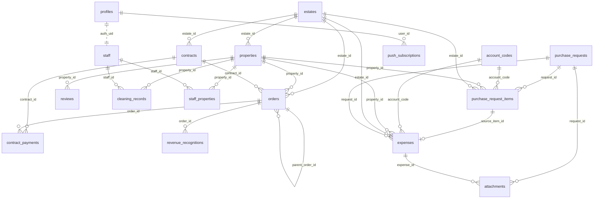

# 安幸上工 — 內部管理網站

Next.js 14 (App Router) + Supabase(Auth + PostgreSQL + RLS)。
短租/長租訂單、收款、營收認列、請款核可、支出、憑證、Airbnb 評價與清潔記錄的一站式後台。
可安裝為 PWA,請款核可有推播通知。

正式站:**https://justwork.estia.com.tw**

> 給非工程同仁的操作說明請看 **[`docs/會計手冊.md`](docs/會計手冊.md)**;
> 請款與支出模組的設計決策見 **[`docs/expenses.md`](docs/expenses.md)**。

**動手前先讀三件事**:〈角色與權限〉、〈Migration 怎麼跑〉、以及文末的〈已知缺口〉—— 這三處是踩坑最多的地方。

---

## 快速開始

```bash
npm install
npm run dev      # http://localhost:3000
```

`.env.local` 需要:

| 變數 | 用途 | 可公開 |
|---|---|---|
| `NEXT_PUBLIC_SUPABASE_URL` | Supabase 專案 URL | ✅ |
| `NEXT_PUBLIC_SUPABASE_ANON_KEY` | 前端 anon key(安全性由 RLS 保護) | ✅ |
| `SUPABASE_SERVICE_KEY` | 匯入 / 管理 API 用的 service role key | ❌ 僅伺服器 |
| `IMPORT_KEY` | `/api/import/*` 的共享密鑰(header `x-import-key`) | ❌ |
| `NEXT_PUBLIC_VAPID_PUBLIC_KEY` | Web Push 公鑰(前端訂閱用) | ✅ |
| `VAPID_PUBLIC_KEY` / `VAPID_PRIVATE_KEY` | Web Push 簽章 | ❌ 僅伺服器 |

---

## 目錄結構

```
src/
  middleware.ts                  未登入一律導向 /login;/api/import/* 除外
  lib/supabase.ts                createBrowserClient
  app/
    login/page.tsx
    (app)/layout.tsx             側邊選單(依 profiles.role 過濾)
    (app)/shortterm/page.tsx     短租訂單與收款(orders)
    (app)/contracts/page.tsx     契約訂單與收款(contracts + orders)
    (app)/dashboard/page.tsx     財務儀表板(手寫 SVG 圖表,零圖表相依)
    (app)/revenues/page.tsx      營收報表(revenue_recognitions)+ xlsx 匯出
    (app)/purchases/page.tsx     請款填寫(purchase_requests + items)+ 兩票核可
    (app)/expenses/page.tsx      支出(expenses)+ 科目/房源分項統計
    (app)/reviews/page.tsx       Airbnb 評價(reviews)
    (app)/cleaning/page.tsx      清潔記錄(cleaning_records)
    (app)/admin/page.tsx         權限管理(分頁):人員 / 物業 / 收付款帳號 / 房源 / **編輯紀錄**
    api/admin/staff-account/     建立/停權/改密碼/改角色(service role)
    api/push/*                   Web Push 訂閱與發送
    api/import/*                 外部資料匯入端點(排程與爬蟲呼叫)
  components/Receipts.tsx        憑證上傳共用元件(壓縮、暫存、簽名網址)
  lib/sortable.tsx               表頭排序共用元件(SortTh / sortRows)
  lib/period.ts                  期間與日期格式的**單一定義**(ym 是 YYYYMM 不是 YYYY-MM)
  lib/filters.tsx                篩選列共用元件 —— 清除只有一顆,版面全站一致
  lib/hkParse.ts                 排班解析與計數(**全專案風險最高的邏輯**)
  lib/hkParse.test.ts            上面那支的測試(`npm test`,44 則含 period)
  lib/__fixtures__/hk-202607.ts  7 月真實排班資料,測試的黃金基準
public/
  manifest.webmanifest           PWA
  sw.js                          service worker(推播接收)
  icons/                         maskable icons
supabase/migrations/             migration_30 ~ 71(見文末索引)
supabase/schema-baseline.sql     線上 schema 快照(**參考用,不可執行**)
supabase/dump-schema.sql         產生上面那份快照的目錄查詢
archive/                         已完成任務的東西(見 archive/README.md)
smoke-test.ps1                   線上端點煙霧測試 —— build 過不等於服務活著
.gitattributes                   行尾正規化 —— 沒有它 git status 會有 44 個假異動
deploy.ps1                       一鍵部署:測試 → build → commit → push
docs/                            會計手冊、模組設計文件
```

`src/data/` 的一次性 seed 資料與四支 seed 端點已移到 `archive/seed-2026-07/`。它們沒有防重跑機制,再呼叫一次會產生整批重複訂單 —— 一個只會用一次卻能造成大範圍損害的端點,留在線上是純風險。

`revenue_recognitions.ym` 存的是**六碼無連字號**(`202608`),不是 `2026-08`。拿 `2026-08` 去比會**安靜地回空集合** —— 字串比較下 `'202608' >= '2026-08'` 成立、`<= '2026-08'` 不成立,整個區間被排除。儀表板上線當天就中了這一發,畫面顯示營收 0 而那個月實際有八百多萬。格式一律用 `lib/period.ts`,那裡有測試釘住。

`middleware.ts` 有一個容易重蹈的坑:**redirect 時必須把刷新後的 auth cookie 一起帶上**。`NextResponse.redirect()` 會丟掉 `response.cookies` 裡的內容,而 Supabase 的 refresh token 是**一次性**的 —— 一旦刷新後的新 token 沒寫回瀏覽器,舊的那顆也同時失效,症狀是「隔天要重新登入」。

---

## 角色與權限

角色存於 `profiles.role`,RLS 全部透過 `current_role_of()` 判斷:

```sql
create function current_role_of() returns text
  language sql stable security definer as $$
  select role from profiles where id = auth.uid() and active $$;
```

### 職位是主軸,權限是衍生的

使用者只會看到「職位」,權限由職位 1:1 推導出來,不能各自設定(`migration_33`)。少了這條規則,同一個人可能出現「職位是房務、權限是總經理」這種對不起來的組合。

| 職位 `staff.staff_type` | → 權限 `profiles.role` | 權限顯示名 |
|---|---|---|
| 管家 `housekeeper` | `housekeeper` | 一般 |
| 房務 `roomservice` | `housekeeper` | 一般 |
| 經理 `manager` | `manager` | 主管 |
| 會計 `accountant` | `accountant` | 會計 |
| 總經理 `gm` | `super_admin` | 總經理 |
| 其他 `other` | `housekeeper` | 一般 |

改職位會同時更新 `staff.staff_type`、`staff.role` 與 `profiles.role`。資料庫另有保護:**不能把最後一個 `super_admin` 降級**,否則沒人進得了設定頁。

核可流程上的稱呼是「主管核可」與「總經理核可」,對應 `manager` 與 `super_admin` 兩票。

### 各角色能做什麼

| 角色 | 側邊選單 | 資料權限重點 |
|---|---|---|
| 一般(管家/房務) | 短租、契約、請款、評價、清潔 | 讀寫 `orders` / `contracts` / `contract_payments`;請款單**只看得到自己送的**;**看不到** `expenses`、`revenue_recognitions`、`revenue_snapshots` |
| 主管 `manager` | + 儀表板、營收、支出 | 讀寫 `orders`/`reviews`/`cleaning_records`/`expenses`;請款**投主管那一票**;可排付款與確認出款 |
| 會計 `accountant` | 短租、契約、儀表板、營收、請款、支出 | **讀寫** `orders`/`contracts`/`invoices`/`expenses`(見下);請款單看得到全部但**不得核可**;可排付款與確認出款 |
| 總經理 `super_admin` | + 設定 | 全部,含 `estates`/`properties`/`staff`/`profiles`/`account_codes`/`payment_accounts`;請款**投總經理那一票**;可編輯任何人未核可的請款單 |

所有 public schema 的表都已啟用 RLS。

### 會計權限的演進(migration 41 → 44)

`accountant` 是後加的角色,`migration_30` 只給了 `for select`。實際用起來陸續發現三個做不到的事,現在都已開放:

| 症狀 | 原因 | 修正 |
|---|---|---|
| 不能確認收款 | `orders_accountant_read` 只有 SELECT | `migration_41` |
| 不能開發票 | `invoices_accountant_read` 只有 SELECT | `migration_42` |
| 不能編輯契約日期 | 同上 + 見下方那個坑 | `migration_43/44` |

⚠️ **`migration_41` 當時加的 `orders_guard_accountant` 觸發器自己造成了新問題**:它用欄位白名單限制會計能改 `orders` 的哪些欄位,但編輯契約會觸發 `gen_contract_orders()` 重產月租單,而那支函式**不是** `SECURITY DEFINER`,它的巢狀 UPDATE 一樣會撞上白名單。結果是「會計改契約日期存不進去,且沒有錯誤訊息」。`migration_44` 移除該觸發器,改為完整 ALL 權限。

`revenue_recognitions` **維持唯讀**,對所有角色皆然 —— 那是 `orders` 的衍生資料,能手改就會跟來源對不起來。要改金額請改 `orders`。

### RLS 管不到的地方

RLS 是列層級的,無法表達「這個角色不能改這一欄」。以下規則改用觸發器實作:

| 規則 | 實作 |
|---|---|
| 會計不得核可請款單 | `pr_guard_votes()` 觸發器 |
| 免核門檻(< NT$3,000 自動核可) | `pr_apply_status()` 觸發器,**前端不自己算** —— 否則改前端就能繞過門檻 |
| `total_amount` 不接受前端寫入 | `sync_pr_total()` 觸發器由項目重算 |
| 未核可不能填出款日 | CHECK 約束 `pr_purchase_chk` |
| 出款帳號只有匯款/信用卡能填 | CHECK 約束 `pr_planned_chk`(`migration_49`) |
| 憑證號碼與「無憑證」互斥 | CHECK 約束 `pr_voucher_chk` / `exp_voucher_chk`(`migration_52`) |

> 開放新角色的做法是**追加一條 policy**,不改寫既有的 —— Postgres 的 permissive policy 是 OR 關係,追加不會動到原本的判斷,避免重寫時把既有權限改壞。

### 請款單的編輯權限

| 狀態 | 誰能編輯 |
|---|---|
| `draft` / `rejected` | 申請人本人、總經理 |
| `pending` 審核中 | 申請人本人、總經理 —— **存檔會清空既有核可票並重新送審** |
| `approved` 已核可 | 申請人本人、總經理 —— **同樣清票重送審**。但**出款日一填、支出一產生就鎖住**(`migration_73`) |

原本 approved 完全不能改,理由是「錢要出去了,改內容等於繞過審核」。那個理由只在「改了不用重審」的前提下成立 —— 現在改內容一定伴隨重新送審,就不成立了。真正的紅線移到 `purchased_on` / `expense_generated_at`:支出一產生就是錢真的花掉的紀錄,只能到支出頁調整或撤銷重開。押金退款流程同一套規則,紅線是 `returned_on`。

重新送審的實作是把 `status` 先退回 `draft`、清空兩個 `*_approved_at`,寫完項目再送 `pending`。這樣直接重用既有狀態機,而且**免核門檻會依新金額重算** —— 5,000 改成 2,000 會自動核可,不會卡在 pending 等兩張不需要的票。

撤銷(刪除)的條件寫在 RLS:`expense_generated_at is null`。已產生支出的單不能撤 —— 支出是錢真的花掉的紀錄,而 `gen_expenses_from_pr()` 只在出款日「從無到有」時建立支出,單子刪掉後重填也補不回來。

---

## 資料庫架構

### ER 圖



### 三層核心關係

```
主體層          交易層                     報表層
estates  ──┐
           ├─► orders ───(trigger)───► revenue_recognitions   (即時,依月切分)
properties ┘      ▲
                  │ (trigger 產生 LT_ 月租單)
contracts ────────┘

                                        revenue_snapshots      (歷史月份快照,無 FK)
```

收入與支出是兩條獨立的鏈,**目前不在系統內相減**(損益要靠營收報表與支出頁各自匯出 Excel 後合併):

```
收入鏈   contracts / 匯入 ──► orders ──► revenue_recognitions
支出鏈   purchase_requests ──► purchase_request_items ──► expenses
                                    (填採購日時逐項產生,1 對 1)
```

### 外鍵一覽

| 子表.欄位 | → 父表.欄位 | on delete |
|---|---|---|
| `properties.estate_id` | `estates.id` | NO ACTION |
| `orders.estate_id` | `estates.id` | NO ACTION |
| `orders.property_id` | `properties.id` | NO ACTION |
| `contracts.estate_id` | `estates.id` | NO ACTION |
| `contract_payments.contract_id` | `contracts.id` | **CASCADE** |
| `contract_payments.order_id` | `orders.id` | NO ACTION |
| `revenue_recognitions.order_id` | `orders.id` | **CASCADE** |
| `reviews.property_id` | `properties.id` | NO ACTION |
| `cleaning_records.property_id` | `properties.id` | NO ACTION |
| `cleaning_records.staff_id` | `staff.id` | NO ACTION |
| `staff_properties.staff_id` | `staff.id` | **CASCADE** |
| `staff_properties.property_id` | `properties.id` | **CASCADE** |
| `purchase_requests.requester_id` | `auth.users.id` | NO ACTION |
| `purchase_request_items.request_id` | `purchase_requests.id` | **CASCADE** |
| `purchase_request_items.property_id` | `properties.id` | NO ACTION |
| `purchase_request_items.account_code` | `account_codes.code` | NO ACTION |
| `purchase_request_items.estate_id` | `estates.id` | NO ACTION |
| `expenses.source_item_id` | `purchase_request_items.id` | **SET NULL**(且 UNIQUE) |
| `expenses.request_id` | `purchase_requests.id` | **SET NULL** |
| `expenses.estate_id` | `estates.id` | NO ACTION |
| `expenses.property_id` | `properties.id` | NO ACTION |
| `expenses.account_code` | `account_codes.code` | NO ACTION |
| `attachments.request_id` | `purchase_requests.id` | **CASCADE** |
| `attachments.expense_id` | `expenses.id` | **CASCADE** |
| `attachments.uploaded_by` | `profiles.id` | NO ACTION |
| `push_subscriptions.user_id` | `profiles.id` | **CASCADE** |

> 未建 FK 但邏輯上相關:`orders.contract_id → contracts.id`、`orders.parent_order_id → orders.id`(加費/移房子單)、`orders.move_group`(同一次移房的群組 id)、`profiles.id` 與 `staff.auth_uid` 皆指向 `auth.users.id`。

### 唯一鍵(冪等匯入的依據)

| 表 | 唯一鍵 |
|---|---|
| `orders` | `order_key` |
| `reviews` | `airbnb_review_id` |
| `cleaning_records` | `record_key` |
| `properties` | `airbnb_listing_id` |
| `estates` | `name` |
| `staff` | `name` |
| `contract_payments` | (`contract_id`, `period_start`) |
| `staff_properties` | (`staff_id`, `property_id`) — 複合主鍵 |
| `purchase_requests` | `req_no`(`PR-YYYYMM-NNN`,由 `next_req_no()` 產生) |
| `expenses` | `source_item_id` — **一個請款項目只能產生一筆支出**,這條在 DB 層成立,不靠應用層自律 |
| `attachments` | `path` — storage 裡的路徑,一個檔案只登記一次 |
| `push_subscriptions` | `endpoint` |
| `payment_accounts` | `code` |

### 查詢索引

| 表 | 索引欄位 |
|---|---|
| `orders` | `checkin`, `checkout`, `estate_id`, `source` |
| `revenue_recognitions` | `ym`, `order_id` |
| `revenue_snapshots` | `ym`, `estate_name` |
| `reviews` | `property_id`, `checkout_date`, `overall_rating` |
| `cleaning_records` | `record_date`, `property_id`, `staff_id`, `overall_rating`, `note`(gin_trgm) |

---

## 各表說明

### `estates` 物業
`id, name*, manager, sort, active, created_at`
最上層。`manager` 是文字欄位(非 FK),評價報表用它做「主管排行」。

### `properties` 房源
`id, name, estate_id→estates, airbnb_listing_id*, name_aliases text[], active, created_at`
`airbnb_listing_id` 是 Airbnb 匯入時對應房源的主要鍵;抓不到時退回 `name` 的模糊比對(`normUnit()` 正規化房號)。

### `staff` 人員 / `profiles` 帳號
- `staff`: `id, name*, aliases text[], staff_type, role, email, auth_uid, active, sort`
- `profiles`: `id (= auth.users.id), name, role, active`

`staff` 是人員名冊(清潔記錄用 `name`/`aliases` 比對),`profiles` 是登入帳號。兩者透過 `staff.auth_uid = profiles.id` 對應,由 `/api/admin/staff-account` 維護(建立帳號、改密碼、停權、改角色會同時更新兩張表)。

### `contracts` 契約
`id, name, type(longterm|company|office), estate_id→estates, room, property_raw, tenant_name, phone,
start_date, end_date, cadence(monthly|quarterly|halfyear|yearly), monthly_rent, amount_per_period, deposit,
first_payment_date, pay_day, account, note, paid, deposit_received(_at), deposit_returned(_at),
active, auto_renew, watch, display_name, created_at`

`watch` = 釘選到「本月已收/未收」清單;`display_name` = 自訂顯示名;`auto_renew` = 到期後自動續產月租單。

### `orders` 訂單(全站交易中心)
`id, order_key*, source, estate_id→estates, property_id→properties, property_raw, guest_name,
checkin, checkout, nights, amount, deposit, deposit_received(_at), deposit_returned(_at),
fx_revenue jsonb, fx_deposit jsonb, account, note, fee_type, paid, paid_at,
contract_id, parent_order_id, move_group, imported_via, created_at`

`source` 值:

| 值 | 意義 | 產生方式 |
|---|---|---|
| `airbnb` | Airbnb(含 co-host 搭檔收款) | 自動匯入 |
| `agoda` | Agoda | 匯入 |
| `private` | 直客短租 | 手動 / 匯入 |
| `oneoff` | 一次性收入(取消費、加費、**折讓**) | 觸發 / 手動 |
| `longterm` / `company` / `office` | 長租 / 公司戶 / 辦公室月租 | **由 contracts 觸發器產生** |

`imported_via`:`contract`(觸發器產生,可被覆寫)/ `auto`(爬蟲)/ `excel` / `manual` / `extend`(手動展延)。

`order_key` 命名規則:`LT_{room}_{YYYYMM}` 月租、`CFEE_…` 契約加費、`FEE_…` 訂單加費、`MOVE_…` 移房子單、`CDIS_…` 契約折讓、`OO_/PV_…` 手動一次性/直客。

**契約折讓分兩層**(`migration_48`):

| | 存在哪 | 影響金額 |
|---|---|---|
| 折讓**約定** | `contracts.concessions` jsonb,可多筆 | ❌ 純文字備查 |
| **實際**折讓 | `orders` 的負數 `oneoff` 列(`CDIS_…`,`fee_type='折讓'`) | ✅ 該月營收自動減少 |

實際折讓不直接改月租單的金額,因為 `LT_{room}_{YYYYMM}` 是 `gen_contract_orders()` 產的 —— 只要之後編輯一次契約(改租期、改租金),觸發器就會把未收款的月份重新產生,折讓後的金額會被無聲蓋回原價。獨立一筆負數訂單就不會被動到,而且 `oneoff` 本來就流進 `revenue_recognitions`,營收自動變少,不用另外寫連動。

收租畫面顯示淨額並載明原始金額:`應收 $80,000（原 $100,000 − 折讓 $20,000）`,備註自動寫成算式。同一期折讓第二次時會多帶一段「已折讓 $X」,算式才對得起來。

### `revenue_recognitions` 營收認列(由觸發器維護,勿手改)
`id, order_id→orders(CASCADE), ym, period_start, period_end, source, estate_id, property_id,
estate_name, property_raw, guest_name, checkin, checkout, total_amount, total_nights,
month_nights, month_amount, fee_type, created_at`

一張 `orders` 依住宿區間切成多個月份列,金額按住宿天數比例攤分。營收報表頁直接查這張表。

**攤分方式:捨去 + 尾期補餘額**(`migration_53`)

```
除了最後一個月 →  trunc(amount × month_nights / total_nights)   無條件捨去到整數
最後一個月     →  amount − 前面各月的合計                        餘數全給它
```

10,000 分三期 → 3,333 + 3,333 + **3,334** = 10,000。舊版是每月各自 `round(..., 2)`,結果帳上出現 333.33 這種小數,而且三個月加起來 999.99 對不上 1,000。

「最後一個月」是**時間上最晚**的那個,用 `date_trunc('month', checkout - 1)` 判斷 —— `checkout` 是退房日不算一晚,7/30 進 8/1 出的最後一晚在 7/31,所以尾差記在 7 月不是 8 月。餘數放最後一期而非第一期,是因為最後一期通常還沒結案,調整它不會動到已經對過帳、出過月報的月份。

用 `trunc` 而非 `floor` 是為了負數 —— `floor(-3333.3) = -3334` 會變成「捨去反而變大」。正數兩者相同。

`source='oneoff'` 不跨月,整筆記在 `checkin` 當月。契約折讓就是走這條路的負數訂單。

> 這張表對**所有角色唯讀**。它是 `orders` 的衍生資料,能手改就會跟來源對不起來。改金額請改 `orders`,觸發器會重算。

### `revenue_snapshots` 歷史營收快照
`id, ym, source, estate_name, property_raw, guest_name, checkin, checkout,
total_amount, month_amount, month_nights, total_nights, note, created_at`
無外鍵,系統上線前的歷史月份資料,由 `/api/import/snapshots` 全刪重建。

### `reviews` Airbnb 評價
`id, airbnb_review_id*, property_id→properties, listing_name_raw, guest_name,
checkin_date, checkout_date, nights, overall_rating,
comment, comment_original, comment_language,
rating_checkin / _cleanliness / _accuracy / _communication / _location / _value,
detail_comments jsonb, host_reply, source_url, imported_via, scraped_at`

`detail_comments` 內含 `private_feedback`、`private_feedback_localized`、`tags`。重新匯入時**已翻成中文的 `comment` 不會被覆蓋**。

### `cleaning_records` 清潔記錄
`id, record_key*, record_date, staff_name, staff_id→staff, staff_type,
property_id→properties, property_raw, estate_name, overall_rating, note, doc_url, source, created_at`
`staff_name` 先用 `staff.name` / `staff.aliases` 對應;房源用 `normUnit()` 模糊比對。評分可從 note 的「N 星」解析。

### `contract_payments` 契約期款
`id, contract_id→contracts(CASCADE), order_id→orders, period_start, period_end, amount, confirmed, confirmed_at`
唯一鍵 (`contract_id`, `period_start`)。目前前端未使用,收款狀態實際記在 `orders.paid` / `paid_at`。

### `staff_properties` 人員 × 房源
複合主鍵 (`staff_id`, `property_id`),雙向 CASCADE。目前前端未使用。

### `account_codes` 會計科目主檔
`code(PK), name, sort, active`
預設 15 個科目(修繕維護、清潔費、備品消耗品…)。所有登入者可讀,只有 `super_admin` 可改。

### `payment_accounts` 出款帳戶主檔(`migration_38`)
`code(PK), name, method(cash|transfer|credit_card|crypto), card_last4, for_payment, for_receipt, active, sort`

我方的錢從哪裡出、收到哪裡去。依 `method` 分組:匯款可有多個銀行帳號,信用卡可有多張。請款單的出款帳號、支出的付款帳號、短租與契約的入款帳號都從這裡取,不再各自打字。

### `purchase_requests` 請款單
`id, req_no*, requester_id→auth.users, status, total_amount,
currency, fx_rate,
payment_method, payee_bank_code, payee_account, payee_company, payee_tax_id,
planned_transfer_on, payout_account, purchased_on,
voucher_no, no_voucher,
note, submitted_at, manager_approved_by/_at, admin_approved_by/_at,
rejected_by/_at, reject_reason, expense_generated_at, created_at`

`status`:`draft` → `pending` → `approved` / `rejected`。

**兩票並行,沒有先後**:`manager` 一票、`super_admin` 一票,兩票到齊才進 `approved`。總額 < NT$3,000 送出即核可(兩票全免)。**開放自核** —— 主管送的單那一票由他自己投,不再要求第二人(`migration_32`)。

**付款分兩段**(`migration_39`,`migration_49` 放寬時機):

```
填單(可先填預定出款日/出款帳號) → 核可 → 排付款(會計調整計畫) → 確認出款日 → 產生支出
                                                              ↑ 錢真的出去才記帳
```

- `planned_transfer_on` = 打算哪天付(計畫,可改)。申請人送單時就能填,現金/匯款/信用卡都有。
- `purchased_on` = 實際哪天付。填了才觸發支出產生,而且這張單就不能再撤銷。
- `payout_account` = **我方**出款帳號/信用卡,對應 `payment_accounts.code`。信用卡的用詞是「刷卡日/刷卡卡片」,同一組欄位換個說法。

`payee_*` 存的是**收款方(廠商)**的帳戶資訊,與 `payout_account`(我方)方向相反,兩者不互通。

**幣別**(`migration_40`):一張單限定一種幣別,支援 TWD / USD / JPY / CNY / EUR,匯率手動填。`amount_original` 存使用者輸入的原幣金額,`amount` 一律存台幣。換算在存檔時一次做完,資料庫不會有「一半換過一半沒換」的中間狀態。免核門檻看的是**換算後的台幣**。

**憑證**(`migration_52`):`voucher_no` 與 `no_voucher` 互斥,由 CHECK 約束保證。分成兩件事是為了讓「還沒填」和「本來就沒有」在帳上分得出來 —— 只留一個空白欄位的話,會計永遠不知道還要不要追這張發票。

`total_amount` 由 `sync_pr_total()` 觸發器維護,**前端勿寫**。

CHECK 約束 `pr_purchase_chk`:`purchased_on` 只有在 `status='approved'` 時才能有值,**「未核可不能出款」寫在資料庫層**,不是只靠前端藏按鈕。

### `purchase_request_items` 請款項目
`id, request_id→purchase_requests(CASCADE), item_name, amount, amount_original,
account_code→account_codes, purpose_type(estate|office),
estate_id→estates, property_id→properties, note, sort`

一張請款單含多個項目。

**用途是物業層級**(`migration_34`)。原本綁在房源上,但多數支出(水電、清潔、耗材)是整棟共用的,逐間房挑一個等於亂記。`purpose_type='office'` 表示安幸辦公室,此時 `estate_id` 與 `property_id` 都必須為 null。房源(`property_id`)是**選填**的細分(`migration_47`),知道是哪一間就填,之後要追單一房間的花費才有依據。

### `expenses` 支出
`id, spent_on, item_name, amount, amount_original, currency, fx_rate,
account_code→account_codes, purpose_type, estate_id→estates, property_id→properties,
voucher_no, no_voucher, payment_method, pay_account,
note, source_item_id→purchase_request_items(UNIQUE), request_id→purchase_requests,
created_by, created_at`

兩種來源:請款連動產生(`source_item_id` 有值)、或直接手動新增(為 null)。

`request_id`(`migration_55`)記錄這筆支出來自哪張請款單。除了追溯來歷,憑證照片也靠它沿用 —— **照片不複製**,一張請款單常拆成好幾筆支出,複製會讓同一張發票在 storage 出現 N 份,某天有人刪掉其中一個,其他還在,對帳時分不出哪張才算數。憑證**號碼**則是真的複製一份,因為同一張發票本來就對應多個項目,對帳靠這個號碼把它們串回去。

**連動產生的支出只有 `super_admin` 能刪。** 兩票核可是為了管錢,若那筆錢的紀錄一個人就能刪掉,這道關卡等於白設;而且刪除是靜默的 —— 請款單仍顯示已核可、有出款日,支出卻不見了,兩邊對不上而系統不會叫。

### `attachments` 憑證附件(`migration_51`)
`id, request_id→purchase_requests(CASCADE), expense_id→expenses(CASCADE),
path*, file_name, mime_type, size_bytes, uploaded_by→profiles, created_at`

檔案本體在 Supabase Storage 的 **`receipts`** bucket(私有,10MB 上限),這張表只存路徑與歸屬。CHECK 約束 `att_one_parent` 要求兩個父鍵**恰好一個**有值。

沒有在請款單上加一個 `image_url` 欄位,因為一張單常常有好幾張發票,單一欄位放不下,而且刪檔案要順便清欄位,很容易留下指向不存在檔案的死連結。

路徑約定 `pr/{request_id}/{uuid}.{ext}` 與 `exp/{expense_id}/{uuid}.{ext}` —— **storage 的 RLS policy 直接解析這個路徑判斷權限,格式不能亂改**。權限判斷集中在兩支 `SECURITY DEFINER` 函式:`can_see_receipt(path)` 與 `can_edit_receipt(path)`。

bucket 私有代表看圖要用簽名網址(前端 `createSignedUrls`,1 小時到期)。手機拍的照片會先在瀏覽器壓到長邊 1600px 的 JPEG 再上傳,4MB 通常剩 300KB 左右。填新單時還沒有 id、路徑組不出來,選的檔案會先暫存在瀏覽器,母單建立後才真正上傳。

### `push_subscriptions` 推播訂閱(`migration_35`)
`id, user_id→profiles, endpoint*, p256dh, auth, user_agent, created_at`

Web Push 的訂閱資料。請款單送審時由資料庫觸發器經 **`pg_net`** 打 `/api/push/notify`,通知有權核可的人(`migration_36`,換網域後 `migration_37`)。用 `pg_net` 而非 Supabase Dashboard 的 Webhook,是因為後者不在版控裡,換網域時會忘記改。

> iOS 的 Web Push 只在**加到主畫面**之後才會運作(16.4+),用 Safari 直接開網站收不到通知。

---

## 自動化(觸發器與函式)

```
contracts  ──[contracts_sync: AFTER INSERT/UPDATE/DELETE]──► gen_contract_orders(ct)
                                                              └─ 依 start_date~end_date 逐月
                                                                 upsert orders(LT_{room}_{YYYYMM})
                                                                 只覆寫 imported_via='contract' 且 paid=false 的列

orders     ──[orders_recognize: AFTER INSERT/UPDATE/DELETE]──► trg_orders_recog()
                                                              └─ 先刪舊 recognitions,再 gen_recognitions(o)
                                                                 依月切分攤 amount * n/nights
                                                                 source=oneoff 則整筆記在 checkin 當月

purchase_request_items ──[trg_sync_pr_total: AFTER I/U/D]──► sync_pr_total()
                                                              └─ 重算母單 total_amount

purchase_requests ──[BEFORE UPDATE,依序三支]
   1. trg_pr_status      pr_apply_status()   狀態機:送出判斷免核門檻、兩票到齊翻 approved、駁回清票
   2. trg_pr_guard_votes pr_guard_votes()    擋:會計投票(RLS 管不到欄位層級)
   3. trg_gen_expenses   gen_expenses_from_pr()
                          └─ approved 且 purchased_on 由空變有值 → 逐項 insert expenses
                             (帶 currency/fx_rate、payout_account、voucher_no/no_voucher、request_id)
                             出款日變動 → 只同步既有支出的 spent_on,不重複產生

purchase_requests ──[AFTER UPDATE → pending]──► pg_net 打 /api/push/notify
                                                  └─ 通知有權核可的人(Web Push)
```

⚠️ `gen_expenses_from_pr()` **只在出款日「從無到有」時建立支出**(`on conflict (source_item_id) do nothing`)。連動產生的支出一旦被刪除,重填出款日也不會補回來 —— 這是刪除限制成 `super_admin` 才能做的原因之一。同理,改版前就結案的單不會回頭補憑證欄位,那些要人工補。

⚠️ **這支函式的線上定義曾經跟 repo 對不起來。** `migration_30` 之後,它被 `migration_34/38/40` 各改過一次但沒有全部進版控,照 repo 的版本 `create or replace` 會把那幾次修改整批回捲。`migration_54/55` 已經把線上定義撈回來納管(`pg_get_functiondef`)。**改這支之前先確認線上定義**:

```sql
select pg_get_functiondef('public.gen_expenses_from_pr()'::regprocedure);
```

**重要:刪除或改寫契約時,已收款(`paid=true`)與匯入來源的訂單不會被觸發器動到**,這是保護人工欄位(收款、押金、外幣、移房)的設計。

其他 RPC / 工具函式:

| 函式 | 用途 |
|---|---|
| `review_stats(p_from, p_to)` | 各物業評價數與平均分 |
| `manager_stats(p_from, p_to)` | 主管別 1–5 星分布 |
| `cleaning_staff_stats(p_from, p_to)` | 清潔人員件數 / 平均分 / 低分數 |
| `monthly_revenue(p_year, p_month)` | 單月營收明細 |
| `monthly_revenue_summary(p_year, p_month)` | 單月營收彙總(物業 × 來源) |
| `rebuild_recognitions()` | 全量重建 `revenue_recognitions` |
| `rebuild_contract_orders()` | 全量重建契約月租單 |
| `current_role_of()` | RLS 用,取目前登入者角色 |
| `next_req_no()` | 產生下一個請款單號 `PR-YYYYMM-NNN`(台北時區) |
| `can_see_receipt(path)` / `can_edit_receipt(path)` | 憑證附件的權限判斷,storage policy 與 `attachments` policy 共用 |

DB 擴充:`pg_trgm`(房號模糊比對)、**`pg_net`**(資料庫直接發 HTTP,推播用)。

---

## 匯入 API

全部需要 header `x-import-key: $IMPORT_KEY`,並使用 `SUPABASE_SERVICE_KEY` 繞過 RLS。

| 端點 | 方法 | 說明 |
|---|---|---|
| `/api/import/reviews` | POST | Airbnb 評價;以 `airbnb_review_id` upsert,回傳 `needTranslation` 清單。CORS 限 `airbnb.com` |
| `/api/import/translate` | GET / POST | 列出待翻譯留言 / 寫回中文翻譯(只接受含中文的內容) |
| `/api/import/reconcile` | POST | **撤評對帳**:傳入 Airbnb 現存的全部 review id,刪除 DB 有而 Airbnb 沒有的。三道護欄:抓取完整性(`totalCount` 須相符)、比例閘(不足現有 90% 中止)、刪除上限(`maxDelete`,預設 5)。`dryRun` **預設 true** |
| `/api/import/airbnb-orders` | POST | Airbnb 訂單;`code`→`order_key` 去重,既有列只更新金額/日期,保留人工欄位 |
| `/api/import/orders` | POST | 通用訂單 upsert(Excel / Make) |
| `/api/health` | GET | **不需金鑰**。回 `{ok, db, at}`,實際查一次資料庫。CI 部署完打這支,非 200 就回滾 |
| `/api/import/reviews/state` | GET / POST | 撤評哨兵的狀態:`dbCount`、最近 300 筆 `recentIds`、`lastFullReconcile`。**取代原本的本機 `sync-state.json`** |
| `/api/import/cleaning` | POST | 清潔記錄 upsert(`record_key`) |
| `/api/import/housekeeping` | POST | 房務排班文字解析後匯入(與前端共用 `hkParse`) |
| `/api/admin/staff-account` | POST | `create` / `password` / `role` / `ban` / `delete_account`,呼叫者須為 `super_admin` |

四支 seed 端點(`snapshots` / `contracts-seed` / `contracts-general` / `shortterm-seed`)**已移入 `archive/seed-2026-07/`**。資料 2026-07 就匯完了,而它們沒有防重跑機制 —— 帶著正確的金鑰呼叫第二次會產生一整批重複訂單。要重跑的話請先讀 `archive/README.md`。

---

## 排程與自動化

兩支 Cowork 排程每天跑,程式碼在 `C:\Users\ASUS\Claude\Scheduled\`,金鑰讀專案根目錄的 `.env.sync`(已在 `.gitignore` 內)。

| 排程 | 時間 | 做什麼 |
|---|---|---|
| `airbnb-orders-sync` | 每日 06:00 | 抓未來/取消/最近結束三批訂單 → `/api/import/airbnb-orders` |
| `airbnb-reviews-sync` | 每日 06:30 | 抓最新 50 筆評價 → 匯入 → 翻譯 → 視情況撤評對帳 |
| `housekeeping-timetree-sync` | 每月 1 號 09:00 | TimeTree 排班 → `/api/import/housekeeping` |

實際觸發時間會有幾分鐘隨機延遲,那是刻意的(避免整點一起打 Airbnb)。

**兩件事情非做不可,否則資料會靜靜地錯:**

* **`locale` 必須是 `zh-TW`。** 用 `en` 時 Airbnb 回的是英文翻譯後的房源名,跟 DB 裡的中文原名對不上,房源對照會整片失效。2026-07-30 就因為這個洗掉了 50 筆評價的房源歸屬。
* **所有 fetch 都要在 airbnb.com 分頁的 context 裡執行。** Airbnb API 靠同源 cookie 認證,匯入端點的 CORS 也只允許 `https://www.airbnb.com`。

撤評哨兵的狀態**存在 DB 的 `sync_state`,不是本機檔**(`migration_71`)。舊版存在 `sync-backups/sync-state.json`,那個檔只存在於某一台機器上 —— 換路徑之後「找不到 `topReviewId`」天天成立,於是天天多跑一次 30 次請求的全量對帳,而症狀跟「今天真的新增很多評價」完全一樣,不會有人發現。

---

## 部署

**一鍵部署(建議)** —— 在專案資料夾:

```powershell
.\deploy.ps1 "commit 訊息"
```

依序做:檢查變更 → **`npm test`** → **本機 `npm run build`** → 失敗就中止 → `git add` 程式與設定(不碰根目錄的個人筆記)→ **列出這次帶的 migration 並要你確認** → commit → push → 印出 Actions 連結。

測試排在 build 之前,因為它跑幾秒就有結果,沒必要等三分鐘的 build 才發現邏輯錯了。

先在本機 build 過再推是刻意的:CI 在 Vultr 上是 `git reset --hard` → `npm install` → `npm run build` → `pm2 restart`,build 掛掉的話**程式碼已經被拉到最新、但服務還跑舊版**,會停在不一致的狀態。

**主機**:Vultr / Ubuntu 24.04 / Node 20+,`pm2` 常駐,**Caddy(Docker)** 反向代理並自動處理 SSL。

> ⚠️ `npm start` 監聽 **3001**(`package.json` 的 `next start -p 3001`)。`DEPLOY.md` 裡的 Nginx 範例是**過時的** —— 實際跑的是 Caddy,不是 Nginx。
>
> ⚠️ Caddyfile 是 Docker 的**單檔 bind mount**,綁的是 inode。用 `sed -i` 改會產生新 inode,結果是主機看到新內容、容器裡還是舊的,而且 `caddy reload` 會說 "config is unchanged"。改完要 `docker restart`,不能只 reload。

**網域**:`justwork.estia.com.tw`(原 `justwork.oasisliving.tw` 已淘汰)。換網域時要一起改的地方:DNS、Caddyfile、Supabase Auth 的 Site URL 與 Redirect URLs、`migration_37` 的推播觸發器、PWA 的 manifest(使用者需重新安裝)。

CI:`.github/workflows/deploy.yml` — push 到 `main` 觸發。用 `git fetch origin main && git reset --hard origin/main` 而非 `git pull`,因為主機上的 `package-lock.json` 會被 `npm install` 改髒而擋住 pull。**任何 commit(含只改文件)都會觸發重建與重啟**。詳見 `DEPLOY.md`。

---

## PWA 與推播

網站可以「加到主畫面」當 App 用:`public/manifest.webmanifest` + service worker + maskable icons,`display: standalone`。

推播用 Web Push(VAPID)。流程:

```
使用者在網站上授權 → PushManager 訂閱 → 寫入 push_subscriptions
請款單送出審核 → DB 觸發器經 pg_net → /api/push/notify → web-push 發給有權核可的人
```

> **iOS 限制**:16.4 以後才支援 Web Push,而且**只有加到主畫面之後才會運作**。用 Safari 直接開網站是收不到通知的。

VAPID 金鑰放在 `.env.local`(`VAPID_PUBLIC_KEY` / `VAPID_PRIVATE_KEY`,前者另需 `NEXT_PUBLIC_` 版本給前端)。

---

## 帳號管理

建議走 **設定 → 人員** 頁(`/admin`),由 `/api/admin/staff-account` 一次建立 `auth.users` + `profiles` 並回寫 `staff`。**改職位時三個地方會一起更新**:`staff.staff_type`、`staff.role`、`profiles.role`。

設定頁另有兩張主檔可維護:**會計科目**(`account_codes`)與**出款帳戶**(`payment_accounts`),都只有總經理能改。

手動作法:Supabase Dashboard → Authentication → Add user,再到 SQL Editor:

```sql
insert into profiles (id, name, role)
values ('<user_uuid>', '名字', 'housekeeper');  -- housekeeper | accountant | manager | super_admin
```

`profiles.role` 有 CHECK 約束 `profiles_role_chk` 限定這四個值。`staff.staff_type` 的約束在 `migration_31` 放寬過(加入 `gm`)。

> 由 SQL 直接建立的帳號如果沒有對應的 `staff` 列,設定頁會顯示「孤兒帳號」警示並提供補建。

---

## 功能現況

| 模組 | 狀態 |
|---|---|
| 登入 / 角色選單 | ✅ |
| 短租訂單與收款(含加費、移房、外幣、押金) | ✅ |
| 契約訂單與收款(自動月租單、展延、關注、**折讓**) | ✅ |
| 營收報表(月度認列、房源篩選、xlsx 匯出) | ✅ |
| 短租 xlsx 匯出(伺服器端分頁,匯出重取完整結果) | ✅ |
| 請款填寫(多項目、幣別、兩票核可、駁回、撤銷) | ✅ |
| 請款付款兩段流程(排付款 → 確認出款日) | ✅ |
| 請款核可前可編輯(存檔清票重新送審) | ✅ |
| **憑證上傳**(請款單 + 支出,自動壓縮,連動沿用) | ✅ |
| 支出(科目/帳戶/房源分項統計、外幣、xlsx 匯出) | ✅ |
| 發票開立與待開清單 | ✅ |
| 評價查詢(篩選、細節抽屜、負評警示、自動翻譯) | ✅ |
| Airbnb 每日同步(評價+訂單,含撤評對帳) | ✅ 排程 |
| 清潔記錄(人員統計、分享到 LINE) | ✅ |
| 設定(人員/物業/房源/帳號/科目/出款帳戶) | ✅ |
| **PWA 安裝 + 核可推播** | ✅ |
| 手機版面(全站) | ✅ |

### 已知缺口

| 項目 | 說明 |
|---|---|
| ~~`supabase/migrations/` 缺基準 schema~~ | **已補**:`supabase/schema-baseline.sql` 是 2026-08 的線上快照（表、約束、索引、函式、觸發器、RLS）。產生方式見 `supabase/dump-schema.sql`。<br>那份是**參考用不是可重跑**的 —— `create table` 沒有依賴排序。它的用途是讓「線上到底長什麼樣」在 repo 裡 grep 得到,改既有函式前先看那裡,不要照 `migration_30` 的舊版猜（`gen_expenses_from_pr()` 已被改過六輪）。 |
| 爬蟲不送 `listingId` | 評價被指到錯誤房源的**根因**。4 間開封的 Airbnb 標題完全相同,靠名稱比對必然出錯(全站有 23 個共用名稱)。`migration_45` 已用日曆訂單修正既有資料,匯入端也改成用訂單回查,但來源沒修就還是治標 |
| 出款日無撤銷路徑 | 填錯只能改日期(會同步支出),無法退回未出款。要補得設計作廢流程,含已產生支出的處理 |
| ~~損益未整合~~ | **已補**:財務儀表板的〈各物業損益〉把 `revenue_recognitions` 與 `expenses` 按物業接起來。**支出只算有指定物業的**,辦公室的公共費用不分攤 —— 分攤比例沒人決定過,亂攤比不攤更誤導 |
| 評價分項評分缺漏 | `ReviewsSectionQuery` 不回傳分項評分與房東回覆,那 7 欄目前留 null |
| ~~錢的紀錄沒有刪除軌跡~~ | **已修**(`migration_72`):`data_audit` 記下支出、請款單、押金、訂單、契約的增刪改。2026-08-04 有人問「支出之前比較多筆是不是被刪了」,查遍 migration 與 baseline 都排除了,最後只能說「可能有人刪的,但沒紀錄」—— 那次查不出來就是這張表存在的理由 |
| ~~撤評哨兵綁在單一機器~~ | **已修**(`migration_71`):狀態改存 `sync_state`,排程改打 `GET /api/import/reviews/state`。舊版存在 `sync-backups/sync-state.json`,換路徑後「找不到 topReviewId」天天成立,於是天天多跑一次 30 次請求的全量對帳,而且不會有人發現 |
| 請款憑證不回補 | 改版前已結案的單不會自動補 `voucher_no` 到支出(`on conflict do nothing`),要人工補 |
| ~~房務設定按了沒用~~ | **已修**:`count_mode`、`include_gift`、工作類型與房源的計布巾開關都真的接上計算了。過濾規則收在 `hkParse.filterItems()`,由測試釘住 |
| ~~`hk_audit` 是空表~~ | **已修**(`migration_67`):四張設定主檔的增刪改都會寫,`changes` 只存真的變動的欄位。排班格的日常增刪不記 —— 量差好幾個數量級,而且畫面上看得到 |
| ~~不知道 migration 跑到哪~~ | **已修**(`migration_70`):`schema_migrations` + `record_migration()`。30~65 是事後回填的推測值(`source = 'assumed'`) |
| ~~44 個檔案永遠顯示已修改~~ | **已修**:加了 `.gitattributes`(`text=auto eol=lf`)。Windows 編輯器存 CRLF、repo 存 LF,git 把整檔當成改過。危害是 `git add -u` 會把假異動一起 commit,真正改了什麼被埋在裡面,之後 merge 還會在這些檔案上衝突 |
| ~~部署失敗會把網站弄掛~~ | **已修**:CI 現在 build 前備份 `.next` 與當前 commit,`npm install` / `npm run build` / 健康檢查任一失敗就整組還原並重啟。之前是 `git reset --hard` 換掉原始碼 → build 失敗 → `.next` 只寫了一半 → 舊程序讀殘缺的 `.next` → 崩潰重啟。**「部署失敗」和「網站掛掉」是同一件事,而 Actions 上只顯示前者** |
| ~~健康檢查被 middleware 導走~~ | **已修**:`/api/health` 加進 `middleware.ts` 的排除清單。部署腳本在主機上 curl 它、手上不可能有登入 cookie,漏掉就會拿到 307 而不是 200 —— CI 因此回滾了一次完全正常的部署 |
| ~~build 過就當作部署成功~~ | **已修**:CI 重啟後會打 `/api/health`(真的碰一次資料庫),15 次重試都非 200 就回滾。本機另有 `.\smoke-test.ps1` 驗線上端點 |
| ~~全站 503,pm2 重啟 79 次~~ | **已修**:`next.config.mjs` 的 `output: 'standalone'` 與 pm2 跑的 `next start` 不相容。服務起得來(log 顯示 ✓ Ready),一有請求就 `Cannot find module '.next/server/pages/_error.js'` 崩潰重啟。這種錯**不會出現在 build 階段**,只在執行期才炸 —— 本機 `npm run build` 過了不代表線上活得下來 |
| `hk_property.beds` 有 null | `17B5 / 18B5 / 19B2 / 6B2` 的床數還沒填,布巾統計會少算這幾間。不是程式問題,是主檔沒補完 |
| 房務沒有月結鎖定 | 改主檔(幾床、計布巾)會**追溯改變已經出過的月報**。`hk_audit` 現在查得到是誰改的,但沒有東西擋住改動本身 |

---

## Migration 索引

`supabase/migrations/` 依序執行。**30 之前的沒有進版控**(見上方缺口)。

| # | 主題 |
|---|---|
| 30 | 請款單與支出:建表、狀態機、RLS、觸發器 |
| 31 | `staff` ↔ `profiles` 打通,職位加入 `gm` |
| 32 | 請款撤銷規則、開放自核 |
| 33 | **職位為權限的唯一來源**,保護最後一個 `super_admin` |
| 34 | 用途改為物業層級(`estate_id`) |
| 35 | `push_subscriptions` |
| 36 / 37 | 推播觸發器(`pg_net`)/ 換網域後更新 URL |
| 38 | `payment_accounts` 出款帳戶主檔 |
| 39 | 預定出款日 + 出款帳號(付款兩段化) |
| 40 | 幣別與匯率 |
| 41–44 | 會計權限逐步開放(收款 → 發票 → 契約 → 完整) |
| 45 | 用日曆訂單修正評價的房源歸屬 |
| 46 | 會計科目:差旅/交通拆開,加交際費、職工福利 |
| 47 | 支出的房源改選填 |
| 48 | 契約折讓(約定 jsonb + 實際走負數 oneoff) |
| 49 | 預定出款日改成申請時就能填 |
| 50 | 核可前可編輯請款單 |
| 51 | 憑證附件:`receipts` bucket + `attachments` + storage policy |
| 52 | 憑證號碼與「無憑證」註記 |
| 53 | **跨月營收改捨去 + 尾期補餘額**(含全量重算) |
| 54 | 憑證號碼帶進支出 |
| 55 | `expenses.request_id`,憑證照片沿用 |
| 56 | 押金:`deposits` 表、訂單/契約自動連動 |
| 57 | 手動建立押金(沒有訂單來源的舊案) |
| 58 | 房務排班:人員/房源/工作項主檔 + 種子資料 |
| 59 | 房務主檔可維護化(`ptype`、`count_linen`、`hk_audit`) |
| 60 | 間數可手動覆寫(`rooms_override`) |
| 61 | 退押金審核流程:房客帳戶、兩票、確認退款日 |
| 62 | 合併重複房源(匿名化造成的 14 組) |
| 63 | 合併 南京5 / 台4(需人工判斷的 2 組) |
| 64 | 布巾群組歸位 |
| 65 | 修 `sync_order_deposits()` 的 `malformed array literal` |
| 66 | 「公區清潔」計布巾 —— 消除匯入與手改的結果不一致 |
| 67 | `hk_audit` 開始寫入(設定層四張主檔的觸發器) |
| 68 | 移除 `hk_property.is_common`,公區只看 `ptype` |
| 69 | 移除 `hk_staff.source_name`,顯示名只看 `source_names[]` + 重名防呆 |
| 70 | **`schema_migrations` 執行紀錄** —— 每支結尾要 `select record_migration('編號_名稱')` |
| 71 | `sync_state`:排程同步狀態改存 DB(原本在本機 json,換機器就失效) |
| 73 | 核可後仍可編輯(存檔即清票重送審),紅線移到出款日 |
| 74 | 會計科目新增「零用金」(小額現金支出) |
| 75 | 一次性收入的「取消費」併入「其他」;沒填科目時預設「其他」 |
| 76 | 定期收費(recurring_charges) + 一次性收入的「項目」欄位 |
| 77 | 契約可以只掛物業(沒有房號);月租單鍵改走 keyBase() |
| 78 | 契約產生的月租單帶「契約類別」(辦公室/公司登記不再被標成長租) |
| 72 | **`data_audit` 編輯紀錄**:支出/請款/押金/訂單/契約的增刪改。刪除與新增存整列,修改只存變動欄位 |

---

## Migration 怎麼跑

沒有 `supabase link`,也沒有 Docker,所以 `supabase db push` 用不了 —— **migration 是手動貼進 [Supabase SQL Editor](https://supabase.com/dashboard/project/_/sql) 執行的**,CI 完全不會碰。

程式推上去了但 SQL 沒跑,症狀是線上噴 `column does not exist`,而且要等有人點到那個頁面才發現。所以:

```sql
-- 線上跑到哪了？
select name, applied_at, source from schema_migrations order by name;
```

`source = 'assumed'` 的那些是 `migration_70` 事後回填的推測值(對照 schema 快照看起來是生效了),不是當下記錄的。從 66 開始才是真的有憑據。

`deploy.ps1` 在 commit 前會列出這次帶了哪幾支 migration 並要你確認 —— 那是提醒,不是保證,它沒有連到資料庫。

**寫新的 migration 時**:

* 結尾補上 `select record_migration('編號_名稱')`
* **要能重跑**。`migration_63` 第二次跑時報「不同名或不同物業」,是因為守衛把「已經處理完了」和「資料對不上」講成同一句話。守衛要分開判斷,而且「已完成」要跳過而不是中止。
* **驗證段要有真的寫入**,不能只有 `select`。`sync_order_deposits()` 的陣列 bug 撐了兩天沒被發現,就是因為驗證只讀不寫,從來沒碰到觸發器。做法是包在 `do $$ ... $$` 裡寫一次、檢查結果、再讓它回滾。
