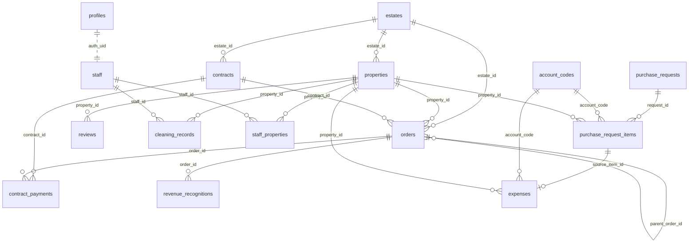

# 安幸上工 — 內部管理網站

Next.js 14 (App Router) + Supabase(Auth + PostgreSQL + RLS)。
短租/長租訂單、收款、營收認列、請款核可、支出、Airbnb 評價與清潔記錄的一站式後台。

> 給非工程同仁的操作說明請看 **[`docs/會計手冊.md`](docs/會計手冊.md)**;
> 請款與支出模組的設計決策見 **[`docs/expenses.md`](docs/expenses.md)**。

---

## 快速開始

```bash
npm install
npm run dev      # http://localhost:3000
```

`.env.local` 需要:

| 變數 | 用途 | 可公開 |
|---|---|---|
| `NEXT_PUBLIC_SUPABASE_URL` | Supabase 專案 URL | ✅ |
| `NEXT_PUBLIC_SUPABASE_ANON_KEY` | 前端 anon key(安全性由 RLS 保護) | ✅ |
| `SUPABASE_SERVICE_KEY` | 匯入 / 管理 API 用的 service role key | ❌ 僅伺服器 |
| `IMPORT_KEY` | `/api/import/*` 的共享密鑰(header `x-import-key`) | ❌ |

---

## 目錄結構

```
src/
  middleware.ts                  未登入一律導向 /login;/api/import/* 除外
  lib/supabase.ts                createBrowserClient
  app/
    login/page.tsx
    (app)/layout.tsx             側邊選單(依 profiles.role 過濾)
    (app)/shortterm/page.tsx     短租訂單與收款(orders)
    (app)/contracts/page.tsx     契約訂單與收款(contracts + orders)
    (app)/revenues/page.tsx      營收報表(revenue_recognitions)+ xlsx 匯出
    (app)/purchases/page.tsx     請款填寫(purchase_requests + items)+ 兩票核可
    (app)/expenses/page.tsx      支出(expenses)+ 科目/房源分項統計
    (app)/reviews/page.tsx       Airbnb 評價(reviews)
    (app)/cleaning/page.tsx      清潔記錄(cleaning_records)
    (app)/admin/page.tsx         設定:人員 / 物業 / 房源 / 帳號
    api/admin/staff-account/     建立/停權/改密碼/改角色(service role)
    api/import/*                 外部資料匯入端點
  lib/sortable.tsx               表頭排序共用元件(SortTh / sortRows)
  data/*.json                    一次性 seed 資料
supabase/migrations/
  migration_30_purchases_expenses.sql
migration_28_auto_renew.sql      (待整理進 supabase/migrations/)
migration_29_watch.sql
```

---

## 角色與權限

角色存於 `profiles.role`,RLS 全部透過 `current_role_of()` 判斷:

```sql
create function current_role_of() returns text
  language sql stable security definer as $$
  select role from profiles where id = auth.uid() and active $$;
```

| 角色 | 選單 | 資料權限重點 |
|---|---|---|
| `housekeeper` 管家 | 短租、契約、**請款**、評價、清潔 | 可讀寫 `orders` / `contracts` / `contract_payments`;請款單**只看得到自己送的**;**看不到** `expenses`、`revenue_recognitions`、`revenue_snapshots` |
| `accountant` 會計 | 短租、契約、營收、**請款**、**支出** | 上述四張表唯讀;`expenses` 可讀寫;請款單可看全部但**不得核可**,可填採購日 |
| `manager` 主管 | + 營收、請款、支出 | 可寫 `orders`/`reviews`/`cleaning_records`/營收表/`expenses`;請款**投一票** |
| `super_admin` | + 設定 | 全部,含 `estates`/`properties`/`staff`/`profiles` 的寫入;請款**投一票** |

所有 public schema 的表都已啟用 RLS。

**`accountant` 是後加的角色**,既有表的 policy 都明列角色名,新角色預設什麼都讀不到。開放方式是**追加一條 `for select` policy**(見 `migration_30` 第 10 節),不改寫既有 policy —— Postgres 的 permissive policy 是 OR 關係,追加不會動到原本的判斷,避免重寫時把既有權限改壞。

**RLS 管不到欄位層級。** 「會計不得核可」「不得核可自己送的單」這兩條無法用 RLS 表達(會計為了填採購日必須能 update 該列),改用 `pr_guard_votes()` 觸發器擋。

---

## 資料庫架構

### ER 圖



### 三層核心關係

```
主體層          交易層                     報表層
estates  ──┐
           ├─► orders ───(trigger)───► revenue_recognitions   (即時,依月切分)
properties ┘      ▲
                  │ (trigger 產生 LT_ 月租單)
contracts ────────┘

                                        revenue_snapshots      (歷史月份快照,無 FK)
```

收入與支出是兩條獨立的鏈,**目前不在系統內相減**(損益要靠營收報表與支出頁各自匯出 Excel 後合併):

```
收入鏈   contracts / 匯入 ──► orders ──► revenue_recognitions
支出鏈   purchase_requests ──► purchase_request_items ──► expenses
                                    (填採購日時逐項產生,1 對 1)
```

### 外鍵一覽

| 子表.欄位 | → 父表.欄位 | on delete |
|---|---|---|
| `properties.estate_id` | `estates.id` | NO ACTION |
| `orders.estate_id` | `estates.id` | NO ACTION |
| `orders.property_id` | `properties.id` | NO ACTION |
| `contracts.estate_id` | `estates.id` | NO ACTION |
| `contract_payments.contract_id` | `contracts.id` | **CASCADE** |
| `contract_payments.order_id` | `orders.id` | NO ACTION |
| `revenue_recognitions.order_id` | `orders.id` | **CASCADE** |
| `reviews.property_id` | `properties.id` | NO ACTION |
| `cleaning_records.property_id` | `properties.id` | NO ACTION |
| `cleaning_records.staff_id` | `staff.id` | NO ACTION |
| `staff_properties.staff_id` | `staff.id` | **CASCADE** |
| `staff_properties.property_id` | `properties.id` | **CASCADE** |
| `purchase_requests.requester_id` | `auth.users.id` | NO ACTION |
| `purchase_request_items.request_id` | `purchase_requests.id` | **CASCADE** |
| `purchase_request_items.property_id` | `properties.id` | NO ACTION |
| `purchase_request_items.account_code` | `account_codes.code` | NO ACTION |
| `expenses.source_item_id` | `purchase_request_items.id` | **SET NULL**(且 UNIQUE) |
| `expenses.property_id` | `properties.id` | NO ACTION |
| `expenses.account_code` | `account_codes.code` | NO ACTION |

> 未建 FK 但邏輯上相關:`orders.contract_id → contracts.id`、`orders.parent_order_id → orders.id`(加費/移房子單)、`orders.move_group`(同一次移房的群組 id)、`profiles.id` 與 `staff.auth_uid` 皆指向 `auth.users.id`。

### 唯一鍵(冪等匯入的依據)

| 表 | 唯一鍵 |
|---|---|
| `orders` | `order_key` |
| `reviews` | `airbnb_review_id` |
| `cleaning_records` | `record_key` |
| `properties` | `airbnb_listing_id` |
| `estates` | `name` |
| `staff` | `name` |
| `contract_payments` | (`contract_id`, `period_start`) |
| `staff_properties` | (`staff_id`, `property_id`) — 複合主鍵 |
| `purchase_requests` | `req_no`(`PR-YYYYMM-NNN`,由 `next_req_no()` 產生) |
| `expenses` | `source_item_id` — **一個請款項目只能產生一筆支出**,這條在 DB 層成立,不靠應用層自律 |

### 查詢索引

| 表 | 索引欄位 |
|---|---|
| `orders` | `checkin`, `checkout`, `estate_id`, `source` |
| `revenue_recognitions` | `ym`, `order_id` |
| `revenue_snapshots` | `ym`, `estate_name` |
| `reviews` | `property_id`, `checkout_date`, `overall_rating` |
| `cleaning_records` | `record_date`, `property_id`, `staff_id`, `overall_rating`, `note`(gin_trgm) |

---

## 各表說明

### `estates` 物業
`id, name*, manager, sort, active, created_at`
最上層。`manager` 是文字欄位(非 FK),評價報表用它做「主管排行」。

### `properties` 房源
`id, name, estate_id→estates, airbnb_listing_id*, name_aliases text[], active, created_at`
`airbnb_listing_id` 是 Airbnb 匯入時對應房源的主要鍵;抓不到時退回 `name` 的模糊比對(`normUnit()` 正規化房號)。

### `staff` 人員 / `profiles` 帳號
- `staff`: `id, name*, aliases text[], staff_type, role, email, auth_uid, active, sort`
- `profiles`: `id (= auth.users.id), name, role, active`

`staff` 是人員名冊(清潔記錄用 `name`/`aliases` 比對),`profiles` 是登入帳號。兩者透過 `staff.auth_uid = profiles.id` 對應,由 `/api/admin/staff-account` 維護(建立帳號、改密碼、停權、改角色會同時更新兩張表)。

### `contracts` 契約
`id, name, type(longterm|company|office), estate_id→estates, room, property_raw, tenant_name, phone,
start_date, end_date, cadence(monthly|quarterly|halfyear|yearly), monthly_rent, amount_per_period, deposit,
first_payment_date, pay_day, account, note, paid, deposit_received(_at), deposit_returned(_at),
active, auto_renew, watch, display_name, created_at`

`watch` = 釘選到「本月已收/未收」清單;`display_name` = 自訂顯示名;`auto_renew` = 到期後自動續產月租單。

### `orders` 訂單(全站交易中心)
`id, order_key*, source, estate_id→estates, property_id→properties, property_raw, guest_name,
checkin, checkout, nights, amount, deposit, deposit_received(_at), deposit_returned(_at),
fx_revenue jsonb, fx_deposit jsonb, account, note, fee_type, paid, paid_at,
contract_id, parent_order_id, move_group, imported_via, created_at`

`source` 值:

| 值 | 意義 | 產生方式 |
|---|---|---|
| `airbnb` | Airbnb(含 co-host 搭檔收款) | 自動匯入 |
| `agoda` | Agoda | 匯入 |
| `private` | 直客短租 | 手動 / 匯入 |
| `oneoff` | 一次性收入(取消費、加費) | 觸發 / 手動 |
| `longterm` / `company` / `office` | 長租 / 公司戶 / 辦公室月租 | **由 contracts 觸發器產生** |

`imported_via`:`contract`(觸發器產生,可被覆寫)/ `auto`(爬蟲)/ `excel` / `manual` / `extend`(手動展延)。

`order_key` 命名規則:`LT_{room}_{YYYYMM}` 月租、`CFEE_…` 契約加費、`FEE_…` 訂單加費、`MOVE_…` 移房子單、`OO_/PV_…` 手動一次性/直客。

### `revenue_recognitions` 營收認列(由觸發器維護,勿手改)
`id, order_id→orders(CASCADE), ym, period_start, period_end, source, estate_id, property_id,
estate_name, property_raw, guest_name, checkin, checkout, total_amount, total_nights,
month_nights, month_amount, fee_type, created_at`

一張 `orders` 依住宿區間切成多個月份列,金額按住宿天數比例攤分。營收報表頁直接查這張表。

### `revenue_snapshots` 歷史營收快照
`id, ym, source, estate_name, property_raw, guest_name, checkin, checkout,
total_amount, month_amount, month_nights, total_nights, note, created_at`
無外鍵,系統上線前的歷史月份資料,由 `/api/import/snapshots` 全刪重建。

### `reviews` Airbnb 評價
`id, airbnb_review_id*, property_id→properties, listing_name_raw, guest_name,
checkin_date, checkout_date, nights, overall_rating,
comment, comment_original, comment_language,
rating_checkin / _cleanliness / _accuracy / _communication / _location / _value,
detail_comments jsonb, host_reply, source_url, imported_via, scraped_at`

`detail_comments` 內含 `private_feedback`、`private_feedback_localized`、`tags`。重新匯入時**已翻成中文的 `comment` 不會被覆蓋**。

### `cleaning_records` 清潔記錄
`id, record_key*, record_date, staff_name, staff_id→staff, staff_type,
property_id→properties, property_raw, estate_name, overall_rating, note, doc_url, source, created_at`
`staff_name` 先用 `staff.name` / `staff.aliases` 對應;房源用 `normUnit()` 模糊比對。評分可從 note 的「N 星」解析。

### `contract_payments` 契約期款
`id, contract_id→contracts(CASCADE), order_id→orders, period_start, period_end, amount, confirmed, confirmed_at`
唯一鍵 (`contract_id`, `period_start`)。目前前端未使用,收款狀態實際記在 `orders.paid` / `paid_at`。

### `staff_properties` 人員 × 房源
複合主鍵 (`staff_id`, `property_id`),雙向 CASCADE。目前前端未使用。

### `account_codes` 會計科目主檔
`code(PK), name, sort, active`
預設 15 個科目(修繕維護、清潔費、備品消耗品…)。所有登入者可讀,只有 `super_admin` 可改。

### `purchase_requests` 請款單
`id, req_no*, requester_id→auth.users, status, total_amount,
payment_method, payee_bank_code, payee_account, payee_company, payee_tax_id,
note, submitted_at, manager_approved_by/_at, admin_approved_by/_at,
rejected_by/_at, reject_reason, purchased_on, expense_generated_at, created_at`

`status`:`draft` → `pending` → `approved` / `rejected`。

**兩票並行,沒有先後**:`manager` 一票、`super_admin` 一票,兩票到齊才進 `approved`。總額 < 3000 送出即核可(兩票全免)。

`payee_*` 存的是**收款方(廠商)**的帳戶資訊,與 `expenses.pay_account`(我方付款帳號)方向相反,兩者不互通。

`total_amount` 由 `sync_pr_total()` 觸發器維護,**前端勿寫** —— 免核門檻靠它判斷,交給呼叫端等於門檻形同虛設。

CHECK 約束 `pr_purchase_chk`:`purchased_on` 只有在 `status='approved'` 時才能有值,**「未核可不能採購」寫在資料庫層**,不是只靠前端藏按鈕。

### `purchase_request_items` 請款項目
`id, request_id→purchase_requests(CASCADE), item_name, amount, account_code→account_codes,
purpose_type(property|office), property_id→properties, note, sort`

一張請款單含多個項目;`purpose_type='office'` 表示安幸辦公室(此時 `property_id` 必須為 null,由 CHECK 約束保證)。

### `expenses` 支出
`id, spent_on, item_name, amount, account_code→account_codes,
purpose_type, property_id→properties, voucher_no, payment_method, pay_account,
note, source_item_id→purchase_request_items(UNIQUE), created_by, created_at`

兩種來源:請款連動產生(`source_item_id` 有值)、或直接手動新增(為 null)。

**連動產生的支出只有 `super_admin` 能刪。** 兩票核可是為了管錢,若那筆錢的紀錄一個人就能刪掉,這道關卡等於白設;而且刪除是靜默的 —— 請款單仍顯示已核可、有採購日,支出卻不見了,兩邊對不上而系統不會叫。

---

## 自動化(觸發器與函式)

```
contracts  ──[contracts_sync: AFTER INSERT/UPDATE/DELETE]──► gen_contract_orders(ct)
                                                              └─ 依 start_date~end_date 逐月
                                                                 upsert orders(LT_{room}_{YYYYMM})
                                                                 只覆寫 imported_via='contract' 且 paid=false 的列

orders     ──[orders_recognize: AFTER INSERT/UPDATE/DELETE]──► trg_orders_recog()
                                                              └─ 先刪舊 recognitions,再 gen_recognitions(o)
                                                                 依月切分攤 amount * n/nights
                                                                 source=oneoff 則整筆記在 checkin 當月

purchase_request_items ──[trg_sync_pr_total: AFTER I/U/D]──► sync_pr_total()
                                                              └─ 重算母單 total_amount

purchase_requests ──[BEFORE UPDATE,依序三支]
   1. trg_pr_status      pr_apply_status()   狀態機:送出判斷免核門檻、兩票到齊翻 approved、駁回清票
   2. trg_pr_guard_votes pr_guard_votes()    擋:會計投票、核可自己送的單(RLS 管不到欄位層級)
   3. trg_gen_expenses   gen_expenses_from_pr()
                          └─ approved 且 purchased_on 由空變有值 → 逐項 insert expenses
                             採購日變動 → 只同步既有支出的 spent_on,不重複產生
```

⚠️ `gen_expenses_from_pr()` **只在採購日「從無到有」時建立支出**。連動產生的支出一旦被刪除,重填採購日也不會補回來 —— 這是刪除限制成 `super_admin` 才能做的原因之一。

**重要:刪除或改寫契約時,已收款(`paid=true`)與匯入來源的訂單不會被觸發器動到**,這是保護人工欄位(收款、押金、外幣、移房)的設計。

其他 RPC / 工具函式:

| 函式 | 用途 |
|---|---|
| `review_stats(p_from, p_to)` | 各物業評價數與平均分 |
| `manager_stats(p_from, p_to)` | 主管別 1–5 星分布 |
| `cleaning_staff_stats(p_from, p_to)` | 清潔人員件數 / 平均分 / 低分數 |
| `monthly_revenue(p_year, p_month)` | 單月營收明細 |
| `monthly_revenue_summary(p_year, p_month)` | 單月營收彙總(物業 × 來源) |
| `rebuild_recognitions()` | 全量重建 `revenue_recognitions` |
| `rebuild_contract_orders()` | 全量重建契約月租單 |
| `current_role_of()` | RLS 用,取目前登入者角色 |
| `next_req_no()` | 產生下一個請款單號 `PR-YYYYMM-NNN`(台北時區) |

DB 擴充:`pg_trgm`(房號模糊比對)。

---

## 匯入 API

全部需要 header `x-import-key: $IMPORT_KEY`,並使用 `SUPABASE_SERVICE_KEY` 繞過 RLS。

| 端點 | 方法 | 說明 |
|---|---|---|
| `/api/import/reviews` | POST | Airbnb 評價;以 `airbnb_review_id` upsert,回傳 `needTranslation` 清單。CORS 限 `airbnb.com` |
| `/api/import/translate` | GET / POST | 列出待翻譯留言 / 寫回中文翻譯(只接受含中文的內容) |
| `/api/import/reconcile` | POST | **撤評對帳**:傳入 Airbnb 現存的全部 review id,刪除 DB 有而 Airbnb 沒有的。三道護欄:抓取完整性(`totalCount` 須相符)、比例閘(不足現有 90% 中止)、刪除上限(`maxDelete`,預設 5)。`dryRun` **預設 true** |
| `/api/import/airbnb-orders` | POST | Airbnb 訂單;`code`→`order_key` 去重,既有列只更新金額/日期,保留人工欄位 |
| `/api/import/orders` | POST | 通用訂單 upsert(Excel / Make) |
| `/api/import/cleaning` | POST | 清潔記錄 upsert(`record_key`) |
| `/api/import/snapshots` | POST | 歷史營收快照,全刪重建 |
| `/api/import/contracts-seed` | POST | 正隆契約 seed |
| `/api/import/contracts-general` | POST | 一般契約 seed(longterm/company/office) |
| `/api/import/shortterm-seed` | POST | 短租訂單 seed(先清空短租類再灌) |
| `/api/admin/staff-account` | POST | `create` / `password` / `role` / `ban` / `delete_account`,呼叫者須為 `super_admin` |

> `seed` 類端點是**破壞性**的(先 delete 再 insert),正式環境請勿隨意呼叫。

---

## 部署(Vultr)

```bash
# Ubuntu 24.04, Node 20+
npm install && npm run build
npm i -g pm2 && pm2 start npm --name anxing -- start
# Nginx 反代 + certbot 上 SSL
```

> ⚠️ `npm start` 實際監聽 **3001**(`package.json` 的 `next start -p 3001`),但 `DEPLOY.md` 的 Nginx 範例寫 `proxy_pass http://127.0.0.1:3000`。重建主機時要對齊。

CI:`.github/workflows/deploy.yml` — push 到 `main` 會 SSH 進 Vultr 執行 `git pull && npm install && npm run build && pm2 restart`,**任何 commit(含只改文件)都會觸發重建與重啟**。詳見 `DEPLOY.md`。

---

## 帳號管理

建議走 **設定 → 人員** 頁(`/admin`),由 `/api/admin/staff-account` 一次建立 `auth.users` + `profiles` 並回寫 `staff`。

手動作法:Supabase Dashboard → Authentication → Add user,再到 SQL Editor:

```sql
insert into profiles (id, name, role)
values ('<user_uuid>', '名字', 'housekeeper');  -- housekeeper | accountant | manager | super_admin
```

`profiles.role` 有 CHECK 約束 `profiles_role_chk` 限定這四個值。要再加角色得先改約束(見 `migration_30` 第 0 節)。

---

## 功能現況

| 模組 | 狀態 |
|---|---|
| 登入 / 角色選單 | ✅ |
| 短租訂單與收款(含加費、移房、外幣、押金) | ✅ |
| 契約訂單與收款(自動產生月租單、展延、關注) | ✅ |
| 營收報表(月度認列、xlsx 匯出) | ✅ |
| 短租 xlsx 匯出(伺服器端分頁,匯出重取完整結果) | ✅ |
| **請款填寫(多項目、兩票並行核可、駁回、採購日)** | ✅ |
| **支出(科目/房源分項統計、xlsx 匯出、請款連動)** | ✅ |
| 評價查詢(篩選、細節抽屜、負評警示、自動翻譯) | ✅ |
| Airbnb 每日同步(評價+訂單,含撤評對帳) | ✅ 排程 |
| 清潔記錄(人員統計) | ✅ |
| 設定(人員/物業/房源/帳號) | ✅ |

### 已知缺口

| 項目 | 說明 |
|---|---|
| 採購日無撤銷路徑 | 填錯只能改日期(會同步支出),無法退回未採購。要補得設計作廢流程,含已產生支出的處理 |
| 損益未整合 | 收入鏈與支出鏈各自獨立,要看損益得兩邊各自匯出 Excel 再合併 |
| 評價分項評分缺漏 | `ReviewsSectionQuery` 不回傳分項評分與房東回覆,那 7 欄目前留 null |
