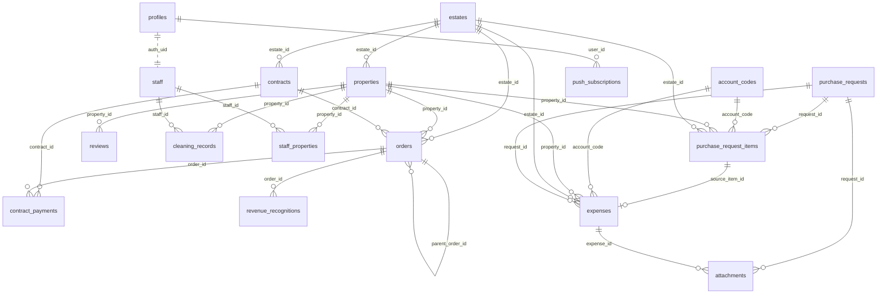
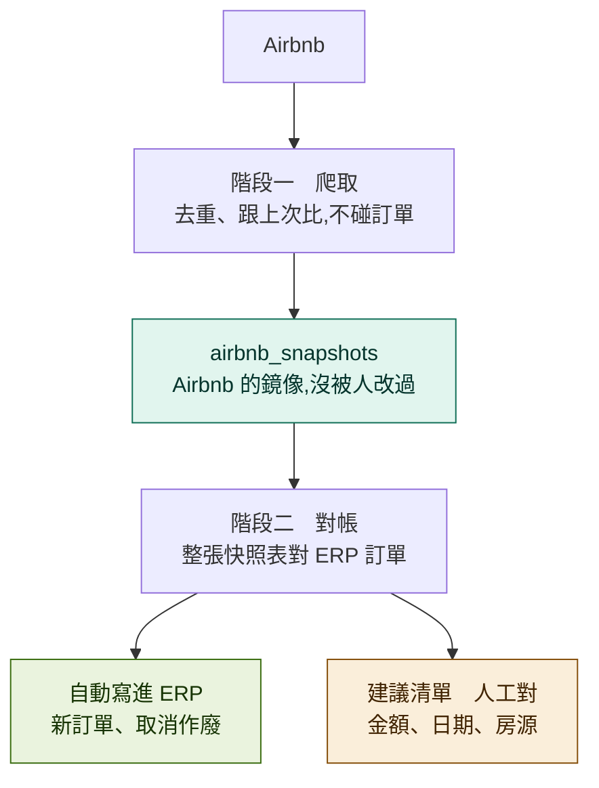

# 安幸上工 — 內部管理網站

Next.js 14 (App Router) + Supabase(Auth + PostgreSQL + RLS)。
短租/長租訂單、收款、營收認列、請款核可、支出、憑證、Airbnb 評價與清潔記錄的一站式後台。
可安裝為 PWA,請款核可有推播通知。

正式站:**https://justwork.estia.com.tw**

> 給非工程同仁的操作說明請看 **[`docs/會計手冊.md`](docs/會計手冊.md)**;
> 請款與支出模組的設計決策見 **[`docs/expenses.md`](docs/expenses.md)**。

**動手前先讀三件事**:〈角色與權限〉、〈Migration 怎麼跑〉、以及文末的〈已知缺口〉—— 這三處是踩坑最多的地方。

---

## 快速開始

```bash
npm install
npm run dev      # http://localhost:3000
```

`.env.local` 需要:

| 變數 | 用途 | 可公開 |
|---|---|---|
| `NEXT_PUBLIC_SUPABASE_URL` | Supabase 專案 URL | ✅ |
| `NEXT_PUBLIC_SUPABASE_ANON_KEY` | 前端 anon key(安全性由 RLS 保護) | ✅ |
| `SUPABASE_SERVICE_KEY` | 匯入 / 管理 API 用的 service role key | ❌ 僅伺服器 |
| `IMPORT_KEY` | `/api/import/*` 的共享密鑰(header `x-import-key`) | ❌ |
| `NEXT_PUBLIC_VAPID_PUBLIC_KEY` | Web Push 公鑰(前端訂閱用) | ✅ |
| `VAPID_PUBLIC_KEY` / `VAPID_PRIVATE_KEY` | Web Push 簽章 | ❌ 僅伺服器 |

---

## 目錄結構

```
src/
  middleware.ts                  未登入一律導向 /login;/api/import/* 除外
  lib/supabase.ts                createBrowserClient
  app/
    login/page.tsx
    (app)/layout.tsx             側邊選單(依 profiles.role 過濾)
    (app)/shortterm/page.tsx     短租訂單與收款(orders)
    (app)/contracts/page.tsx     契約訂單與收款(contracts + orders)
    (app)/dashboard/page.tsx     財務儀表板(手寫 SVG 圖表,零圖表相依)
    (app)/revenues/page.tsx      營收報表(revenue_recognitions)+ xlsx 匯出
    (app)/purchases/page.tsx     請款填寫(purchase_requests + items)+ 兩票核可
    (app)/expenses/page.tsx      支出(expenses)+ 科目/房源分項統計
    (app)/reviews/page.tsx       Airbnb 評價(reviews)
    (app)/cleaning/page.tsx      清潔記錄(cleaning_records)
    (app)/admin/page.tsx         權限管理(分頁):人員 / 物業與負責人(含**管家任期**)/ 收付款帳號 /
                                 常用帳號 / 房源 / **同步建議** / **編輯紀錄**
    api/admin/staff-account/     建立/停權/改密碼/改角色(service role)
    api/push/*                   Web Push 訂閱與發送
    api/import/*                 外部資料匯入端點(排程與爬蟲呼叫)
  components/Receipts.tsx        憑證上傳共用元件(壓縮、暫存、簽名網址)
  lib/sortable.tsx               表頭排序共用元件(SortTh / sortRows)
  lib/period.ts                  期間與日期格式的**單一定義**(ym 是 YYYYMM 不是 YYYY-MM)
  lib/filters.tsx                篩選列共用元件 —— 清除只有一顆,版面全站一致
  lib/hkParse.ts                 排班解析與計數(**全專案風險最高的邏輯**)
  lib/hkParse.test.ts            上面那支的測試
  lib/__fixtures__/hk-202607.ts  7 月真實排班資料,測試的黃金基準
  lib/airbnb-sync.ts             Airbnb 同步的決策規則(純函式,81 個測試)
  lib/airbnb-reconcile.ts        階段二對帳:讀整張快照表 → 決策 → 寫回
  lib/audit-orders.ts            👀防呆:重複、期間重疊、房源過載、房價過低
  lib/estate-manager.ts          管家任期:哪一天誰在管哪個物業
  lib/required.ts / components/Req.tsx   全站必填檢查與紅色星號
  lib/money-input.ts             金額欄位的千分位與游標位置
  lib/share.ts                   請款單與押金退款分享到 LINE(訊息隨狀態改)
public/
  manifest.webmanifest           PWA
  sw.js                          service worker(推播接收)
  icons/                         maskable icons
supabase/migrations/             migration_30 ~ 116(見文末索引)
supabase/schema-baseline.sql     線上 schema 快照(**參考用,不可執行**)
supabase/dump-schema.sql         產生上面那份快照的目錄查詢
archive/                         已完成任務的東西(見 archive/README.md)
smoke-test.ps1                   線上端點煙霧測試 —— build 過不等於服務活著
.gitattributes                   行尾正規化 —— 沒有它 git status 會有 44 個假異動
deploy.ps1                       一鍵部署:測試 → build → commit → push
docs/                            會計手冊、模組設計文件
```
`npm test` 跑 `src/**/*.test.ts`,目前 **649 則**。全部是純函式 —— 測試跑不到 `.tsx`(執行環境不會處理 JSX),所以**只要邏輯值得測,就必須寫在 `.ts` 而不是元件裡**。這條限制其實是好事:它逼著把「算什麼」跟「畫什麼」分開。

| 檔案 | 則數 | 釘住什麼 |
|---|---|---|
| `airbnb-sync.ts` | 81 | 同步的每一條決策規則 |
| `audit-orders.ts` | 33 | 👀防呆的五種檢查 |
| `notify-text.ts` | 22 | 推播內文的格式與截斷 |
| `estate-manager.ts` | 20 | 管家任期的邊界(交接當天、重疊) |
| `share.ts` | 18 | 分享訊息隨單據狀態改寫 |
| `money-input.ts` | 13 | 千分位與游標位置 |
| `required.ts` | 7 | 必填判斷 |
| `hkParse.ts` 等 | 其餘 | 排班解析(**全專案風險最高的邏輯**) |


`src/data/` 的一次性 seed 資料與四支 seed 端點已移到 `archive/seed-2026-07/`。它們沒有防重跑機制,再呼叫一次會產生整批重複訂單 —— 一個只會用一次卻能造成大範圍損害的端點,留在線上是純風險。

`revenue_recognitions.ym` 存的是**六碼無連字號**(`202608`),不是 `2026-08`。拿 `2026-08` 去比會**安靜地回空集合** —— 字串比較下 `'202608' >= '2026-08'` 成立、`<= '2026-08'` 不成立,整個區間被排除。儀表板上線當天就中了這一發,畫面顯示營收 0 而那個月實際有八百多萬。格式一律用 `lib/period.ts`,那裡有測試釘住。

`middleware.ts` 有一個容易重蹈的坑:**redirect 時必須把刷新後的 auth cookie 一起帶上**。`NextResponse.redirect()` 會丟掉 `response.cookies` 裡的內容,而 Supabase 的 refresh token 是**一次性**的 —— 一旦刷新後的新 token 沒寫回瀏覽器,舊的那顆也同時失效,症狀是「隔天要重新登入」。

---

## 角色與權限

角色存於 `profiles.role`,RLS 全部透過 `current_role_of()` 判斷:

```sql
create function current_role_of() returns text
  language sql stable security definer as $$
  select role from profiles where id = auth.uid() and active $$;
```

### 職位是主軸,權限是衍生的

使用者只會看到「職位」,權限由職位 1:1 推導出來,不能各自設定(`migration_33`)。少了這條規則,同一個人可能出現「職位是房務、權限是總經理」這種對不起來的組合。

| 職位 `staff.staff_type` | → 權限 `profiles.role` | 權限顯示名 |
|---|---|---|
| 管家 `housekeeper` | `housekeeper` | 一般 |
| 房務 `roomservice` | `housekeeper` | 一般 |
| 經理 `manager` | `manager` | 主管 |
| 會計 `accountant` | `accountant` | 會計 |
| 總經理 `gm` | `super_admin` | 總經理 |
| 其他 `other` | `housekeeper` | 一般 |

改職位會同時更新 `staff.staff_type`、`staff.role` 與 `profiles.role`。資料庫另有保護:**不能把最後一個 `super_admin` 降級**,否則沒人進得了設定頁。

核可流程上的稱呼是「主管核可」與「總經理核可」,對應 `manager` 與 `super_admin` 兩票。

### 各角色能做什麼

| 角色 | 側邊選單 | 資料權限重點 |
|---|---|---|
| 一般(管家/房務) | 短租、契約、請款、評價、清潔 | 讀寫 `orders` / `contracts` / `contract_payments`;請款單**只看得到自己送的**;**看不到** `expenses`、`revenue_recognitions`、`revenue_snapshots` |
| 主管 `manager` | + 儀表板、營收、支出 | 讀寫 `orders`/`reviews`/`cleaning_records`/`expenses`;請款**投主管那一票**;可排付款與確認出款 |
| 會計 `accountant` | 短租、契約、儀表板、營收、請款、支出 | **讀寫** `orders`/`contracts`/`invoices`/`expenses`(見下);請款單看得到全部但**不得核可**;可排付款與確認出款 |
| 總經理 `super_admin` | + 設定 | 全部,含 `estates`/`properties`/`staff`/`profiles`/`account_codes`/`payment_accounts`;請款**投總經理那一票**;可編輯任何人未核可的請款單 |

所有 public schema 的表都已啟用 RLS。

### 會計權限的演進(migration 41 → 44)

`accountant` 是後加的角色,`migration_30` 只給了 `for select`。實際用起來陸續發現三個做不到的事,現在都已開放:

| 症狀 | 原因 | 修正 |
|---|---|---|
| 不能確認收款 | `orders_accountant_read` 只有 SELECT | `migration_41` |
| 不能開發票 | `invoices_accountant_read` 只有 SELECT | `migration_42` |
| 不能編輯契約日期 | 同上 + 見下方那個坑 | `migration_43/44` |

⚠️ **`migration_41` 當時加的 `orders_guard_accountant` 觸發器自己造成了新問題**:它用欄位白名單限制會計能改 `orders` 的哪些欄位,但編輯契約會觸發 `gen_contract_orders()` 重產月租單,而那支函式**不是** `SECURITY DEFINER`,它的巢狀 UPDATE 一樣會撞上白名單。結果是「會計改契約日期存不進去,且沒有錯誤訊息」。`migration_44` 移除該觸發器,改為完整 ALL 權限。

`revenue_recognitions` **維持唯讀**,對所有角色皆然 —— 那是 `orders` 的衍生資料,能手改就會跟來源對不起來。要改金額請改 `orders`。

### RLS 管不到的地方

RLS 是列層級的,無法表達「這個角色不能改這一欄」。以下規則改用觸發器實作:

| 規則 | 實作 |
|---|---|
| 會計不得核可請款單 | `pr_guard_votes()` 觸發器 |
| 免核門檻(< NT$3,000 自動核可) | `pr_apply_status()` 觸發器,**前端不自己算** —— 否則改前端就能繞過門檻 |
| `total_amount` 不接受前端寫入 | `sync_pr_total()` 觸發器由項目重算 |
| 未核可不能填出款日 | CHECK 約束 `pr_purchase_chk` |
| 出款帳號只有匯款/信用卡能填 | CHECK 約束 `pr_planned_chk`(`migration_49`) |
| 憑證號碼與「無憑證」互斥 | CHECK 約束 `pr_voucher_chk` / `exp_voucher_chk`(`migration_52`) |

> 開放新角色的做法是**追加一條 policy**,不改寫既有的 —— Postgres 的 permissive policy 是 OR 關係,追加不會動到原本的判斷,避免重寫時把既有權限改壞。

### 請款單的編輯權限

| 狀態 | 誰能編輯 |
|---|---|
| `draft` / `rejected` | 申請人本人、總經理 |
| `pending` 審核中 | 申請人本人、總經理 —— **存檔會清空既有核可票並重新送審** |
| `approved` 已核可 | 申請人本人、總經理 —— **同樣清票重送審**。但**出款日一填、支出一產生就鎖住**(`migration_73`) |

原本 approved 完全不能改,理由是「錢要出去了,改內容等於繞過審核」。那個理由只在「改了不用重審」的前提下成立 —— 現在改內容一定伴隨重新送審,就不成立了。真正的紅線移到 `purchased_on` / `expense_generated_at`:支出一產生就是錢真的花掉的紀錄,只能到支出頁調整或撤銷重開。押金退款流程同一套規則,紅線是 `returned_on`。

重新送審的實作是把 `status` 先退回 `draft`、清空兩個 `*_approved_at`,寫完項目再送 `pending`。這樣直接重用既有狀態機,而且**免核門檻會依新金額重算** —— 5,000 改成 2,000 會自動核可,不會卡在 pending 等兩張不需要的票。

撤銷(刪除)的條件寫在 RLS:`expense_generated_at is null`。已產生支出的單不能撤 —— 支出是錢真的花掉的紀錄,而 `gen_expenses_from_pr()` 只在出款日「從無到有」時建立支出,單子刪掉後重填也補不回來。

---

## 資料庫架構

### ER 圖



### 三層核心關係

```
主體層          交易層                     報表層
estates  ──┐
           ├─► orders ───(trigger)───► revenue_recognitions   (即時,依月切分)
properties ┘      ▲
                  │ (trigger 產生 LT_ 月租單)
contracts ────────┘

                                        revenue_snapshots      (歷史月份快照,無 FK)
```

收入與支出是兩條獨立的鏈,**目前不在系統內相減**(損益要靠營收報表與支出頁各自匯出 Excel 後合併):

```
收入鏈   contracts / 匯入 ──► orders ──► revenue_recognitions
支出鏈   purchase_requests ──► purchase_request_items ──► expenses
                                    (填採購日時逐項產生,1 對 1)
```

### 外鍵一覽

| 子表.欄位 | → 父表.欄位 | on delete |
|---|---|---|
| `properties.estate_id` | `estates.id` | NO ACTION |
| `orders.estate_id` | `estates.id` | NO ACTION |
| `orders.property_id` | `properties.id` | NO ACTION |
| `contracts.estate_id` | `estates.id` | NO ACTION |
| `contract_payments.contract_id` | `contracts.id` | **CASCADE** |
| `contract_payments.order_id` | `orders.id` | NO ACTION |
| `revenue_recognitions.order_id` | `orders.id` | **CASCADE** |
| `reviews.property_id` | `properties.id` | NO ACTION |
| `cleaning_records.property_id` | `properties.id` | NO ACTION |
| `cleaning_records.staff_id` | `staff.id` | NO ACTION |
| `staff_properties.staff_id` | `staff.id` | **CASCADE** |
| `staff_properties.property_id` | `properties.id` | **CASCADE** |
| `purchase_requests.requester_id` | `auth.users.id` | NO ACTION |
| `purchase_request_items.request_id` | `purchase_requests.id` | **CASCADE** |
| `purchase_request_items.property_id` | `properties.id` | NO ACTION |
| `purchase_request_items.account_code` | `account_codes.code` | NO ACTION |
| `purchase_request_items.estate_id` | `estates.id` | NO ACTION |
| `expenses.source_item_id` | `purchase_request_items.id` | **SET NULL**(且 UNIQUE) |
| `expenses.request_id` | `purchase_requests.id` | **SET NULL** |
| `expenses.estate_id` | `estates.id` | NO ACTION |
| `expenses.property_id` | `properties.id` | NO ACTION |
| `expenses.account_code` | `account_codes.code` | NO ACTION |
| `attachments.request_id` | `purchase_requests.id` | **CASCADE** |
| `attachments.expense_id` | `expenses.id` | **CASCADE** |
| `attachments.uploaded_by` | `profiles.id` | NO ACTION |
| `push_subscriptions.user_id` | `profiles.id` | **CASCADE** |

> 未建 FK 但邏輯上相關:`orders.contract_id → contracts.id`、`orders.parent_order_id → orders.id`(加費/移房子單)、`orders.move_group`(同一次移房的群組 id)、`profiles.id` 與 `staff.auth_uid` 皆指向 `auth.users.id`。

### 唯一鍵(冪等匯入的依據)

| 表 | 唯一鍵 |
|---|---|
| `orders` | `order_key` |
| `reviews` | `airbnb_review_id` |
| `cleaning_records` | `record_key` |
| `properties` | `airbnb_listing_id` |
| `estates` | `name` |
| `staff` | `name` |
| `contract_payments` | (`contract_id`, `period_start`) |
| `staff_properties` | (`staff_id`, `property_id`) — 複合主鍵 |
| `purchase_requests` | `req_no`(`PR-YYYYMM-NNN`,由 `next_req_no()` 產生) |
| `expenses` | `source_item_id` — **一個請款項目只能產生一筆支出**,這條在 DB 層成立,不靠應用層自律 |
| `attachments` | `path` — storage 裡的路徑,一個檔案只登記一次 |
| `push_subscriptions` | `endpoint` |
| `payment_accounts` | `code` |

### 查詢索引

| 表 | 索引欄位 |
|---|---|
| `orders` | `checkin`, `checkout`, `estate_id`, `source` |
| `revenue_recognitions` | `ym`, `order_id` |
| `revenue_snapshots` | `ym`, `estate_name` |
| `reviews` | `property_id`, `checkout_date`, `overall_rating` |
| `cleaning_records` | `record_date`, `property_id`, `staff_id`, `overall_rating`, `note`(gin_trgm) |

---

## 各表說明

### `estates` 物業
`id, name*, ~~manager~~, sort, active, created_at`
最上層。`manager` 這一欄**已棄用**(`migration_115`)—— 它沒有時間維度,管家輪動後改掉那格,過去所有評價的歸屬就跟著一起變,而且沒有任何跡象顯示這件事發生過。現在改用 `estate_managers` 記任期,評價依退房日回查。欄位暫時保留是為了不動到還沒改完的呼叫點,確認沒人用之後可以移除。

### `properties` 房源
`id, name, estate_id→estates, airbnb_listing_id*, name_aliases text[], active, created_at`
`airbnb_listing_id` 是 Airbnb 匯入時對應房源的主要鍵;抓不到時退回 `name` 的模糊比對(`normUnit()` 正規化房號)。

### `staff` 人員 / `profiles` 帳號
- `staff`: `id, name*, aliases text[], staff_type, role, email, auth_uid, active, sort`
- `profiles`: `id (= auth.users.id), name, role, active`

`staff` 是人員名冊(清潔記錄用 `name`/`aliases` 比對),`profiles` 是登入帳號。兩者透過 `staff.auth_uid = profiles.id` 對應,由 `/api/admin/staff-account` 維護(建立帳號、改密碼、停權、改角色會同時更新兩張表)。

### `contracts` 契約
`id, name, type(longterm|company|office), estate_id→estates, room, property_raw, tenant_name, phone,
start_date, end_date, cadence(monthly|quarterly|halfyear|yearly), monthly_rent, amount_per_period, deposit,
first_payment_date, pay_day, account, note, paid, deposit_received(_at), deposit_returned(_at),
active, auto_renew, watch, display_name, created_at`

`watch` = 釘選到「本月已收/未收」清單;`display_name` = 自訂顯示名;`auto_renew` = 到期後自動續產月租單。

### `orders` 訂單(全站交易中心)
`id, order_key*, source, estate_id→estates, property_id→properties, property_raw, guest_name,
checkin, checkout, nights, amount, paid_amount, deposit, deposit_received(_at), deposit_returned(_at),
fx_revenue jsonb, fx_deposit jsonb, account, note, fee_type, item_name, paid, paid_at,
account_code→account_codes, invoice_required, invoice_title, invoice_tax_id,
contract_id, parent_order_id, move_group, imported_via, created_at`

`paid_amount` 由 `order_payments` 加總而來(`migration_84`),**前端不要寫**。與 `amount` 比對得出未收款 / 部分收款 / 已收款。

`account_code` 是**系統自動填的**(`migration_91`)—— 訂單表單上沒有這個欄位,規則見〈錢的流向 → 會計科目〉。

`fee_type` 是**名目**不是會計科目(水費、電費、停車費……),`item_name` 是名目底下的細目
(例如 `fee_type='設備費'` + `item_name='冰箱'`)。合成一個字串的話,報表上會出現「設備費－冰箱」
「設備費－電視」兩個各自獨立的分類,永遠回答不了「設備費一共收多少」。

`source` 值:

| 值 | 意義 | 產生方式 |
|---|---|---|
| `airbnb` | Airbnb(含 co-host 搭檔收款) | 自動匯入 |
| `agoda` | Agoda | 匯入 |
| `private` | 直客短租 | 手動 / 匯入 |
| `oneoff` | 一次性收入(取消費、加費、**折讓**) | 觸發 / 手動 |
| `longterm` / `company` / `office` | 長租 / 公司戶 / 辦公室月租 | **由 contracts 觸發器產生** |

`imported_via`:`contract`(觸發器產生,可被覆寫)/ `auto`(爬蟲)/ `excel` / `manual` / `extend`(手動展延)。

`order_key` 命名規則:`LT_{room}_{YYYYMM}` 月租、`CFEE_…` 契約加費、`FEE_…` 訂單加費、`MOVE_…` 移房子單、`CDIS_…` 契約折讓、`OO_/PV_…` 手動一次性/直客。

**契約折讓分兩層**(`migration_48`):

| | 存在哪 | 影響金額 |
|---|---|---|
| 折讓**約定** | `contracts.concessions` jsonb,可多筆 | ❌ 純文字備查 |
| **實際**折讓 | `orders` 的負數 `oneoff` 列(`CDIS_…`,`fee_type='折讓'`) | ✅ 該月營收自動減少 |

實際折讓不直接改月租單的金額,因為 `LT_{room}_{YYYYMM}` 是 `gen_contract_orders()` 產的 —— 只要之後編輯一次契約(改租期、改租金),觸發器就會把未收款的月份重新產生,折讓後的金額會被無聲蓋回原價。獨立一筆負數訂單就不會被動到,而且 `oneoff` 本來就流進 `revenue_recognitions`,營收自動變少,不用另外寫連動。

收租畫面顯示淨額並載明原始金額:`應收 $80,000（原 $100,000 − 折讓 $20,000）`,備註自動寫成算式。同一期折讓第二次時會多帶一段「已折讓 $X」,算式才對得起來。

### `revenue_recognitions` 營收認列(由觸發器維護,勿手改)
`id, order_id→orders(CASCADE), ym, period_start, period_end, source, estate_id, property_id,
estate_name, property_raw, guest_name, checkin, checkout, total_amount, total_nights,
month_nights, month_amount, fee_type, created_at`

一張 `orders` 依住宿區間切成多個月份列,金額按住宿天數比例攤分。營收報表頁直接查這張表。

**攤分方式:捨去 + 尾期補餘額**(`migration_53`)

```
除了最後一個月 →  trunc(amount × month_nights / total_nights)   無條件捨去到整數
最後一個月     →  amount − 前面各月的合計                        餘數全給它
```

10,000 分三期 → 3,333 + 3,333 + **3,334** = 10,000。舊版是每月各自 `round(..., 2)`,結果帳上出現 333.33 這種小數,而且三個月加起來 999.99 對不上 1,000。

「最後一個月」是**時間上最晚**的那個,用 `date_trunc('month', checkout - 1)` 判斷 —— `checkout` 是退房日不算一晚,7/30 進 8/1 出的最後一晚在 7/31,所以尾差記在 7 月不是 8 月。餘數放最後一期而非第一期,是因為最後一期通常還沒結案,調整它不會動到已經對過帳、出過月報的月份。

用 `trunc` 而非 `floor` 是為了負數 —— `floor(-3333.3) = -3334` 會變成「捨去反而變大」。正數兩者相同。

`source='oneoff'` 不跨月,整筆記在 `checkin` 當月。契約折讓就是走這條路的負數訂單。

> 這張表對**所有角色唯讀**。它是 `orders` 的衍生資料,能手改就會跟來源對不起來。改金額請改 `orders`,觸發器會重算。

### `revenue_snapshots` 歷史營收快照
`id, ym, source, estate_name, property_raw, guest_name, checkin, checkout,
total_amount, month_amount, month_nights, total_nights, note, created_at`
無外鍵,系統上線前的歷史月份資料,由 `/api/import/snapshots` 全刪重建。

### `reviews` Airbnb 評價
`id, airbnb_review_id*, property_id→properties, listing_name_raw, guest_name,
checkin_date, checkout_date, nights, overall_rating,
comment, comment_original, comment_language,
rating_checkin / _cleanliness / _accuracy / _communication / _location / _value,
detail_comments jsonb, host_reply, source_url, imported_via, scraped_at`

`detail_comments` 內含 `private_feedback`、`private_feedback_localized`、`tags`。重新匯入時**已翻成中文的 `comment` 不會被覆蓋**。

### `cleaning_records` 清潔記錄
`id, record_key*, record_date, staff_name, staff_id→staff, staff_type,
property_id→properties, property_raw, estate_name, overall_rating, note, doc_url, source, created_at`
`staff_name` 先用 `staff.name` / `staff.aliases` 對應;房源用 `normUnit()` 模糊比對。評分可從 note 的「N 星」解析。

### `contract_payments` 契約期款
`id, contract_id→contracts(CASCADE), order_id→orders, period_start, period_end, amount, confirmed, confirmed_at`
唯一鍵 (`contract_id`, `period_start`)。目前前端未使用,收款狀態實際記在 `orders.paid` / `paid_at`。

### `staff_properties` 人員 × 房源
複合主鍵 (`staff_id`, `property_id`),雙向 CASCADE。目前前端未使用。

### `order_payments` 訂單收款(`migration_84` / `85`)
`id, order_id→orders(CASCADE), paid_on, amount, method, account, invoice_no, note, created_by, created_at`

一張訂單可以收很多次,收幾次填幾次,直到收滿為止。`method`:`cash` 現金 / `crypto` 加密貨幣 /
`credit_card` 信用卡 / `transfer` 匯款。

`op_account_chk` 要求**只有匯款才能填收款帳戶** —— 現金收款卻掛著一個銀行帳號,對帳時分不出那是真的還是誤填。

每一筆收款可以附憑證照片(`attachments.order_payment_id`,`migration_85`),證據跟著那一筆走而不是掛在訂單上 ——
掛在訂單上的話,收了三次就有三張圖混在一起,對不出哪張是哪次。

### `contract_recurring_charges` 契約固定加費(`migration_86`)
`id, contract_id→contracts(CASCADE), fee_type, item_name, amount, active, created_at`

管理費、停車費、設備費這類每期都發生的費用。`gen_contract_fee_orders()` 依契約期數逐期產生訂單,
鍵 `CRC_{id}_{YYYYMM}`、`imported_via='contract_fee'`。**已收款的那一期不會被動到**(`paid = false` 才覆寫)。

### `account_codes` 會計科目主檔
`code(PK), name, sort, active, kind`

收支**共用同一份科目表**(`migration_90`)。目前 23 個科目,所有登入者可讀,只有 `super_admin` 可改
—— 而且系統裡**沒有新增科目的畫面**,一律用 SQL 加。

`kind` 決定方向,是 `migration_90` 新增的:

| 值 | 意義 | 例 |
|---|---|---|
| `expense` | 只用於支出 | 保險費、薪資勞務、規費稅捐 |
| `income` | 只用於收入 | 租金收入 |
| `both` | 收支兩用 | 清潔費、管理費、水電瓦斯、修繕維護、網路第四台、停車費、設備費、其他 |

同一個科目兩用是正常的會計做法 —— 清潔費跟房客收是收入、付清潔公司是支出,損益表上各站一邊,
不必拆成兩個名字。畫面依情境只顯示該方向的選項,所以支出的下拉裡不會出現「租金收入」。

**`kind` 使用者不填也看不到。** 值在 migration 裡寫死,前端只拿它過濾下拉。

⚠️ **改科目一律只改 `name`,不要改 `code`。** 既有支出是靠 `code` 掛著的(`expenses.account_code` 有外鍵),
改 code 會讓所有既有支出對不到科目。`migration_46`(差旅交通)、`migration_90`(房租支出 → 租金支出)都走這條路。

### `payment_accounts` 出款帳戶主檔(`migration_38`)
`code(PK), name, method(cash|transfer|credit_card|crypto), card_last4, for_payment, for_receipt, active, sort`

我方的錢從哪裡出、收到哪裡去。依 `method` 分組:匯款可有多個銀行帳號,信用卡可有多張。請款單的出款帳號、支出的付款帳號、短租與契約的入款帳號都從這裡取,不再各自打字。

### `purchase_requests` 請款單
`id, req_no*, requester_id→auth.users, status, total_amount,
currency, fx_rate,
payment_method, payee_bank_code, payee_account, payee_company, payee_tax_id,
planned_transfer_on, payout_account, purchased_on,
voucher_no, no_voucher, fee_mode, fee_amount,
note, submitted_at, manager_approved_by/_at, admin_approved_by/_at,
rejected_by/_at, reject_reason, expense_generated_at, created_at`

`status`:`draft` → `pending` → `approved` / `rejected`。

**匯款手續費**(`migration_83`):`fee_mode` = `internal` 內扣(廠商吸收,不另記帳)/ `extra` 不內扣(我方另付)。
選 `extra` 要填 `fee_amount`,而且 `pr_fee_chk` 要求 **`payment_method` 必須是 `transfer`** —— 現金付款不會有匯費。

出款日填了之後,`sync_pr_fee_expense()` 會另外產生一筆支出:科目固定**郵電費**、日期＝出款日、
物業與房源同那張請款單。這支函式是冪等的,條件不再成立時會把那筆支出刪掉
(靠 `expenses.fee_request_id` UNIQUE 認人,不會誤刪別的)。

**兩票並行,沒有先後**:`manager` 一票、`super_admin` 一票,兩票到齊才進 `approved`。總額 < NT$3,000 送出即核可(兩票全免)。**開放自核** —— 主管送的單那一票由他自己投,不再要求第二人(`migration_32`)。

**付款分兩段**(`migration_39`,`migration_49` 放寬時機):

```
填單(可先填預定出款日/出款帳號) → 核可 → 排付款(會計調整計畫) → 確認出款日 → 產生支出
                                                              ↑ 錢真的出去才記帳
```

- `planned_transfer_on` = 打算哪天付(計畫,可改)。申請人送單時就能填,現金/匯款/信用卡都有。
- `purchased_on` = 實際哪天付。填了才觸發支出產生,而且這張單就不能再撤銷。
- `payout_account` = **我方**出款帳號/信用卡,對應 `payment_accounts.code`。信用卡的用詞是「刷卡日/刷卡卡片」,同一組欄位換個說法。

`payee_*` 存的是**收款方(廠商)**的帳戶資訊,與 `payout_account`(我方)方向相反,兩者不互通。

**幣別**(`migration_40`):一張單限定一種幣別,支援 TWD / USD / JPY / CNY / EUR,匯率手動填。`amount_original` 存使用者輸入的原幣金額,`amount` 一律存台幣。換算在存檔時一次做完,資料庫不會有「一半換過一半沒換」的中間狀態。免核門檻看的是**換算後的台幣**。

**憑證**(`migration_52`):`voucher_no` 與 `no_voucher` 互斥,由 CHECK 約束保證。分成兩件事是為了讓「還沒填」和「本來就沒有」在帳上分得出來 —— 只留一個空白欄位的話,會計永遠不知道還要不要追這張發票。

`total_amount` 由 `sync_pr_total()` 觸發器維護,**前端勿寫**。

CHECK 約束 `pr_purchase_chk`:`purchased_on` 只有在 `status='approved'` 時才能有值,**「未核可不能出款」寫在資料庫層**,不是只靠前端藏按鈕。

### `purchase_request_items` 請款項目
`id, request_id→purchase_requests(CASCADE), item_name, amount, amount_original,
account_code→account_codes, purpose_type(estate|office),
estate_id→estates, property_id→properties, note, sort`

一張請款單含多個項目。

**用途是物業層級**(`migration_34`)。原本綁在房源上,但多數支出(水電、清潔、耗材)是整棟共用的,逐間房挑一個等於亂記。`purpose_type='office'` 表示安幸辦公室,此時 `estate_id` 與 `property_id` 都必須為 null。房源(`property_id`)是**選填**的細分(`migration_47`),知道是哪一間就填,之後要追單一房間的花費才有依據。

### `expenses` 支出
`id, spent_on, item_name, amount, amount_original, currency, fx_rate,
account_code→account_codes, purpose_type, estate_id→estates, property_id→properties,
voucher_no, no_voucher, payment_method, pay_account,
note, source_item_id→purchase_request_items(UNIQUE), request_id→purchase_requests,
parent_expense_id→expenses(CASCADE), gross_amount, deferred, starred,
created_by, created_at`

兩種來源:請款連動產生(`source_item_id` 有值)、或直接手動新增(為 null)。

**遞延認列的三個欄位**(`migration_88`,完整規則見〈錢的流向〉):

| 欄位 | 誰有值 | 意義 |
|---|---|---|
| `parent_expense_id` | 只有子單 | 指回母單。母單為 null |
| `gross_amount` | 只有遞延母單 | **實付總額**。`amount` 是「這一天認列多少」,不是「付了多少」 |
| `deferred` | 只有母單 | 子單不標記 —— 子單靠 `parent_expense_id` 辨認 |

`exp_deferral_chk` 列舉出三種合法身分(一般支出 / 遞延母單 / 子單),寫成寬鬆條件的話會出現
「`deferred=true` 但 `gross_amount` 是 null」—— 那種列會讓等式守衛直接跳過不驗,母子金額對不上也沒人發現。

`starred` 關注支出(`migration_89`):**遞延母子單會雙向連動**,打其中一個整組都亮。部分索引 `exp_starred_idx`。

`request_id`(`migration_55`)記錄這筆支出來自哪張請款單。除了追溯來歷,憑證照片也靠它沿用 —— **照片不複製**,一張請款單常拆成好幾筆支出,複製會讓同一張發票在 storage 出現 N 份,某天有人刪掉其中一個,其他還在,對帳時分不出哪張才算數。憑證**號碼**則是真的複製一份,因為同一張發票本來就對應多個項目,對帳靠這個號碼把它們串回去。

**連動產生的支出只有 `super_admin` 能刪。** 兩票核可是為了管錢,若那筆錢的紀錄一個人就能刪掉,這道關卡等於白設;而且刪除是靜默的 —— 請款單仍顯示已核可、有出款日,支出卻不見了,兩邊對不上而系統不會叫。

### `attachments` 憑證附件(`migration_51`)
`id, request_id→purchase_requests(CASCADE), expense_id→expenses(CASCADE),
path*, file_name, mime_type, size_bytes, uploaded_by→profiles, created_at`

檔案本體在 Supabase Storage 的 **`receipts`** bucket(私有,10MB 上限),這張表只存路徑與歸屬。CHECK 約束 `att_one_parent` 要求兩個父鍵**恰好一個**有值。

沒有在請款單上加一個 `image_url` 欄位,因為一張單常常有好幾張發票,單一欄位放不下,而且刪檔案要順便清欄位,很容易留下指向不存在檔案的死連結。

路徑約定 `pr/{request_id}/{uuid}.{ext}` 與 `exp/{expense_id}/{uuid}.{ext}` —— **storage 的 RLS policy 直接解析這個路徑判斷權限,格式不能亂改**。權限判斷集中在兩支 `SECURITY DEFINER` 函式:`can_see_receipt(path)` 與 `can_edit_receipt(path)`。

bucket 私有代表看圖要用簽名網址(前端 `createSignedUrls`,1 小時到期)。手機拍的照片會先在瀏覽器壓到長邊 1600px 的 JPEG 再上傳,4MB 通常剩 300KB 左右。填新單時還沒有 id、路徑組不出來,選的檔案會先暫存在瀏覽器,母單建立後才真正上傳。

### `push_subscriptions` 推播訂閱(`migration_35`)
`id, user_id→profiles, endpoint*, p256dh, auth, user_agent, created_at`

Web Push 的訂閱資料。請款單送審時由資料庫觸發器經 **`pg_net`** 打 `/api/push/notify`,通知有權核可的人(`migration_36`,換網域後 `migration_37`)。用 `pg_net` 而非 Supabase Dashboard 的 Webhook,是因為後者不在版控裡,換網域時會忘記改。

> iOS 的 Web Push 只在**加到主畫面**之後才會運作(16.4+),用 Safari 直接開網站收不到通知。

### `airbnb_snapshots` 爬蟲快照(`migration_116`)
`code (pk), listing_id, guest, start_date, end_date, nights, status_key, earnings, cohost, revenue, first_seen, last_seen, changed_at, change_note, missing_since, raw, seen_count`

Airbnb 的鏡像 —— 爬蟲上次在 Airbnb 看到的樣子,**一筆訂單一列**(不是一天一列)。ERP 的訂單表已經被人改過、被規則擋過,早就不是原貌了;要對帳就得有一份沒被動過的東西可以對。只有 `select` policy,寫入只走服務金鑰 —— 人能改的紀錄就不再是紀錄。詳見「Airbnb 同步:兩階段」。

### `sync_runs` / `sync_issues` 同步紀錄與建議(`migration_113`、`116`)
- `sync_runs`: `id, at, kind, received, inserted, updated, voided, skipped, detail jsonb, scan_from, scan_to`
- `sync_issues`: `(kind, code, field) pk, first_seen, last_seen, from_val, to_val, listing_id, extra jsonb, severity, reason, airbnb_changed`

`sync_runs` 是**流水帳**(永久,只存數字);`sync_issues` 是**待辦**(自清)。分開是刻意的:同一個房源不一致在對照表修好之前每天都會再出現一次,當成流水帳存的話一週後同一個問題有七列,看不出哪一列還算數。

`record_sync_run()` 每次把清單整批換掉,沒再出現的直接刪 —— **清單空了就代表真的沒事**,那是流水帳給不了的保證。`first_seen` 刻意不動,所以看得到「這條掛多久了」。

### `estate_managers` 管家任期(`migration_115`)
`id, estate_id→estates, staff_id→staff, start_date, end_date, note, created_at, created_by`

`end_date` 為 null 代表至今,含頭含尾。評價依**退房日**回查這張表決定歸屬 —— 改管家不會動到歷史成績。`estates.manager` 沒有時間維度,改一次就重寫全部歷史,**已棄用不要再讀**。

---

## 錢的流向:人工做什麼、系統做什麼

> 這一節是整份文件最該先讀的部分。系統裡幾乎每一個「數字自己變了」的疑問,答案都在這裡。
>
> **原則:認列與現金是兩件事,而且收入與支出的順序剛好相反。**

### 一句話總覽

| | 先發生 | 後發生 |
|---|---|---|
| **收入** | **訂單認列**(系統自動,建單當下) | **現金認列**(人工,收到錢才登記) |
| **支出** | **現金認列**(人工,付了錢才產生) | **遞延認列**(人工,可選,事後拆到各月) |

收入是「先算帳、後收錢」:訂單一建立,營收就按月拆好了,跟錢到了沒有完全無關。
支出是「先付錢、後算帳」:錢出去了才有支出列,要分攤到別的月份是之後再做的事。

兩邊順序相反不是設計失誤 —— 收入的義務在訂單成立時就發生,支出的事實在付款時才發生。

---

### 收入:訂單認列 → 現金認列

```
[系統] 契約觸發器 / 匯入 / 手動建單
          ↓
       orders 一筆
          ↓
[系統] orders_recognize 觸發器 → gen_recognitions()
          ↓
       revenue_recognitions 逐月拆好      ← ★ 營收在這一刻就成立了
          ↓
[人工] 訂單上按「收款」,填收款日/金額/方式/帳號,可附圖
          ↓
       order_payments 一筆(可多筆,收幾次填幾次)
          ↓
[系統] sync_order_paid() 加總 → orders.paid_amount
          ↓
       狀態自動變成 未收款 / 部分收款 / 已收款
```

**人工要做的**

| 動作 | 在哪 | 說明 |
|---|---|---|
| 建立訂單 | 短租訂單頁 / 契約頁 | 契約的月租單不用建,觸發器會產生 |
| 登記收款 | 訂單抽屜 →「收款」 | 收款日、台幣金額、**收款方式**、憑證照片 |
| 選收款帳戶 | 同上 | **只有「匯款」才需要**;現金/加密貨幣/信用卡不填(`op_account_chk` 擋著) |
| 勾「要開發票」 | 訂單表單 | 勾了之後在收款那裡填發票號碼(`migration_87`) |

**系統自動做的**

| 行為 | 觸發時機 | 規則 |
|---|---|---|
| 產生營收認列 | 訂單 INSERT/UPDATE/DELETE | 先刪光該訂單的舊認列再重生。跨月按天數拆,**尾期補餘額**(`migration_53`) |
| 加總已收金額 | `order_payments` 增刪改 | `sync_order_paid()` 寫回 `orders.paid_amount` |
| 訂單金額改了重算 | `orders.amount` 變動 | `trg_orders_resync_paid` 重新比對收款狀態 |
| 一個月只留一列認列 | 隨時 | `uq_recognition_order_month` 唯一索引(`migration_82`)—— 結構上不可能重複算 |
| 刪契約 → 營收一起消失 | 契約 DELETE | 外鍵 CASCADE(`migration_81`)。之前會留下 757 筆對不到契約的孤兒訂單,營收永遠算得出來但沒人知道從哪來 |

> ⚠️ **收款不影響營收。** 一筆訂單全額收清或一毛沒收,`revenue_recognitions` 完全一樣。
> 儀表板的營收讀的是認列表,不是收款 —— 這是刻意的,不是 bug。

---

### 支出:現金認列 → 遞延認列

```
[人工] 填請款單(多項目、幣別、預定出款日)
          ↓  送出
[系統] pr_apply_status() 狀態機:判斷免核門檻 / 等兩票
          ↓
[人工] manager 一票 + super_admin 一票(可駁回、可撤銷)
          ↓
       status = approved
          ↓
[人工] 實際付款後,填「出款日」                    ← ★ 紅線,填了就鎖住
          ↓
[系統] gen_expenses_from_pr() 逐項產生 expenses    ← ★ 現金認列成立
          ↓
[系統] 若勾了「手續費不內扣」→ 另生一筆郵電費支出
          ↓
[人工] (可選) 在支出上開「遞延認列」,填各期認列日與金額
          ↓
[系統] 拆成母單 + N 張子單,並強制 母單+子單 = 實付總額
```

**人工要做的**

| 動作 | 在哪 | 說明 |
|---|---|---|
| 填請款單 | 請款單頁 | 可多項目,每項各有科目/用途/物業/憑證 |
| 核可 | 請款單抽屜 | manager 與 super_admin 各一票,**並行沒有先後**;會計不能投票 |
| 填預定出款日 | 請款單 | 申請時就能填(`migration_49`),只是排程用 |
| 勾手續費處理 | 請款單 | **內扣**(廠商吸收)/ **不內扣**(我方另付)。不內扣要填金額,且**只有匯款才能選**(`pr_fee_chk`) |
| 填出款日 | 請款單 | **這是不可逆的一步** —— 支出在這一刻產生,而且日期之後不能改 |
| 設遞延認列 | 支出頁 → 檢視抽屜 | 填每一期的認列日與金額,**合計必須剛好等於實付總額**才能存 |
| 打星關注 | 支出列表,檢視旁邊 | 大額的、有爭議的、要跟廠商對的 |

**系統自動做的**

| 行為 | 觸發時機 | 規則 |
|---|---|---|
| 重算請款單總額 | 項目增刪改 | `sync_pr_total()`,前端不要寫 `total_amount` |
| 狀態機 | 請款單 UPDATE | 送出判免核門檻、兩票到齊翻 `approved`、駁回清票 |
| 擋會計投票 | 請款單 UPDATE | RLS 管不到欄位層級,所以用觸發器擋 |
| 產生支出 | 出款日**從無到有** | `on conflict (source_item_id) do nothing` —— **刪掉了不會補回來** |
| 產生手續費支出 | 同上,且 `fee_mode='extra'` | 科目固定「郵電費」,日期＝出款日,物業與房源同那張請款單(`migration_83`) |
| 推播通知 | 狀態變 `pending` | `pg_net` 打 `/api/push/notify` 通知有權核可的人 |

> ⚠️ **出款日填了就不能改。** `migration_88` 特意把 `gen_expenses_from_pr()` 裡「只改日期就同步支出」那段拿掉了 ——
> 留著的話某天會把母單的日期改掉、子單留在原地,母子單就散了。

---

### 遞延認列:母子單的規則(`migration_88`)

**要解決的問題**:8/8 一次付了半年房租 10,000,不該讓 8 月的費用暴增然後之後幾個月都是 0。

**存下去長什麼樣**

```
母單  8/8   amount 0        gross_amount 10,000   deferred=true
子單  9/8   amount 5,000    parent_expense_id → 母單
子單  10/8  amount 5,000    parent_expense_id → 母單
```

**為什麼母單的金額會變小 —— 這是整個機制最關鍵的一件事**

系統裡**沒有支出認列表**。營收有 `revenue_recognitions`,支出沒有:儀表板、Excel、月報全部直接
`sum(expenses.amount) group by spent_on`。

所以母單若留著 10,000、又生出 5,000+5,000 的子單,報表會算成 20,000 —— **這筆房租變兩倍,而且不會報錯**。

解法是讓 `amount` 的語意從「付了多少」收斂成「**這一天認列多少**」:

```
母單.amount       = 實付總額 − 所有子單合計
母單.gross_amount = 實付總額(對發票、對銀行用)
```

`sum(amount)` 因此恆等於實付總額,**所有既有報表一行都不用改**。
代價是母單的金額可能是 0,所以畫面上一定要把實付總額顯示出來,否則會計拿 10,000 的發票搜不到任何一列。

**行為規則一覽**

| 規則 | 誰負責 | 為什麼 |
|---|---|---|
| 母單 + 所有子單 = 實付總額 | **資料庫**(`trg_expense_deferral_sum`,`deferrable initially deferred`) | 前端也擋,但前端擋不住 API、匯入、下一個工程師。差一塊都不給存 |
| 一筆支出只能是三種身分之一 | 資料庫(`exp_deferral_chk`) | 一般支出 / 遞延母單 / 子單。列舉而不是寫寬鬆條件,避免「標了 deferred 但沒 gross_amount」讓守衛靜靜跳過 |
| **子單不可單獨編輯或刪除** | 前端 + 資料庫 | 要改一律回母單。子單沒有自己的付款事實,它的存在完全依附母單 |
| 子單繼承母單的描述欄位 | 資料庫(`sync_expense_child`) | 科目、用途、物業、房源、憑證、付款方式、幣別、匯率、請款單。**日期與金額不繼承** —— 那正是子單存在的理由 |
| 母單改描述欄位 → 子單跟著改 | 資料庫(`propagate_expense_parent`) | 只在描述欄位真的變動時才跑(WHEN 條件),不會無限遞迴 |
| **母單金額不可改** | 前端(金額輸入框 disabled) | 改了等式就破。要改先取消遞延,重設一次 |
| 母單刪 → 子單一起刪 | 資料庫(`on delete cascade`) | 母單刪了子單沒有意義 |
| 改遞延明細 = 全刪重建 | 前端 | 逐筆比對要處理三種路徑,而等式在中途一定會短暫不成立。全刪重建只有一條路徑,而觸發器是 deferrable,交易結束才驗 |
| `source_item_id` 不繼承 | 資料庫 | 那一欄是 UNIQUE(一個請款項目一筆支出),複製過去直接違反約束。子單靠 `parent_expense_id` 回溯請款單 |

**兩個數字要分開看**

| | 算法 | 意義 |
|---|---|---|
| **認列支出** | `sum(amount)` | 這段期間的**費用**是多少。跟改版前完全一樣 |
| **實際支出** | 只算非子單,母單取 `gross_amount` | 這段期間**真的付出去**多少錢 |

8/8 付 10,000 分兩期:8 月認列 5,000 / 實際 10,000,9 月認列 5,000 / 實際 0。
只看認列會以為 8 月沒花錢,銀行對帳對不上;只看實際會讓 9 月的費用憑空消失。**沒有遞延時兩個數字完全相同**。

兩個數字都在支出頁的統計卡與 Excel 匯出裡。Excel 的「實際支出」欄在子單那列**留空**,不印 0 —— 印 0 會讓人以為那天付了 0 元。

---

### 關注支出:母子單雙向連動(`migration_89`)

星星在支出列表「檢視」的旁邊。打星之後可以篩選,也會出現在財務儀表板。

**連動規則**

```
母單打星  →  所有子單跟著亮
子單打星  →  母單跟著亮,母單再帶動其他兄弟
取消同理
```

一筆錢拆成母單 + N 張子單,使用者的規則是**打其中任何一個,整組都要亮**。

**為什麼寫在資料庫而不是前端**:寫在前端的話,只有「從支出頁點星星」那條路會同步。從儀表板、從匯入、從 API 改的都不會 —— 而不同步不會報錯,只會讓篩選出來的清單少幾張子單,看起來像資料不見了。

**遞迴防護**(母單改 → 更新子單 → 子單觸發器又想更新母單 → 無限迴圈):

1. 兩個觸發器都有 `WHEN` 條件 —— 值真的變了才跑
2. UPDATE 的 WHERE 再比對一次 —— 值一樣就不寫,沒有 UPDATE 就沒有下一輪

**新子單繼承母單的星**:遞延明細改了會全刪重建,不繼承的話那組單的星星每次都掉光,而且沒有任何跡象。

---

### 會計科目:名目 ≠ 科目(`migration_90` / `91`)

**兩層,不要混在一起**:

* **名目** = 收款畫面上選的細項(`orders.fee_type`):水費、電費、瓦斯費、停車費……
* **會計科目** = 損益表上的分類(`account_codes`),本來就該比名目粗

| | 誰填 |
|---|---|
| **支出的科目** | **人工選**(請款單與支出頁的下拉) |
| **收入的科目** | **系統自動填,使用者完全不用選** —— 訂單表單上沒有這個欄位 |

**收入的對應規則**(`order_account_code(source, fee_type)`,回填與觸發器共用同一份):

| 來源 / 名目 | 計入科目 |
|---|---|
| 長租 / 辦公室 / 公司登記 / Airbnb / Agoda / 私下 / 搭檔 | 租金收入 |
| 水費 / 電費 / 瓦斯費 | 水電瓦斯 |
| 修繕費 | 修繕維護 |
| 網路費 | 網路第四台 |
| 管理費 / 清潔費 / 停車費 / 設備費 | 同名科目 |
| 其他 / 沒填 / 舊值「取消費」 | 其他 |

`account_codes.kind` 決定方向:`expense` 只用於支出 / `income` 只用於收入 / `both` 兩邊都用。
清潔費是 `both` —— 跟房客收是收入、付清潔公司是支出,損益表上同一個科目各站一邊,不必拆成兩個名字。

**兩道對稱的守衛**(資料庫層,因為前端擋不住 API 與匯入):

* 收入科目掛到支出上 → 擋(`check_account_kind_expense`,`expenses` 與 `purchase_request_items`)
* 支出專用科目計入收入 → 擋(`check_account_kind_income`,`orders`)

---

### 契約的固定加費(`migration_86`)

管理費、停車費、設備費(冰箱/洗烘衣機/電視)這類每期都發生的費用,**設定一次,每一期自動長出來**。

| | |
|---|---|
| **人工** | 契約抽屜設定加費項目與金額(有五個預設可選) |
| **系統** | `gen_contract_fee_orders()` 依契約期數逐期產生訂單,鍵 `CRC_{id}_{YYYYMM}`,`imported_via='contract_fee'` |
| **系統** | 跟租金一起收、一起認列營收 |

**停止加費時**:已經產生且**已收款**的那一期不退,下一期才停(`paid = false` 才會被觸發器動到)。這是使用者定的規則 —— 錢已經收了,系統不該自己去改一筆收過的帳。

---

### 押金:退款是一條審核流程(`migration_61`)

原本填個退押金日就算退了。**押金動輒十幾二十萬,退錯追不回來**,所以這道關卡跟請款單同一套。

```
暫收中
  │  填退款資訊(房客帳戶 ＋ 預計匯款日 ＋ 我方出款帳號)
  ▼
待核可 ──主管 ✓ ＋ 總經理 ✓──► 已核可
  │                              │  實際匯出後填「退押金日」
  │                              ▼
  └──駁回(清掉兩張票)          已退款
```

**「已退款」不再是「有填 `returned_on`」,而是「走完整條流程」。** 沒核可就填日期會被 CHECK 擋掉 —— 寫在資料庫層,不是只靠前端藏按鈕。兩票到齊自動翻 `approved`、駁回清票,也都在觸發器裡:放前端的話,改前端就能繞過審核。

**兩個帳戶方向相反,命名沿用請款單那一套**,看程式碼不用再想一次:

| 欄位 | 是誰的帳戶 | 錢的方向 |
|---|---|---|
| `payee_bank_code` / `payee_name` / `payee_account` | **房客的** | 錢退到哪 |
| `returned_account` | **我方的**(對應 `payment_accounts.code`) | 錢從哪出 |

改內容會**清掉既有核可票並重新送審** —— 跟請款單同一條規則。紅線是 `returned_on`:錢一旦匯出去就不能再改流程狀態。

押金退款與請款單合在**請款頁的「請款審核」分頁**一起審。核可這個動作跟錢的來源無關,兩種單各開一頁的話,同一顆按鈕會在兩個地方長得不一樣、位置也不同。兩種單在那一頁攤平成同一個形狀(`Pend`),只寫一份畫面。

> 那一頁的「請款者」欄位,押金放的是 `refund_requested_by`(送審的人),不是房客 —— 房客是錢要退去的人,不是請款者。同一欄兩種意思的話,看的人得先分辨這列是哪一種單才讀得懂。

### 押金:一筆多幣別(`migration_87`)

有時房客拿多種幣別,實務上是一起放保險箱、之後一起退,所以**押金不該按幣別拆成好幾筆**。

一張訂單/契約只有**一列**押金,幣別明細存在 `deposits.lines` jsonb 裡,共用同一個收款日、收款方式與退款流程。
`dep_order_once_idx` / `dep_contract_once_idx` 從結構上保證一個來源只會有一列。

`deposits.amount` **只有台幣那部分**。要看全部幣別一律走 `lib/deposit-lines` —— 只讀 `amount` 會漏掉外幣,而且不會有任何跡象。

---

## 訂單的子母單:加費、移房、定期收費

`orders` 這張表裡不是每一列都是「一段住宿」。有四種列長得像訂單但**不是獨立的住宿**,全站好幾個地方都要把它們排除掉 —— 而漏掉排除的症狀通常是「數字悄悄變大」,不會報錯。

| 是什麼 | 怎麼認 | `order_key` 前綴 |
|---|---|---|
| **加費子單** | `parent_order_id` 不是 null | `FEE_` / `CFEE_` |
| **移房拆段** | `move_group` 不是 null | `MOVE_` |
| **定期收費** | `imported_via = 'recurring'` | (依設定) |
| **契約月租** | `imported_via = 'contract'` | `LT_{room}_{YYYYMM}` |

### 哪些地方要排除,為什麼

| 地方 | 排除誰 | 不排除會怎樣 |
|---|---|---|
| **客戶彙整** `sync_customers()` | 子單 | 加費子單跟母單同房同客,會被算成「又住了一段」 |
| **推播通知** `trg_orders_notify` | 子單、移房 | **一張移房會連發三則**;加費也會各發一則 |
| **編輯紀錄** `data_audit_log()` | 契約月租 | 一份契約按「重整」一次生 24 筆,那不是 24 個決定,是一個決定的結果 —— 不擋的話一次操作就佔滿整頁 |
| **回收桶** | 契約月租(未收款) | 同上,重產月租單會先刪再建,那是系統在算不是人在決定 |
| **👀防呆的重複比對** | 移房、子單 | 它們天生就同房同日期,一律會被誤判成重複訂單 |
| **防呆的房源佔用** | 一次性收入、子單 | 那些沒有住宿天數,算進去會讓房源看起來過載 |

### 移房:一張訂單拆成好幾段

房客中途換房,實務上是同一筆生意。系統把它拆成幾列(每列一個房源、一段日期),用 `move_group` 綁在一起。

拆成好幾列而不是改房源,是因為**營收要落在正確的房源上** —— 只改房源的話,前半段的錢會整筆算到後來那間房頭上。

代價是那幾列在任何「找重複」的邏輯裡都會撞在一起,所以 `move_group` 相同的一律跳過比對。

---

## 固定加費 vs 定期收費

這兩個很像,而且都會自動長出訂單 —— 但**掛的對象不同,停用的規則也不同**。搞混的話會在錯的地方找設定。

| | **契約固定加費** `contract_recurring_charges` | **定期收費** `recurring_charges` |
|---|---|---|
| Migration | `migration_86` | `migration_76` |
| 掛在哪 | **一份契約** | **一個物業**(房源選填) |
| 典型例子 | 管理費、停車費、冰箱租金 | 洗衣機、烘衣機、垃圾代收費 |
| 產生什麼 | 契約每一期的加費子單(`CFEE_`) | 每個月一列一次性收入(`imported_via='recurring'`) |
| 跟著誰的節奏 | **契約的繳別**(月繳/季繳/年繳,`migration_106`) | 自然月 |
| 停用怎麼做 | 設「結束期別」,不是刪設定 | 設迄月 |

**兩邊停用的規則是同一條,而且是整件事最重要的部分:**

```
還沒收款的  →  自動刪掉(連同它的營收認列)
已經收款的  →  原封不動留著
```

已收款的**不退費、不沖銷**。錢已經收了就是收了,下一期起不再產生就好。

### 為什麼要有這兩個東西

不是為了少按幾下。管理費這類費用以前要在收租視窗一期一期按「+ 加費」—— 年繳契約按 4 次、月繳按 24 次,而**漏掉某一期不會有任何跡象**。同理,時兆每個月三筆固定收入,漏一個月的症狀是那個月的營收少一截,沒有人會發現。

自動產生保證的是「**不會漏掉哪個月**」,不是「金額不用填」 —— 洗衣機每月 2,150 / 2,050 / 2,600 都不同,要當月結束才知道。所以產生時帶預設金額,之後逐月改。

---

## 👀防呆驗算模式

訂單頁與營收頁右上角那個**紅色開關**。按下去才檢查,按回去標記全部消失。

### 為什麼需要

這個專案吃過三次同一種虧,而三次都不是系統壞掉:

| 時間 | 發生什麼 | 代價 |
|---|---|---|
| 2026-07 | 同一筆訂單因房客改名變成兩列 | 當月營收多算 33,053 |
| 2026-08 | 29 組重複訂單 | 多算 782,102 |
| 2026-08 | A15 同一段期間被兩筆訂單佔用 | 重疊 32 天 |

三次都是資料本身有問題,而報表照樣算得出一個漂亮的數字。**錯誤的資料不會報錯,它只會安靜地變成營收。**

### 檢查哪五種

| 標記 | 抓什麼 |
|---|---|
| **重複訂單** | 同房源＋同起訖＋同金額(**姓名不列入比對鍵**);以及同一間房兩筆期間有交集 |
| **房源過載** | 一個房源在某月(或篩選期間)被訂的晚數超過那段期間的天數 |
| **資料缺失** | 房客、物業、起訖日、金額沒填;房源不在現有清單裡 |
| **房價過低** | 每晚單價低於同房源均價的 6 成(均價至少要 3 筆才算數) |
| **日期不合理** | 迄日早於起日、起訖同一天、住超過一年、入住日在兩年前或兩年後 |

### 三個容易寫錯的地方

**姓名不進重複比對鍵。** 2026-07 那次就是 `Michael` / `Michael Hu` 被當成兩個人。把姓名列入的話,那種最常見的重複永遠抓不到。

**退房那天不算佔用。** 10/1 入住、10/3 退房 = 佔用兩晚。算成三天的話,「前一筆 10/3 退、後一筆 10/3 進」這種**最正常的週轉**會被判成重疊 —— 每一間正常運轉的房子都會被標記,等於整個功能失效。

**已作廢的取消單完全跳過。** 爬蟲作廢 Airbnb 取消單時就是把金額設成 0,那是**正確狀態不是漏填**。不跳過的話三百多筆取消單會全部被標成「資料缺失」—— 而標記一旦大量出現在正常資料上,真正該看的那幾筆就被淹掉了。

### 為什麼是開關,不是常駐

常駐的話這些標記會變成背景雜訊:每天看到、每天忽略,幾週之後跟沒有一樣。而且有些「異常」是合理的(長住優惠、整棟出租),常駐標記會逼人去解釋一堆本來就沒問題的資料。

做成按下去才看,它就是一個「**我現在要對帳**」的動作。

檢查只標記、**不改資料、不擋操作**。純函式在 `lib/audit-orders.ts`(33 個測試)。

---

## 通知

### 兩層,不要混在一起

| 層 | 表 | 回答什麼問題 |
|---|---|---|
| 裝置層 | `push_subscriptions` | 這台手機/電腦**能不能**收推播 |
| 偏好層 | `notification_prefs` | 這個人**要不要**收某一種通知 |

**偏好是每個人一份,不是每台裝置一份。** 做成每台一份的話,同一個人在手機開了、電腦沒開,他永遠搞不清楚自己到底設定了什麼 —— 而且沒有任何畫面能同時顯示兩台的狀態。

設定在「設定 → 通知」。四種各自開關:

| 種類 | 什麼時候發 | 誰發 |
|---|---|---|
| 訂單 | 爬蟲新增訂單、或有人手動 key 私下訂單 | 匯入 API / 觸發器 |
| 審核 | 請款單狀態變 `pending` | 資料庫觸發器經 `pg_net` |
| 評價 | 爬蟲抓到新評價 | 匯入 API |
| 清潔記錄 | API 匯入新清潔紀錄 | 匯入 API |

### 為什麼批次匯入不走觸發器

三個新來源全部是批次的 —— 訂單每批 200 筆、評價每批 500 筆、房務一次一整包。**每筆一個觸發器就是每筆一則推播**:早上同步抓到 30 筆訂單,手機叮 30 下。

所以那三種改由**匯入 API 跑完之後發一則**,帶筆數與明細。只有「手動 key 的私下訂單」走觸發器 —— 那本來就一次一筆。

### 通知內容要能決定「要不要點開」

「新增 3 筆訂單」沒有一個字幫得上忙。所以內文列出每一筆,而且**最重要的欄位放最前面**:

```
新增 2 筆訂單
$20,000 · A15 · Kevin · 7/1–7/5
$18,860 · A13 · 游宗堉 · 7/8–7/20

新增 3 則評價
★5 · A15 · Castor
★3 · A13 · Erin        ← 3 星要處理,5 星不用
```

最多 4 行,超過補「⋯還有 N 筆,點開看」。純函式在 `lib/notify-text.ts`(22 個測試)。

> **爬蟲的建議清單不發推播。** 建議每天幾十條,每條一則的話手機會叮到整個通知被關掉 —— 連真正該看的那則也一起失效。建議只在網站上(權限管理 → 同步建議)。

---

## 回收桶:刪除是可逆的(`migration_107`)

### 為什麼不是在每張表加 `deleted_at`

直覺的做法是每張表加一個 `deleted_at`,查詢時濾掉。這裡不能那樣做:

全站有幾十處查詢會碰到 `orders` / `expenses` / `contracts`,每一處都要補 `is('deleted_at', null)`。**漏一處的症狀是「已刪除的訂單還在算營收」** —— 而那不會報錯,只會讓數字悄悄變大。這個專案 2026-08 才因為「查詢少了一截」出過一次事(Supabase 的 1000 列上限),同一類錯誤不要再製造一次。

所以改成:**刪除 = 把整列搬進 `trash`,原表真的 `delete`**。

* 既有查詢一行都不用改,刪掉就是刪掉
* 營收、報表、統計自動正確
* 復原就是把 JSON 塞回去

代價是復原要處理外鍵子列 —— 用 `pg_constraint` 自動發現,不是手寫清單。

### 子列一定要一起存

刪一張訂單,資料庫會連帶 CASCADE 掉它的收款紀錄與營收認列。只存主列的話,復原回來的訂單「**金額還在、收款紀錄不見了**」—— 那比沒有復原更糟,因為看起來是好的。

子表**不是寫死的清單**(寫死一定會漏掉之後新增的表),而是每次刪除時去 `pg_constraint` 查「誰的外鍵指向我而且是 CASCADE」,一路收到底(契約 → 訂單 → 收款紀錄)。`children` 是**有順序的**,復原時照順序塞回去 —— 先父後子,不然外鍵會擋。

### 永久刪除留墓碑

總經理按了永久刪除之後,`payload` 清空,但「**誰在什麼時候刪掉了什麼**」那一列留著。不留的話,回收桶本身就變成一個可以湮滅紀錄的地方。

### 表名對照有兩份,加新表要改兩邊

`trash_table_label()`(SQL,給查詢結果用)與 `lib/trash.ts` 的 `TABLE_LABEL`(給畫面用)。只加一邊的話,其中一處會直接顯示英文表名。可刪除的表清單同理:`trash_deletable_tables()` 與 `lib/trash.ts` 的順序陣列要一致。

---

## 客戶管理:彙整而不是主檔

`/customers` —— **各物業一個分頁**,每列一位客戶。所有人都看得到、也都可以編輯。

### 資料從哪來

客戶資料原本散在兩個地方,而且欄位不一樣:

| 來源 | 姓名欄 | 有電話嗎 |
|---|---|---|
| `contracts` 長租 | `tenant_name` | 有(`phone`) |
| `orders` 短租 | `guest_name` | **沒有** |

想知道「三樓那位王小姐的電話」得先猜他是長租還是短租,猜錯就找不到。
而備註(不吃辣、隔壁投訴過、續約意願高)本來沒有地方寫 ——
寫在訂單的 `note` 上會被下一張訂單留在後面。

### 一位客戶一列,不是一段住宿一列

以 **物業 ＋ 房源 ＋ 姓名** 為一列,住宿起訖顯示最早入住 ~ 最晚退房,另標住過幾次。

訂了三次的常客如果佔三列,電話要填三次、備註要填三次,
而下次要看的時候不知道該看哪一列。

姓名比對前會**去掉所有空白再轉小寫** —— 爬蟲送來的空白不穩定,
「王 小明」和「王小明」不正規化的話會變成兩個人,而電話填在其中一列上。

### 哪些欄位是系統的、哪些是你的

| | 誰寫 | 同步時 |
|---|---|---|
| 姓名、房源、住宿起訖、次數 | `sync_customers()` | **覆蓋** |
| 電話 | 契約帶入一次,之後你改 | **只在空的時候補** |
| Email、備註 | 你 | **永遠不動** |

在客戶頁改姓名或日期會被資料庫擋下來(`customers_guard`),並告訴你去訂單上改 ——
不擋的話會被下一次同步打回去,而使用者只會覺得「我改了但它自己變回來」。

電話全部覆蓋也不行:「客戶換號碼了我改成新的」會在下次同步被打回舊的,而且沒有提示。

### 來源消失時不刪除

訂單那邊改了客戶名(例如修正錯字)之後,舊的那一列就對不到來源了。
這時**標 `stale` 而不是刪掉** —— 那一列上可能有人寫過備註,
刪掉的話備註跟著不見,而且沒有人會發現。畫面上標「來源已不存在」讓人自己處理。

### 為什麼不是給 `orders` 加一個 `customer_id`

那要回填 3,504 張訂單、改匯入 API、改所有寫訂單的地方,
而且爬蟲送來的 `guest_name` 本來就不穩定。

這張表是**彙整**不是主檔 —— 訂單那邊什麼都不用改,這一頁壞掉也只壞這一頁。
代價是要跑同步(進頁面時背景跑一次,上面也有手動按鈕)。

---

## 出勤:人員行為、系統行為

`/attendance` 一頁六個分頁 —— **打卡 · 申請 · 核可 · 行事曆 · 公告 · 管理**。
核可與管理對員工**完全不渲染**(不是灰掉 —— 灰掉的按鈕會讓人一直去點,然後來問為什麼不能用)。

分頁順序就是使用頻率:打卡每天兩次、申請每月幾次、核可主管每週看、行事曆與公告偶爾、管理設定完就不動。

### 一句話總覽

| | 人員做什麼 | 系統做什麼 |
|---|---|---|
| 打卡 | 按一顆按鈕 | 取座標 → 比對所有物業 → 最近的那個在範圍內就記,並算遲到/早退分鐘 |
| 請假 | 選假別、起訖、事由 | 算時數 → 檢查額度與時間重疊 → 送兩票 → **核可那一刻才扣時數** |
| 加班 | 選起訖、寫事由(必填) | 送一票 → 核可後計入出勤表 |
| 補登 | 選日期、哪張卡、幾點、原因 | 送一票 → **核可才回寫** `attendance`,狀態標 `fixed` |
| 出勤表 | 選人、選區間、按下載 | `attendance_report()` 逐日展開 → 一人一張 Excel 分頁 |

### 打卡:五種失敗,五種說法

`punch()` 每一種失敗都回一句**告訴你該做什麼**的中文,不是錯誤碼:

| 情況 | 說的話 |
|---|---|
| `NO_IN_YET` | 「今天還沒有上班卡,不能打下班。**如果你是昨天忘了打下班,請用補登申請補昨天那一筆** —— 今天的打卡不會補到昨天去,那樣兩天的工時都會錯」 |
| `ALREADY_OUT` | 今天已經打完,要改請走補登 |
| `OUT_OF_RANGE` | 距離最近的物業幾公尺(數字講出來,不然不知道是差 30 還是差 3000) |
| `OUT_OF_WINDOW` | 現在不在可打卡時段內,並講出時段是幾點到幾點 |
| `NO_ESTATE_CONFIGURED` | 還沒有物業設定打卡位置 —— 這是主管的事,不是他的 |

前端另外處理**瀏覽器的三種定位失敗**(`src/lib/punch.ts`),因為要做的事完全不同:
權限被拒 → 教他去哪裡開(含「無痕視窗常常擋定位」);收不到訊號 → 叫他走到窗邊,**訊息裡刻意不提「權限」**(有測試釘住);逾時 → 再按一次。

全部講成「定位失敗」的話,室內收不到訊號的人會跑去改權限設定,改完還是不行,然後放棄。

### 打卡分頁長什麼樣

上面是打卡鐘(走動的秒數、今日上下班時間、一顆大按鈕),
中間是**月份切換 ＋ 當月統計**(出勤天數、工時、加班、請假、遲到早退),
下面是**當月出勤明細**。

**以整月為單位,不是「近 30 天」。** 近 30 天永遠跨兩個月,
而薪資、請假額度、出勤表都是按月結的 —— 兩邊對不起來。
往前翻月份就是歷史紀錄。

三十列數字沒有人會自己加。月底想知道「這個月上了幾天、加了幾小時」,
不做統計列的話只能匯出 Excel,而那是主管才有的按鈕。

那張表是照著一般打卡系統的做法來的:一天一列,上班卡、下班卡、工時、狀態徽章。
異常的紅字,而且**每一列右邊就有「補登」按鈕** ——
按下去會跳到申請分頁的補登、日期與缺哪張卡都帶好。

光標紅字沒有用。看到「8/7 沒打下班卡」的當下就是他最想處理的時候,
讓他自己切分頁、再切子分頁、再從日曆選 8/7 —— 中間三步,
每一步都是一次放棄的機會,而放棄的成本是那天的工時永遠是錯的。

行事曆的格子裡也直接畫自己的狀態與上下班時間 ——
月曆本來只有假日與請假(那是「別人的事」),真正每天要看的是「我那天正不正常」。

`dayStatus()` 把狀態分成五種,而分界線都是實際會出錯的地方:

| 狀態 | 什麼時候 |
|---|---|
| 正常 / 遲到 N 分 / 早退 N 分 | 兩張卡都有 |
| **上班中** | **今天**有上班卡、還沒下班 —— 不是異常 |
| 沒打下班卡 / 沒打上班卡 | 過去的日子少一張 → 可一鍵補登 |
| 未出勤 | 上班日兩張都沒有、也沒請假 |
| 例假日 / 國定假日 / 假別 | 本來就不用打 |

「今天還沒下班」被標成紅色異常的話,每個人每天早上都會看到一次紅字,
然後那個顏色就失去意義了。同理,「今天還沒打上班卡」是**還沒打卡**不是未出勤 ——
今天還沒過完。

### 系統上線前的日子不評價

`dayStatus()` 有第三個參數 `firstDay` = 這個人第一次打卡那天。**在那之前的日子一律不判斷。**

不加這條的話,第一次打開畫面看到的是「近 30 天有 21 天要處理」——
而那 21 天根本還沒有打卡這回事。全紅的清單跟全綠的一樣沒有資訊量,
差別只在於第一印象是「這系統壞了」。

同一條規則也套在行事曆上,不然整個上個月會是一片紅。

### 手機

打卡明細在手機上是**一天一列的卡片**,不是橫向捲動的表格。
六欄的表格在 375px 寬的螢幕上只看得到兩欄,要看狀態得往右滑 ——
沒有人會滑,他只會覺得這頁在手機上不能用。

上面的六個分頁在手機上橫向捲動、不換行。換行的話標題列變兩排,
把打卡按鈕推到摺線以下,而打卡是這頁最主要的動作。

### 側邊選單的圖示

原本是 emoji(🕐 🏨 📋 …),改成單色線條 SVG(`src/components/NavIcon.tsx`)。
不是為了好看,是三個實際問題:

* **每個系統長得不一樣** —— 同一個 🏨 在 Windows、iPhone、Android 是三套插畫,
  粗細顏色風格都對不起來。自己電腦上看起來還行,別人手機上就是拼貼。
* **選取時不會跟著變** —— 選中那列底色轉藍、文字轉白,但 emoji 永遠是彩色的,
  看起來像貼上去的貼紙。
* **語意很勉強** —— 能挑的字符就那些,最後是「有一個大概像的就用」。

自己畫 14 個 path 而不是裝 lucide-react:為了 1,500 個裡的 14 個裝一個套件,
而且 icon 套件的 tree-shaking 常常沒有想像中乾淨。統一 24×24、stroke-width 1.75、
全部 stroke 不用 fill —— 混用的話同一排會有的重有的輕。

### 忘記打下班:這套系統最常見的問題

打卡鐘的經典災難是「昨天忘了打下班,今天上班打卡被記成昨天的下班」——
兩天的工時都會錯,而且沒有人會發現。

三層處理:

1. **資料庫擋住**(`migration_98`):今天的卡永遠算今天。
2. **打卡頁主動撈出來**:有上班卡沒下班卡的那一天會跳在畫面最上面,明講「今天再打卡不會補到那一天去」。只擋不講的話,那筆會一直掛著沒人處理。
3. **補登只能補今天以前、兩個月以內**(`src/lib/attendance-ui.ts` `checkFixDate`)。補未來會在出勤表留下一筆沒人發現的紀錄;超過兩個月多半已經月結過了,叫他找主管走人工。

### 工時的定義(使用者確認)

```
工作時數 = 每日工時(預設 8) − 當天已核可的請假時數,下限 0
加班時數 = 已核可的申請時數
```

**不看打卡待多久。** 打卡是「有到」的證明,工時走制度:

* 09:00 打卡 21:00 下班,工作時數還是 8 —— 多的算加班,而加班要**事前申請**
* 09:00 打卡 15:00 就走,工作時數還是 8 —— 早退分鐘單獨一欄,不進時數
* 申請 2 小時、實際待 3 小時 → 算 2 小時
* 沒申請就留下來 → 出勤表上不會有加班

這句定義寫在匯出的 Excel 第二列 —— 「為什麼我加班三小時工時還是 8」是必然會被問的問題,問的人自己看得到答案。

### 為什麼請假是兩票、加班是一票

加班是「當下要不要做這件事」的決定,主管在現場。
請假會動到年度額度,那是人事政策,所以主管＋總經理兩票。

**核可的那一刻才扣時數**,而且 `used_hours` 是**整個重算**(`recalc_leave_used`)不是加減 ——
加減會在「核可後改時數」「取消再恢復」這些路徑上慢慢累積誤差,而誤差不會報錯,只會讓餘額愈來愈不準。

### 幾個刻意的取捨

| 決定 | 為什麼 |
|---|---|
| 半徑預設 **500 公尺**,下限 50 | 手機 GPS 市區誤差 10~50 公尺、室內更差。設太小會讓人站在門口卻打不了卡,而那種失敗員工只會覺得系統壞了,然後改用別的方式回報出勤 |
| 座標必須落在台灣範圍(`migration_102`) | 經緯度填反是最常見的錯,而症狀只是「距離 8000 公尺」,沒有人猜得到原因。管理頁另外提供「📍 用我現在的位置」 |
| 請假時間重疊用 `EXCLUDE USING gist` | 觸發器要自己處理併發(兩張單同時送出都看不到對方),索引不用 |
| 假別額度單位是**小時** | 半天假、兩小時假是常態,用天當單位就得處理 0.25 天。顯示時再換算成天(人腦是用天在想的) |
| 班表走 `set_work_time()` 而不是開 `profiles` 的 RLS | RLS 是**列級**的,開了就連 `role` 都能改 —— 主管可以把自己升成總經理,不留痕跡也不報錯 |
| 國定假日是**查表**不是算的 | 農曆假日每年日期不同,補假規則也改過(2025 下半年起取消補班)。用算的一定會錯,而且是明年才發現 |
| 員工在行事曆只看得到自己的假 | 排班需要知道那天誰不在(主管看得到);誰請了幾天病假是健康資訊,不是排班需要的 |
| 公告展開就算已讀 | 「我已讀」按鈕沒有人會按,然後未讀名單永遠是全公司,那份名單就失去意義 |
| 公告下架而不是刪除 | 公告是講過的話,刪掉之後爭議就沒有證據 |

### 前端擋得住的都在測試裡

`src/lib/punch.ts`(12 個測試)與 `src/lib/attendance-ui.ts`(16 個)是純函式,
釘住的是**會算錯薪水但不會噴錯誤**的那一類:

* `datetime-local` 一律補 `+08:00`,不看裝置時區 —— 手機時區設錯的話,同一個 09:00 會存成不同時刻,而畫面看起來完全正常
* 時數算法跟資料庫一致(epoch 差 / 3600,兩位小數) —— 不一致的話畫面說 4、實際扣 4.02
* 上下班都打完 → 兩顆按鈕都不能按(不然是邀請使用者去撞一個必定失敗的動作)
* 月曆固定 42 格 —— 列數會變的話切月份時整個版面會上下跳
* 「收不到訊號」的訊息不能出現「權限」兩個字

---

## 自動化(觸發器與函式)

```
contracts  ──[contracts_sync: AFTER INSERT/UPDATE/DELETE]──► gen_contract_orders(ct)
                                                              └─ 依 start_date~end_date 逐月
                                                                 upsert orders(LT_{room}_{YYYYMM})
                                                                 只覆寫 imported_via='contract' 且 paid=false 的列

orders     ──[orders_recognize: AFTER INSERT/UPDATE/DELETE]──► trg_orders_recog()
                                                              └─ 先刪舊 recognitions,再 gen_recognitions(o)
                                                                 依月切分攤 amount * n/nights
                                                                 source=oneoff 則整筆記在 checkin 當月

purchase_request_items ──[trg_sync_pr_total: AFTER I/U/D]──► sync_pr_total()
                                                              └─ 重算母單 total_amount

purchase_requests ──[BEFORE UPDATE,依序三支]
   1. trg_pr_status      pr_apply_status()   狀態機:送出判斷免核門檻、兩票到齊翻 approved、駁回清票
   2. trg_pr_guard_votes pr_guard_votes()    擋:會計投票(RLS 管不到欄位層級)
   3. trg_gen_expenses   gen_expenses_from_pr()
                          └─ approved 且 purchased_on 由空變有值 → 逐項 insert expenses
                             (帶 currency/fx_rate、payout_account、voucher_no/no_voucher、request_id)
                             出款日變動 → 只同步既有支出的 spent_on,不重複產生

purchase_requests ──[AFTER UPDATE → pending]──► pg_net 打 /api/push/notify
                                                  └─ 通知有權核可的人(Web Push)

purchase_requests ──[出款日填了 且 fee_mode='extra']──► sync_pr_fee_expense()   (migration_83)
                                                  └─ 另生一筆「郵電費」支出,冪等,條件不成立時會刪掉

order_payments ──[AFTER I/U/D]──► sync_order_paid()                             (migration_84)
                                   └─ 加總寫回 orders.paid_amount
orders ──[AFTER UPDATE OF amount]──► resync_order_paid_on_amount()
                                   └─ 訂單金額改了,收款狀態重新比對

orders ──[BEFORE I/U,依序兩支]                                                  (migration_91)
   1. trg_orders_account     sync_order_account()          由 source + fee_type 自動填 account_code
   2. trg_orders_kind_guard  check_account_kind_income()   擋:支出專用科目計入收入
   （命名讓 1 排在 2 前面 —— 先填好值,才輪到守衛檢查）

expenses ──[BEFORE I/U]──► sync_expense_child()                                 (migration_88/89)
                            └─ 子單繼承母單的描述欄位與星號(日期與金額不繼承)
expenses ──[AFTER I/U/D, CONSTRAINT, DEFERRABLE]──► check_expense_deferral()     (migration_88)
                            └─ 母單 + 子單 = 實付總額,交易結束才驗
expenses ──[AFTER UPDATE OF starred, 兩個方向]──► star_down_to_children()        (migration_89)
                                                  star_up_to_parent()
                            └─ 都有 WHEN 條件 + 值比對兩道遞迴防護

contracts ──[AFTER I/U/D]──► gen_contract_fee_orders()                          (migration_86)
                              └─ 固定加費逐期產生 CRC_{id}_{YYYYMM},已收款的那期不動
```

> 這些觸發器的**業務規則**寫在〈錢的流向:人工做什麼、系統做什麼〉,這裡只列連動關係。

⚠️ `gen_expenses_from_pr()` **只在出款日「從無到有」時建立支出**(`on conflict (source_item_id) do nothing`)。連動產生的支出一旦被刪除,重填出款日也不會補回來 —— 這是刪除限制成 `super_admin` 才能做的原因之一。同理,改版前就結案的單不會回頭補憑證欄位,那些要人工補。

⚠️ **這支函式的線上定義曾經跟 repo 對不起來。** `migration_30` 之後,它被 `migration_34/38/40` 各改過一次但沒有全部進版控,照 repo 的版本 `create or replace` 會把那幾次修改整批回捲。`migration_54/55` 已經把線上定義撈回來納管(`pg_get_functiondef`)。**改這支之前先確認線上定義**:

```sql
select pg_get_functiondef('public.gen_expenses_from_pr()'::regprocedure);
```

**重要:刪除或改寫契約時,已收款(`paid=true`)與匯入來源的訂單不會被觸發器動到**,這是保護人工欄位(收款、押金、外幣、移房)的設計。

其他 RPC / 工具函式:

| 函式 | 用途 |
|---|---|
| `review_stats(p_from, p_to)` | 各物業評價數與平均分 |
| `manager_stats(p_from, p_to)` | 主管別 1–5 星分布 |
| `cleaning_staff_stats(p_from, p_to)` | 清潔人員件數 / 平均分 / 低分數 |
| `monthly_revenue(p_year, p_month)` | 單月營收明細 |
| `monthly_revenue_summary(p_year, p_month)` | 單月營收彙總(物業 × 來源) |
| `rebuild_recognitions()` | 全量重建 `revenue_recognitions` |
| `rebuild_contract_orders()` | 全量重建契約月租單 |
| `current_role_of()` | RLS 用,取目前登入者角色 |
| `next_req_no()` | 產生下一個請款單號 `PR-YYYYMM-NNN`(台北時區) |
| `can_see_receipt(path)` / `can_edit_receipt(path)` | 憑證附件的權限判斷,storage policy 與 `attachments` policy 共用 |

DB 擴充:`pg_trgm`(房號模糊比對)、**`pg_net`**(資料庫直接發 HTTP,推播用)。

---

## 匯入 API

全部需要 header `x-import-key: $IMPORT_KEY`,並使用 `SUPABASE_SERVICE_KEY` 繞過 RLS。

| 端點 | 方法 | 說明 |
|---|---|---|
| `/api/import/reviews` | POST | Airbnb 評價;以 `airbnb_review_id` upsert,回傳 `needTranslation` 清單。CORS 限 `airbnb.com` |
| `/api/import/translate` | GET / POST | 列出待翻譯留言 / 寫回中文翻譯(只接受含中文的內容) |
| `/api/import/reconcile` | POST | **撤評對帳**:傳入 Airbnb 現存的全部 review id,刪除 DB 有而 Airbnb 沒有的。三道護欄:抓取完整性(`totalCount` 須相符)、比例閘(不足現有 90% 中止)、刪除上限(`maxDelete`,預設 5)。`dryRun` **預設 true** |
| `/api/import/airbnb-orders` | POST | Airbnb 訂單**階段一**:去重 → 寫 `airbnb_snapshots`,接著自動跑一次對帳。選填 `scope`(掃描範圍,消失偵測要用)、`skipReconcile`(回填時只寫快照)、`dryRun` |
| `/api/sync/reconcile` | POST | Airbnb 訂單**階段二**:拿整張快照表對 ERP。**不爬任何東西**,改了規則就重跑。選填 `dryRun`、`since`、`from`/`to` |
| `/api/import/orders` | POST | 通用訂單 upsert(Excel / Make) |
| `/api/health` | GET | **不需金鑰**。回 `{ok, db, at}`,實際查一次資料庫。CI 部署完打這支,非 200 就回滾 |
| `/api/import/reviews/state` | GET / POST | 撤評哨兵的狀態:`dbCount`、最近 300 筆 `recentIds`、`lastFullReconcile`。**取代原本的本機 `sync-state.json`** |
| `/api/import/cleaning` | POST | 清潔記錄 upsert(`record_key`) |
| `/api/import/housekeeping` | POST | 房務排班文字解析後匯入(與前端共用 `hkParse`) |
| `/api/admin/staff-account` | POST | `create` / `password` / `role` / `ban` / `delete_account`,呼叫者須為 `super_admin` |

四支 seed 端點(`snapshots` / `contracts-seed` / `contracts-general` / `shortterm-seed`)**已移入 `archive/seed-2026-07/`**。資料 2026-07 就匯完了,而它們沒有防重跑機制 —— 帶著正確的金鑰呼叫第二次會產生一整批重複訂單。要重跑的話請先讀 `archive/README.md`。

---

## Airbnb 同步:兩階段



> 綠色是系統自動做的,橘色是只出建議、由人工判斷。灰色是流程本身。

### 為什麼中間要隔一張表

改版前是「這一輪抓到什麼就對什麼」。那樣**對帳範圍被爬取範圍綁死** —— 今天只爬了最近三個月,就只有三個月被對到。而改了一條規則想重算歷史時,唯一的辦法是把整個 Airbnb 再爬一次:幾千次請求,而且會被限流。

隔一張表之後:

* 對帳的輸入是**整張快照表**,不是今天抓到的那幾筆
* 改了規則就重跑對帳(`/api/sync/reconcile`),一次 API 都不用打
* 爬取中斷/失敗不影響已經存下來的東西
* 「Airbnb 到底說多少」變成一句 SQL,不用開瀏覽器去翻

快照是 Airbnb 的鏡像。ERP 的訂單表已經被人改過、被規則擋過,早就不是原貌了 —— 要對帳就得有一份沒被動過的東西可以對。

### 訂單金額 = 你賺得 ＋ 搭檔收款

列表 API 的 `earnings`(Total Payout)是**扣掉搭檔收款之後的淨額**:

```
28 晚房費          207,118.00
清潔費               3,000.00
月租折扣            -2,071.18
平台服務費 15.5%   -32,247.26
搭檔收款           -70,319.83   ← 被扣掉了
──────────────────────────────
Total (TWD)        105,479.73   ← 列表顯示的
```

**ERP 要的營業額是 175,799.56**,不是 105,479.73。那筆錢還是這間房產生的營收,只是分給了 co-host。

用淨額當營收的話,每一筆有搭檔的訂單都少算一大截,**而且少算的比例每筆不同** —— 報表上完全看不出哪裡不對。搭檔收款只在 `StayHostingDetailsQuery` 的明細裡拿得到,所以**每一筆都要進明細抓**,不能只在 `earnings` 為 0 時才抓。

明細抓失敗時要送 `cohost: null` 而**不是** `0`。0 的意思是「確認沒有搭檔收款」,null 是「這次沒抓到」—— 去重時靠這個差別保留有資料的那一筆。

### ERP 只自動做兩件事

| | |
|---|---|
| **新訂單** | 沒見過的確認碼 → 直接新增 |
| **取消** | 無收入 → 整筆作廢、金額歸零;有收入 → 狀態改成取消 |

**其餘一律只出建議,人工對。** 金額、住宿起訖、房源、房客姓名,一個字都不自動改。

這兩件事的共同點是**不會蓋掉任何人的判斷**:新增之前沒有這筆,取消只會讓營收變小。而少算與多算的成本不對稱 —— 少算有人會發現(錢對不上、有人來問),多算不會:一筆已取消的訂單躺在營收裡看起來完全正常,永遠沒有人會去查。

其他每一個欄位都可能是某個人某天刻意調過的。2026-08-12 晚上有人把一筆從 95,231.63 改成 124,346,隔天早上 06:06 同步改回去,中午另一個人又改成 158,720 —— 兩個人都以為是自己沒存到。**那次的教訓不是「要判斷得更聰明」,是根本不要自動改。**

完全不碰(連建議都不出):收款、押金、帳號、備註、發票、移房。

**日期不自動改是有代價的,而且代價不在錢上。** 縮住沒更新,系統以為房間還有人,可能推掉真訂單;延住沒更新,行事曆說空房而實際有人住 —— 那會**重複出租**。補網是訂單頁的「👀防呆」期間重疊,但補網要人去按,所以日期建議的分級是 `mid` 不是 `low`。

### 比對的鑰匙是確認碼

不是姓名、不是日期、不是 listing —— 那三個都會變,一變就會產生**重複訂單**。

2026-07 的真實例子:

```
Michael      2026-06-29~07-09  $41,316  JPR2F
Michael Hu   2026-06-29~07-09  $41,316  JPR2F
```

同一筆,因為名字差兩個字變成兩列,當月營收多算 33,053。確認碼是 Airbnb 給的,延住、改名、換房都不會變。

### 去重有兩道

爬蟲翻頁時同一筆出現在兩頁是**常態**(Airbnb 的分頁依時間切,邊界那幾筆會重複)。不去重的話同一個確認碼會走兩次決策,兩次都判斷「這是新訂單」,然後插入兩列。

* **程式端** `lib/airbnb-sync` 的 `dedupe()` —— 擋得住走這條路的寫入
* **資料庫端** `orders.order_key` 的部分唯一索引(`migration_116`)—— 匯入、批次修正、直接下 SQL 都繞不過去

`migration_112` 清過一次已經產生的重複,但沒加索引 —— 清完還是防不住下一次。116 補的就是那道鎖。

### 快照存了什麼

| 欄位 | 為什麼 |
|---|---|
| `change_note` | 上次變動改了什麼,寫成一句話(「搭檔收款 $0 → $70,320」)。**只有覆蓋前的最後一刻算得出來** —— 對帳可能晚幾小時甚至隔天跑,那時舊值已經沒了 |
| `changed_at` | 跟 `last_seen` 分開。`last_seen` 每天都動,`changed_at` 只在真的改了才動。用 `last_seen` 判斷「今天才變的」會全部都是今天,那個欄位就等於沒有 |
| `missing_since` | 在掃描範圍內卻沒出現 = 在 Airbnb 上不見了 |
| `raw` | Airbnb 回傳的整包明細。今天只想到要比金額、日期、搭檔收款;哪天發現清潔費要單獨記帳,`raw` 裡有的話回頭算得出來,**沒有的話那段歷史就永遠沒有了** |

`change_note` 是會留著的,所以對帳時要先過 `forgetStaleChange()`:只採信 `changed_at` 夠新的。不過濾的話,一筆三個月前改過的訂單會永遠亮著「這次才改的」—— 而永遠亮著的標記等於沒有標記。

### 「不見了」一定要配掃描範圍

爬蟲每天只抓最近幾頁,一年前的訂單本來就不會出現在結果裡。拿「這輪沒看到」當「不見了」,會把幾千筆正常歷史全部標成失蹤 —— 而那樣的清單沒有人會看第二次,連真的不見的那一筆也被埋掉。

所以爬蟲要送 `scope: { from, to }`(掃到的入住日範圍),`sync_runs.scan_from/scan_to` 記著。**沒送就完全不做這個偵測** —— 不知道掃了哪裡就說某筆不見了,那不是偵測,是猜。

### 建議清單存在哪

| 東西 | 存在哪 | 保留多久 |
|---|---|---|
| 建議清單 | `sync_issues` | 到問題解決為止,之後自動消失 |
| 每次同步的數字 | `sync_runs` | 永久(流水帳) |
| Airbnb 原始狀態 | `airbnb_snapshots` | 一筆訂單一列,覆蓋更新 |
| 推播通知 | **不存** | 發完就沒了 |

畫面在「權限管理 → 同步建議」。`record_sync_run()` 每次把清單**整批換掉**:這一輪還在的更新 `last_seen`,沒再出現的直接刪 —— 所以改好對照表,那一列隔天自己不見。**清單空了就代表真的沒事**,那是流水帳給不了的保證。`first_seen` 刻意不動,所以看得到「這條掛多久了」;掛兩週的不是「還沒處理」,是被忽略了。

建議分三級:`high` 營收數字會錯 / `mid` 營收歸屬或行事曆會錯 / `low` 只是通知。排序先看「這次才改的」再看嚴重度 —— 只按嚴重度排的話,新事件會被一整排陳年高風險項目蓋住。

**房客姓名不進清單。** Airbnb 顯示名跟正式姓名本來就不會一樣,而且永遠不會被修好 —— 它不是一件待辦。自清的清單只有在「空了就代表沒事」時才有意義。

**建議不發推播。** 推播只在真的新增訂單時發。建議每天幾十條,每條一則的話手機會叮到整個通知被關掉,連真正該看的那則也一起失效。

### 全量回填

`skipReconcile: true` 只寫快照不對帳,分批跑。全部跑完之後呼叫一次 `/api/sync/reconcile` 涵蓋全部 —— 每批都對帳一次是白費工,因為對帳讀的本來就是整張表。

第一次跑時快照表是空的,所以那一輪不會有任何「這次才改的」,第二天起才有意義。

---

## 排程與自動化

排程跑在 **Cowork**(Claude 桌面版)上,不是伺服器上的 cron。指令是 Markdown 寫的 prompt,存在 `C:\Users\ASUS\Claude\Scheduled\<taskId>\SKILL.md`,金鑰讀專案根目錄的 `.env.sync`(已在 `.gitignore` 內)。

| 排程 | 時間 | 做什麼 |
|---|---|---|
| `airbnb-orders-sync` | 每日 06:00 | 抓未來/取消/最近結束三批訂單,每筆再抓明細取搭檔收款 → `/api/import/airbnb-orders`。詳見上一節 |
| `airbnb-reviews-sync` | 每日 06:30 | 抓最新 50 筆評價 → 匯入 → 翻譯 → 視情況撤評對帳 |
| `housekeeping-timetree-sync` | 每月 1 號 09:00 | TimeTree 排班 → `/api/import/housekeeping` |
| `airbnb-amount-audit` | 手動 | 一次性:全歷史金額對帳(`dryRun`,不寫資料) |

實際觸發時間會有幾分鐘隨機延遲,那是刻意的(避免整點一起打 Airbnb)。

### 為什麼跑在 Cowork 上,不是伺服器

Airbnb 沒有公開 API。要拿到訂單與明細,唯一的路是**用登入中的瀏覽器 session 去打它的內部 API** —— 那需要一個有 cookie 的 airbnb.com 分頁。伺服器上沒有這種東西。

代價要知道:**電腦關機或沒登入 Airbnb,那天就不會跑。** 排程失敗會回報,但不會自己重試。

### 排程的職責邊界

排程做的事只有三件:**抓 → 整理成端點要的格式 → POST**。

**所有判斷都在端點,不在排程。** 這條線很重要 ——

* 排程是 prompt,行為會因為模型、上下文、當天狀況而有些微差異
* 端點是程式碼,有測試,行為固定

把「這筆該不該進」「金額怎麼算」放在 prompt 裡的話,**同一批資料在不同天可能得到不同結果**,而且沒有任何測試能釘住。所以 prompt 裡明寫:**不要自己過濾、不要自己算金額、不要自己決定哪筆該進哪筆不該進。**

同理,`earnings + cohost` 的加法在端點做,prompt 只負責把兩個數字原樣送過去。

### 改了規則就要改 prompt

`SKILL.md` 裡有一段「端點會做什麼」,那是**寫給讀報告的人看的**,不是給程式用的。它會過期 —— 而過期的症狀是排程的回報講著一套已經不存在的規則,看的人照著去找對應的畫面卻找不到。

改端點的決策邏輯時,`SKILL.md` 的那一段要一起改。

### 兩件事情非做不可,否則資料會靜靜地錯

* **`locale` 必須是 `zh-TW`。** 用 `en` 時 Airbnb 回的是英文翻譯後的房源名,跟 DB 裡的中文原名對不上,房源對照會整片失效。2026-07-30 就因為這個洗掉了 50 筆評價的房源歸屬。
* **所有 fetch 都要在 airbnb.com 分頁的 context 裡執行。** Airbnb API 靠同源 cookie 認證,匯入端點的 CORS 也只允許 `https://www.airbnb.com`。

撤評哨兵的狀態**存在 DB 的 `sync_state`,不是本機檔**(`migration_71`)。舊版存在 `sync-backups/sync-state.json`,那個檔只存在於某一台機器上 —— 換路徑之後「找不到 `topReviewId`」天天成立,於是天天多跑一次 30 次請求的全量對帳,而症狀跟「今天真的新增很多評價」完全一樣,不會有人發現。

---

## 部署

**一鍵部署(建議)** —— 在專案資料夾:

```powershell
.\deploy.ps1 "commit 訊息"
```

依序做:檢查變更 → **`npm test`** → **本機 `npm run build`** → 失敗就中止 → `git add` 程式與設定(不碰根目錄的個人筆記)→ **列出這次帶的 migration 並要你確認** → commit → push → 印出 Actions 連結。

測試排在 build 之前,因為它跑幾秒就有結果,沒必要等三分鐘的 build 才發現邏輯錯了。

先在本機 build 過再推是刻意的:CI 在 Vultr 上是 `git reset --hard` → `npm install` → `npm run build` → `pm2 restart`,build 掛掉的話**程式碼已經被拉到最新、但服務還跑舊版**,會停在不一致的狀態。

**主機**:Vultr / Ubuntu 24.04 / Node 20+,`pm2` 常駐,**Caddy(Docker)** 反向代理並自動處理 SSL。

> ⚠️ `npm start` 監聽 **3001**(`package.json` 的 `next start -p 3001`)。`DEPLOY.md` 裡的 Nginx 範例是**過時的** —— 實際跑的是 Caddy,不是 Nginx。
>
> ⚠️ Caddyfile 是 Docker 的**單檔 bind mount**,綁的是 inode。用 `sed -i` 改會產生新 inode,結果是主機看到新內容、容器裡還是舊的,而且 `caddy reload` 會說 "config is unchanged"。改完要 `docker restart`,不能只 reload。

**網域**:`justwork.estia.com.tw`(原 `justwork.oasisliving.tw` 已淘汰)。換網域時要一起改的地方:DNS、Caddyfile、Supabase Auth 的 Site URL 與 Redirect URLs、`migration_37` 的推播觸發器、PWA 的 manifest(使用者需重新安裝)。

CI:`.github/workflows/deploy.yml` — push 到 `main` 觸發。用 `git fetch origin main && git reset --hard origin/main` 而非 `git pull`,因為主機上的 `package-lock.json` 會被 `npm install` 改髒而擋住 pull。**任何 commit(含只改文件)都會觸發重建與重啟**。詳見 `DEPLOY.md`。

---

## PWA 與推播

網站可以「加到主畫面」當 App 用:`public/manifest.webmanifest` + service worker + maskable icons,`display: standalone`。

推播用 Web Push(VAPID)。流程:

```
使用者在網站上授權 → PushManager 訂閱 → 寫入 push_subscriptions
請款單送出審核 → DB 觸發器經 pg_net → /api/push/notify → web-push 發給有權核可的人
```

> **iOS 限制**:16.4 以後才支援 Web Push,而且**只有加到主畫面之後才會運作**。用 Safari 直接開網站是收不到通知的。

VAPID 金鑰放在 `.env.local`(`VAPID_PUBLIC_KEY` / `VAPID_PRIVATE_KEY`,前者另需 `NEXT_PUBLIC_` 版本給前端)。

---

## 帳號管理

建議走 **設定 → 人員** 頁(`/admin`),由 `/api/admin/staff-account` 一次建立 `auth.users` + `profiles` 並回寫 `staff`。**改職位時三個地方會一起更新**:`staff.staff_type`、`staff.role`、`profiles.role`。

設定頁另有兩張主檔可維護:**會計科目**(`account_codes`)與**出款帳戶**(`payment_accounts`),都只有總經理能改。

手動作法:Supabase Dashboard → Authentication → Add user,再到 SQL Editor:

```sql
insert into profiles (id, name, role)
values ('<user_uuid>', '名字', 'housekeeper');  -- housekeeper | accountant | manager | super_admin
```

`profiles.role` 有 CHECK 約束 `profiles_role_chk` 限定這四個值。`staff.staff_type` 的約束在 `migration_31` 放寬過(加入 `gm`)。

> 由 SQL 直接建立的帳號如果沒有對應的 `staff` 列,設定頁會顯示「孤兒帳號」警示並提供補建。

---

## 功能現況

| 模組 | 狀態 |
|---|---|
| 登入 / 角色選單 | ✅ |
| 短租訂單與收款(含加費、移房、外幣、押金) | ✅ |
| **短租分次收款**(多筆、收款方式、逐筆附圖、未收/部分收/已收) | ✅ |
| 契約訂單與收款(自動月租單、展延、關注、**折讓**) | ✅ |
| **契約固定加費**(管理費/停車費/設備費,每期自動產生) | ✅ |
| **押金一筆多幣別**(共用同一個收退款流程) | ✅ |
| **支出遞延認列**(母子單、認列支出 vs 實際支出) | ✅ |
| **關注支出**(★ 母子連動、篩選、儀表板明細) | ✅ |
| **會計科目收支統一**(支出人工選、收入自動填) | ✅ |
| 營收報表(月度認列、房源篩選、xlsx 匯出) | ✅ |
| 短租 xlsx 匯出(伺服器端分頁,匯出重取完整結果) | ✅ |
| 請款填寫(多項目、幣別、兩票核可、駁回、撤銷) | ✅ |
| 請款付款兩段流程(排付款 → 確認出款日) | ✅ |
| 請款核可前可編輯(存檔清票重新送審) | ✅ |
| **憑證上傳**(請款單 + 支出,自動壓縮,連動沿用) | ✅ |
| 支出(科目/帳戶/房源分項統計、外幣、xlsx 匯出) | ✅ |
| 發票開立與待開清單 | ✅ |
| 評價查詢(篩選、細節抽屜、負評警示、自動翻譯) | ✅ |
| Airbnb 每日同步(評價+訂單,含撤評對帳) | ✅ 排程 |
| 清潔記錄(人員統計、分享到 LINE) | ✅ |
| 設定(人員/物業/房源/帳號/科目/出款帳戶) | ✅ |
| **PWA 安裝 + 核可推播** | ✅ |
| **通知設定**(訂單/審核/評價/清潔四類各自開關) | ✅ |
| **出勤 — GPS 打卡**(半徑可設、五種失敗各有說明) | ✅ |
| **出勤 — 請假**(額度小時制、兩票核可、時間重疊擋在資料庫) | ✅ |
| **出勤 — 加班**(主管一票,時數以核可為準) | ✅ |
| **出勤 — 補登打卡**(本人提、主管核可、核可才回寫) | ✅ |
| **出勤 — 行事曆**(國定假日、自己的假;主管看得到當日全員) | ✅ |
| **出勤 — 出勤表 xlsx**(一人一張分頁) | ✅ |
| **公告**(置頂、未讀名單、下架不刪除) | ✅ |
| **客戶管理**(各物業一個分頁,電話/email/備註,與訂單契約連動) | ✅ |
| 手機版面(全站) | ✅ |

### 已知缺口

| 項目 | 說明 |
|---|---|
| ~~`supabase/migrations/` 缺基準 schema~~ | **已補**:`supabase/schema-baseline.sql` 是 2026-08 的線上快照（表、約束、索引、函式、觸發器、RLS）。產生方式見 `supabase/dump-schema.sql`。<br>那份是**參考用不是可重跑**的 —— `create table` 沒有依賴排序。它的用途是讓「線上到底長什麼樣」在 repo 裡 grep 得到,改既有函式前先看那裡,不要照 `migration_30` 的舊版猜（`gen_expenses_from_pr()` 已被改過六輪）。 |
| 爬蟲不送 `listingId` | 評價被指到錯誤房源的**根因**。4 間開封的 Airbnb 標題完全相同,靠名稱比對必然出錯(全站有 23 個共用名稱)。`migration_45` 已用日曆訂單修正既有資料,匯入端也改成用訂單回查,但來源沒修就還是治標 |
| 出款日無撤銷路徑 | 填錯只能改日期(會同步支出),無法退回未出款。要補得設計作廢流程,含已產生支出的處理 |
| ~~損益未整合~~ | **已補**:財務儀表板的〈各物業損益〉把 `revenue_recognitions` 與 `expenses` 按物業接起來。**支出只算有指定物業的**,辦公室的公共費用不分攤 —— 分攤比例沒人決定過,亂攤比不攤更誤導 |
| 評價分項評分缺漏 | `ReviewsSectionQuery` 不回傳分項評分與房東回覆,那 7 欄目前留 null |
| ~~錢的紀錄沒有刪除軌跡~~ | **已修**(`migration_72`):`data_audit` 記下支出、請款單、押金、訂單、契約的增刪改。2026-08-04 有人問「支出之前比較多筆是不是被刪了」,查遍 migration 與 baseline 都排除了,最後只能說「可能有人刪的,但沒紀錄」—— 那次查不出來就是這張表存在的理由 |
| ~~撤評哨兵綁在單一機器~~ | **已修**(`migration_71`):狀態改存 `sync_state`,排程改打 `GET /api/import/reviews/state`。舊版存在 `sync-backups/sync-state.json`,換路徑後「找不到 topReviewId」天天成立,於是天天多跑一次 30 次請求的全量對帳,而且不會有人發現 |
| 請款憑證不回補 | 改版前已結案的單不會自動補 `voucher_no` 到支出(`on conflict do nothing`),要人工補 |
| ~~房務設定按了沒用~~ | **已修**:`count_mode`、`include_gift`、工作類型與房源的計布巾開關都真的接上計算了。過濾規則收在 `hkParse.filterItems()`,由測試釘住 |
| ~~`hk_audit` 是空表~~ | **已修**(`migration_67`):四張設定主檔的增刪改都會寫,`changes` 只存真的變動的欄位。排班格的日常增刪不記 —— 量差好幾個數量級,而且畫面上看得到 |
| ~~不知道 migration 跑到哪~~ | **已修**(`migration_70`):`schema_migrations` + `record_migration()`。30~65 是事後回填的推測值(`source = 'assumed'`) |
| ~~44 個檔案永遠顯示已修改~~ | **已修**:加了 `.gitattributes`(`text=auto eol=lf`)。Windows 編輯器存 CRLF、repo 存 LF,git 把整檔當成改過。危害是 `git add -u` 會把假異動一起 commit,真正改了什麼被埋在裡面,之後 merge 還會在這些檔案上衝突 |
| ~~部署失敗會把網站弄掛~~ | **已修**:CI 現在 build 前備份 `.next` 與當前 commit,`npm install` / `npm run build` / 健康檢查任一失敗就整組還原並重啟。之前是 `git reset --hard` 換掉原始碼 → build 失敗 → `.next` 只寫了一半 → 舊程序讀殘缺的 `.next` → 崩潰重啟。**「部署失敗」和「網站掛掉」是同一件事,而 Actions 上只顯示前者** |
| ~~健康檢查被 middleware 導走~~ | **已修**:`/api/health` 加進 `middleware.ts` 的排除清單。部署腳本在主機上 curl 它、手上不可能有登入 cookie,漏掉就會拿到 307 而不是 200 —— CI 因此回滾了一次完全正常的部署 |
| ~~build 過就當作部署成功~~ | **已修**:CI 重啟後會打 `/api/health`(真的碰一次資料庫),15 次重試都非 200 就回滾。本機另有 `.\smoke-test.ps1` 驗線上端點 |
| ~~全站 503,pm2 重啟 79 次~~ | **已修**:`next.config.mjs` 的 `output: 'standalone'` 與 pm2 跑的 `next start` 不相容。服務起得來(log 顯示 ✓ Ready),一有請求就 `Cannot find module '.next/server/pages/_error.js'` 崩潰重啟。這種錯**不會出現在 build 階段**,只在執行期才炸 —— 本機 `npm run build` 過了不代表線上活得下來 |
| `hk_property.beds` 有 null | `17B5 / 18B5 / 19B2 / 6B2` 的床數還沒填,布巾統計會少算這幾間。不是程式問題,是主檔沒補完 |
| 房務沒有月結鎖定 | 改主檔(幾床、計布巾)會**追溯改變已經出過的月報**。`hk_audit` 現在查得到是誰改的,但沒有東西擋住改動本身 |

---

## Migration 索引

`supabase/migrations/` 依序執行。**30 之前的沒有進版控**(見上方缺口)。

| # | 主題 |
|---|---|
| 30 | 請款單與支出:建表、狀態機、RLS、觸發器 |
| 31 | `staff` ↔ `profiles` 打通,職位加入 `gm` |
| 32 | 請款撤銷規則、開放自核 |
| 33 | **職位為權限的唯一來源**,保護最後一個 `super_admin` |
| 34 | 用途改為物業層級(`estate_id`) |
| 35 | `push_subscriptions` |
| 36 / 37 | 推播觸發器(`pg_net`)/ 換網域後更新 URL |
| 38 | `payment_accounts` 出款帳戶主檔 |
| 39 | 預定出款日 + 出款帳號(付款兩段化) |
| 40 | 幣別與匯率 |
| 41–44 | 會計權限逐步開放(收款 → 發票 → 契約 → 完整) |
| 45 | 用日曆訂單修正評價的房源歸屬 |
| 46 | 會計科目:差旅/交通拆開,加交際費、職工福利 |
| 47 | 支出的房源改選填 |
| 48 | 契約折讓(約定 jsonb + 實際走負數 oneoff) |
| 49 | 預定出款日改成申請時就能填 |
| 50 | 核可前可編輯請款單 |
| 51 | 憑證附件:`receipts` bucket + `attachments` + storage policy |
| 52 | 憑證號碼與「無憑證」註記 |
| 53 | **跨月營收改捨去 + 尾期補餘額**(含全量重算) |
| 54 | 憑證號碼帶進支出 |
| 55 | `expenses.request_id`,憑證照片沿用 |
| 56 | 押金:`deposits` 表、訂單/契約自動連動 |
| 57 | 手動建立押金(沒有訂單來源的舊案) |
| 58 | 房務排班:人員/房源/工作項主檔 + 種子資料 |
| 59 | 房務主檔可維護化(`ptype`、`count_linen`、`hk_audit`) |
| 60 | 間數可手動覆寫(`rooms_override`) |
| 61 | 退押金審核流程:房客帳戶、兩票、確認退款日 |
| 62 | 合併重複房源(匿名化造成的 14 組) |
| 63 | 合併 南京5 / 台4(需人工判斷的 2 組) |
| 64 | 布巾群組歸位 |
| 65 | 修 `sync_order_deposits()` 的 `malformed array literal` |
| 66 | 「公區清潔」計布巾 —— 消除匯入與手改的結果不一致 |
| 67 | `hk_audit` 開始寫入(設定層四張主檔的觸發器) |
| 68 | 移除 `hk_property.is_common`,公區只看 `ptype` |
| 69 | 移除 `hk_staff.source_name`,顯示名只看 `source_names[]` + 重名防呆 |
| 70 | **`schema_migrations` 執行紀錄** —— 每支結尾要 `select record_migration('編號_名稱')` |
| 71 | `sync_state`:排程同步狀態改存 DB(原本在本機 json,換機器就失效) |
| 73 | 核可後仍可編輯(存檔即清票重送審),紅線移到出款日 |
| 74 | 會計科目新增「零用金」(小額現金支出) |
| 75 | 一次性收入的「取消費」併入「其他」;沒填科目時預設「其他」 |
| 76 | 定期收費(recurring_charges) + 一次性收入的「項目」欄位 |
| 77 | 契約可以只掛物業(沒有房號);月租單鍵改走 keyBase() |
| 78 | 契約產生的月租單帶「契約類別」(辦公室/公司登記不再被標成長租) |
| 79 | 回填租期外與已停用契約的月租單來源(78 的迴圈碰不到那些列) |
| 80 | 清掉「鍵過期」的契約月租單;房號改動改為改名而非重複產生 |
| 72 | **`data_audit` 編輯紀錄**:支出/請款/押金/訂單/契約的增刪改。刪除與新增存整列,修改只存變動欄位 |
| 81 | **刪契約 → 營收一起消失**。外鍵改 CASCADE、清掉 757 筆孤兒訂單、加 `uq_contract_order_month`,並改寫 `gen_contract_orders` 為「先去重再改名」—— 換房源不再重複算 |
| 82 | 一筆訂單一個月只能有一列營收認列(`uq_recognition_order_month`) |
| 83 | 請款單的**匯款手續費**:內扣 / 不內扣,不內扣自動生一筆「郵電費」支出 |
| 84 | **短租訂單分次收款**:`order_payments`、`orders.paid_amount`、未收/部分收/已收狀態 |
| 85 | 收款方式(現金/加密貨幣/信用卡/匯款),**只有匯款才填收款帳戶**;每筆收款可附圖 |
| 86 | **契約固定加費**:設定一次每期自動產生。停止時已收款的那期不退,下期才停 |
| 87 | 短租**發票**欄位;**押金改成「一筆多幣別」**(明細存 `deposits.lines`,共用同一個收退款流程) |
| 88 | **支出遞延認列**(母子單)。等式 `母單+子單=實付總額` 由 constraint trigger 強制;出款日不再連動改支出日期 |
| 89 | **關注支出**(★)。母子單雙向連動,兩道遞迴防護;新子單繼承母單的星 |
| 90 | 會計科目分**收入/支出方向**(`kind`);`rent` 正名「租金支出」;新增「租金收入」;兩張表加守衛擋收入科目掛到支出上 |
| 91 | **收入自動計入會計科目**:`orders.account_code` + `order_account_code()` 對應規則 + 全量回填(帶認列指紋護欄)。使用者完全不用選 |
| 92 | **通知偏好**(`notification_prefs`):訂單/審核/評價/清潔四類各自開關。私下訂單觸發器排除移房拆單與加費子單(`move_group is null and parent_order_id is null`),否則一張移房會連發三則 |
| 93 | 月中起租**多產一個月**的修正。`gen_contract_orders` 改用「月份差 + (迄日的日 > 起日的日 ? 1 : 0)」,不再用 `end_date` 當迴圈邊界。36 張契約、$3,521,149 的幽靈營收 |
| 94 | **一期一張發票**:拿掉 `invoices_contract_ym_uniq`,改 `unique(invoice_no) where status='issued'`。重複的併成 `voided` 而不是刪除 |
| 95 | 擋 `checkout < checkin`(兩條 `NOT VALID` check);支出科目新增「雜項購置」 |
| 96 | **常用帳號**(`payee_presets`):會計自己維護,不從歷史請款單匯入(那些資料是髒的);`payment_accounts` 寫入開放給會計 |
| 97 | **出勤基礎**:`estates` 加 GPS 座標與半徑(預設 500 公尺)、`gps_distance_m()`(Haversine)、`work_settings`、`holidays`(2026 全年)、`attendance`、`is_workday()` |
| 98 | **打卡規則**:`punch()` RPC 五種失敗各有中文說明;`attendance_fixes` 補登申請(本人提、主管核可、觸發器回寫);遲到/早退分鐘 |
| 99 | **請假**:`leave_types` / `leave_seniority` / `leave_balances`(單位小時) / `leave_requests`。時間重疊用 `EXCLUDE USING gist` 擋(併發安全);兩票到齊才核可,核可才扣時數 |
| 100 | **個人班表**:`profiles.work_start/work_end/work_hours_per_day/hired_on`;打卡時間窗(上班前後各 120 分鐘,`OUT_OF_WINDOW`) |
| 101 | **加班與出勤表**:`overtime_requests`(主管一票)、`attendance_report(user, from, to)`。工時 = 每日工時 − 已核可請假時數,下限 0 |
| 102 | `estates` 的 RLS 補主管寫入 + 全角色讀取;半徑下限 50 公尺;座標必須落在台灣範圍(擋經緯度填反) |
| 103 | **公告**(`announcements` + `announcement_reads`):置頂、下架不刪除、未讀名單。`announcement_unread()` 自己檢查角色(SECURITY DEFINER 繞過 RLS) |
| 104 | `set_work_time()`:主管設定個人班表**走函式不開 profiles 的 RLS** —— RLS 是列級的,開了連 `role` 都能改,主管可以把自己升成總經理且不留痕跡 |
| 105 | **客戶管理**(`customers`):從 `contracts.tenant_name` 與 `orders.guest_name` 彙整,一位客戶一列(物業＋房源＋姓名)。姓名/房源/起訖由 `sync_customers()` 覆蓋;電話/email/備註是人填的,永遠不覆蓋。`customers_guard` 擋住在客戶頁改來源欄位 |
| 106 | **固定加費改成跟著契約的繳別走**。這是一個還在線上收錯錢的 bug |
| 107 | **回收桶**(軟刪除):不是在每張表加 `deleted_at`,而是集中一張表 —— 見該 migration 的說明 |
| 109 | 公告內容改了之後,可以把已讀清掉讓大家重看 |
| 110 | 房務排班開放給全公司唯讀 |
| 111 | 三張信用卡的代號改成末四碼(中信→2915、匯豐→4175、匯豐9650→9650) |
| 112 | **清掉重複訂單**:同一批 Airbnb 訂單被匯入兩次、用了兩種 `order_key`。只清資料,**沒有加唯一索引** —— 那道鎖在 116 |
| 113 | **爬蟲寫入可見化**:`data_audit_log()` 改成也記錄所有新增(契約自動產的月租單除外);`sync_runs` 流水帳 ＋ `sync_issues` 自清待辦清單;`record_sync_run()`。**用 `clock_timestamp()` 不能用 `now()`** —— `now()` 是交易開始時間,同一交易裡呼叫兩次會讓「刪掉沒再出現的」一列都刪不掉,清單只增不減且完全不報錯 |
| 114 | 會計科目新增**保證金**(`kind='both'`,收入端只出現在一次性收入)。刻意不 `update orders`,那會觸發全表的營收重算 |
| 115 | **管家任期**(`estate_managers`):一個物業一段任期,`end_date` 為 null 代表至今。`btree_gist` 排他約束擋住同一物業任期重疊 —— 只在畫面上擋的話,匯入與直接下 SQL 都會繞過去,而重疊會讓同一則評價被算給兩個人、總數對不上但每個人的數字都正常。`manager_stats` 改成依**退房日**回查任期;查不到的落在「未指派」(刻意讓它看得見)。`estates.manager` 標記為棄用 |
| 116 | **爬蟲快照**(`airbnb_snapshots`)＋ 建議分級(`sync_issues.severity/reason/airbnb_changed`)＋ `sync_runs.scan_from/scan_to` ＋ **`orders.order_key` 部分唯一索引**。索引在有重複時只報告不建立 —— SQL Editor 把整份腳本包在一個交易裡,建索引失敗會讓上面的快照表與欄位一起回滾,而畫面上只看得到一行紅字 |

**108 不存在** —— 編號跳過,不是遺失。

---

## Migration 怎麼跑

沒有 `supabase link`,也沒有 Docker,所以 `supabase db push` 用不了 —— **migration 是手動貼進 [Supabase SQL Editor](https://supabase.com/dashboard/project/_/sql) 執行的**,CI 完全不會碰。

程式推上去了但 SQL 沒跑,症狀是線上噴 `column does not exist`,而且要等有人點到那個頁面才發現。所以:

```sql
-- 線上跑到哪了？
select name, applied_at, source from schema_migrations order by name;
```

`source = 'assumed'` 的那些是 `migration_70` 事後回填的推測值(對照 schema 快照看起來是生效了),不是當下記錄的。從 66 開始才是真的有憑據。

`deploy.ps1` 在 commit 前會列出這次帶了哪幾支 migration 並要你確認 —— 那是提醒,不是保證,它沒有連到資料庫。

**寫新的 migration 時**:

* 結尾補上 `select record_migration('編號_名稱')`
* **要能重跑**。`migration_63` 第二次跑時報「不同名或不同物業」,是因為守衛把「已經處理完了」和「資料對不上」講成同一句話。守衛要分開判斷,而且「已完成」要跳過而不是中止。
* **驗證段要有真的寫入**,不能只有 `select`。`sync_order_deposits()` 的陣列 bug 撐了兩天沒被發現,就是因為驗證只讀不寫,從來沒碰到觸發器。做法是包在 `do $$ ... $$` 裡寫一次、檢查結果、再讓它回滾。
