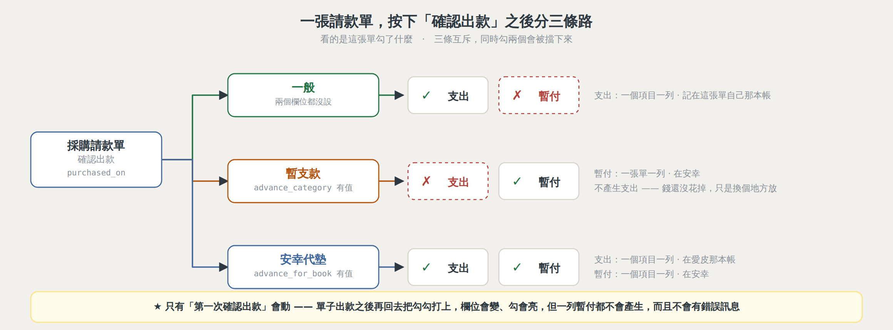
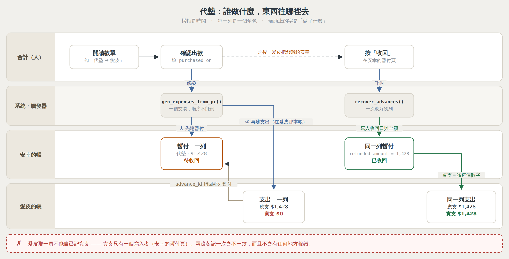
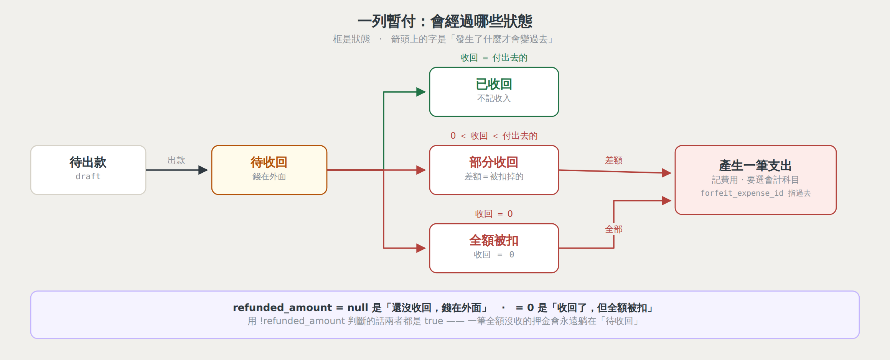
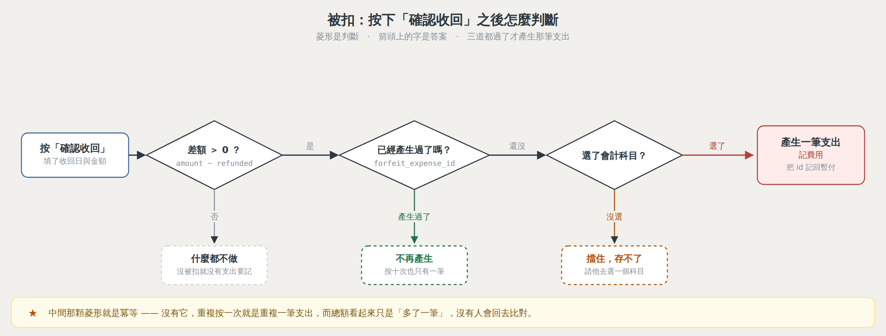

# supabase/migrations

這個資料夾的每一支 `.sql` 都是**跑過一次就算數**的資料庫異動。
這份 README 講三件事：**怎麼跑**、**跑過哪些**、**踩過哪些坑**。

---

## 一、怎麼跑一支 migration

貼進 Supabase 的 SQL Editor，整份一起執行。

### ★★★ 看不到自檢的表格 ＝ 失敗了，不是「沒有輸出」

每一支的結構都是：

```sql
begin;
  …真正的異動…
commit;

-- 自檢（在 commit 之後）
select … ;
```

SQL Editor 把整份腳本包在**一個交易**裡。中間任何一句錯，`begin` 到 `commit`
之間**全部回滾**，而畫面上不一定看得到紅字 —— 於是看起來像「跑完了但沒輸出」。

**自檢在 `commit` 後面。成功就一定看得到那張表。**
（2026-09-10 這件事被誤讀兩次，一次是我、一次是使用者。）

### 自檢的三種判定

| | 意思 |
|---|---|
| ✅ | 這一條過了 |
| ❌ | **停下來**，不要跑下一支 |
| ℹ | 只是印給人看，不判對錯（例如「舊資料本來就沒有，0 是正常的」） |

### ★★ SQL 一律留一份在 repo 裡

migration 放 `supabase/migrations/`，一次性的查詢與修復腳本放
`supabase/一次性腳本/`。

**對話視窗裡的檔案卡是拿來複製的，不是拿來保存的。**
Claude 的工作區是暫時的，閒置夠久就被回收 ——
那時只有寫進 repo 的那一份還在，而一次性腳本往往正是三個月後
「當初那筆錢到底怎麼搬的」唯一的答案。

### ★★ 跑之前先問「這支跑過了沒」

不要憑印象、不要憑對話紀錄。事實在 `schema_migrations`：

```sql
select name, run_at
  from public.schema_migrations
 where name >= '230'
 order by name;
```

2026-09-05 我連續三次說「213／215／216 未跑」，而三支**都在兩天前跑完了** ——
代價是兩輪查詢在追一個不存在的 bug。

---

## 二、寫一支 migration 的規矩

### 1. 自檢一定要有，而且要**判定**自己的母體

```sql
select 3, '母體（需求項目總數）',
       (select count(*)::text from public.purchase_demand_items),
       case when (select count(*) from public.purchase_demand_items) = 0
            then '⚠ 母體是 0 —— 上面那幾條不算數' else '✅' end
```

migration_210 的六列自檢全部 ✅，而第一列「房務支出總筆數」是 **0** ——
一筆都沒產生過，所以「還有幾筆沒補」「有沒有錯置」通通自動成立。
**紅字會讓人停下來，六個綠勾讓人以為做完了。**

### 2. 自檢的**基準值不可以來自另一個問法**

migration_240 第 ⑤ 條寫「筆數應該是 3」，而那個 3 是從一段
**加了日期篩選**的診斷查詢數出來的 —— 它濾掉了匯費。
於是那一條必定為紅，而實際上一筆重複都沒有產生。

**兩邊要問同一件事。** 240 第 ③ 條也是同一個病：
左邊算「代墊金額」、右邊算「這張單的**全部**支出（含記在安幸的匯費）」，
必定差一個手續費。

### 2.5 ★★★ 自檢要從**資料實際掛的那一欄**追，不要從你以為的那一欄

migration_247 第 ⑤ 條：「每一列掛契約的認列，用途都跟契約一致」——
`join revenue_recognitions.contract_id`，結果 ✅ 全對上。

那是假的綠燈。`gen_recognitions()`（短租與 oneoff 那支）**只寫 `order_id`，
不寫 `contract_id`**；只有 `gen_contract_recognitions()` 兩欄都寫。
於是三列走 oneoff 路徑的契約加費認列**在那一條的視野之外**，
$10,741 算錯邊而自檢一片綠。

248 第 ② 條是正確版本：`join order_id`。

★ 寫自檢之前先問一句：**這批資料是誰寫進去的，那支寫了哪幾欄。**
  不要假設「同一張表的同一個概念，每一列都填得一樣齊」。

★ 這也是 §2 的變形 —— 差別在於 §2 是基準值問錯，這裡是**母體圈錯**。
  母體圈錯更難發現：數字會是 0，而 0 看起來像成功。

### 3. 自檢要跑第二次、第十次都一樣

migration_213 寫「最近十分鐘有沒有 expenses 的刪除」——
那支是冪等的，第二次跑什麼都不做，於是那一格變 0，看起來像稽核壞了。
而且「十分鐘內」**會隨時間過期**。一個會自己變紅的檢查等於沒有檢查。

### 3.5 ★★★ 自檢要**呼叫**它在檢查的那個東西

```sql
-- ❌ migration_223：確認函式「存在」，然後自己重算一次日期邏輯來預測結果
--    -- ★★ 今天跑 close_due_periods() 會怎樣（唯讀試算,這裡不真的呼叫）
--    → 印出「ℹ 今天呼叫會把上個月關起來」，而那句話是假的

-- ✅ migration_245：真的叫它一次
select string_agg(c.ym || '：' || c.action, '、') from public.close_due_periods() c
```

`close_due_periods()` 的簽章是 `returns table (ym text, ...)`，而函式體裡有
`on conflict (ym)` —— `ym` 同時是輸出參數名與欄位名，Postgres 每次呼叫都丟
`column reference "ym" is ambiguous`。

**那支函式從 2026-09-07 寫好到 09-11，一次都沒有成功執行過。**
而自檢四天來一片綠 —— 因為它從頭到尾沒問過本人，只證明了「我會算日期」。

★ 函式冪等就直接叫。有副作用不能叫的，就老實寫
「這一條沒有驗到執行」，**不要印一句聽起來很確定的預測**。

### 3.7 ★★★ 自檢要用的暫存資料：`create temp table`，**不要加 `on commit drop`**

自檢跑在 `commit` **後面**，所以它要用的快照必須撐得過那個 commit。

```sql
-- ❌ migration_244：commit 當下就被丟掉 → 自檢死在
--    `relation "_m244_before" does not exist`
create temp table _m244_before on commit drop as select …;

-- ❌ 247~251：為了躲上面那個坑，改建 public 的一般表 ——
--    撐得過 commit，但**每支跑完都在資料庫裡留一張**要人手動 drop
create table public._m247_before as select …;

-- ✅ 正解：純 temp，不加 on commit drop
create temp table _m252_test (…);
```

`on commit drop` 是「交易結束就丟」，而純 `temp` 是**連線結束才丟** ——
撐得過 commit，而且不會出現在 `public` 的資料表清單裡，不用善後。

★★ 244 當下我下的結論是「不要用暫存表」，**那個結論是錯的**，
   而它一路影響了 247~252 六支。
   ★ 判斷錯在哪:看到「暫存表 + 自檢失敗」就歸咎於「暫存表」，
     而真正的變因是那個選項。**把兩件事一起改掉的時候，
     不知道是哪一件解決的** —— 那不是修好，是換一個問題。

### 3.6 ★★ 同一個 SELECT 裡，不要既寫入又讀取

整份自檢是**一個 statement**，所有子查詢共用**同一份快照**，
而那份快照是 statement 開始時拍的。

migration_245 第 ① 條呼叫函式寫進 `period_lock`，第 ② 條讀那張表
—— 讀到的是**寫入之前的世界**，於是印出「❌ 過了 5 號卻沒關」。
資料其實是對的，說謊的是自檢。

★ 要驗寫入的結果就**分兩段跑**。

### 4. 字串比對一律 `ilike`，不要 `like`

Postgres 印的是 `IS NOT NULL`，而 `like '%is not null%'` 是大小寫敏感的。
migration_233 的第 ① 條因此誤報 ❌。

### 5. 掃約束／函式名用**詞邊界**，不要 `%關鍵字%`

```sql
where pg_get_constraintdef(oid) ~ '\mqty\M'     -- ✅
where pg_get_constraintdef(oid) like '%qty%'    -- ❌ 會掃到 quantity_note
```

誤刪一條別的約束**不會報錯**，只會讓一個守門的規則安靜消失。

### 6. 呼叫既有函式時**照抄上一支**，不要憑印象

`record_migration` 是 `(p_name text)` 一個參數、名字不帶 `migration_` 前綴。
每一支都用同一段包起來：

```sql
do $do$ begin
  if to_regprocedure('public.record_migration(text)') is not null then
    perform public.record_migration('243_memo_only_depth');
  end if;
end $do$;
```

（`schema_migrations` 的欄位是 `name` 不是 `version`。）

### 7. `pg_get_functiondef()` 一定要加 `prokind`

```sql
from pg_proc p where p.prokind in ('f','p')
```

不加的話掃到聚合函式就 `ERROR: 42809: "array_agg" is an aggregate function`，
**整支回滾 —— 而爆掉的是自檢**。

### 7.2 ★★★ 掃 `pg_class` 找「表」一定要加 `relkind`

```sql
from pg_class c where c.relkind in ('r','p')      -- r 一般表、p 分割表
```

不加的話**索引與主鍵會一起被掃進來**，而那些本來就沒有 RLS ——
於是「每一張表都開 RLS 了嗎」這一列在**一切正常的時候回 ❌**
（`board_events_pkey  RLS❌`）。

★ 跟 7 是同一種病：**系統目錄裡不只有你要的那一種東西**。
★★ 但它比 7 更難發現。7 會炸掉，炸掉會讓人停下來；
這個只是**讓人習慣忽略那一格**，然後真的壞掉那天也一起被忽略。
（2026-09-17 踩過，拿真的 Postgres 跑起來才看見。）

### 7.3 ★★★ 交給人之前，先在**本地 Postgres 真的跑一次**

```bash
apt-get install -y postgresql
initdb -D /tmp/pgdata && pg_ctl -D /tmp/pgdata -o '-p 5433 -k /tmp' start
# 建一個最小的 Supabase 環境：auth.uid()、storage.buckets/objects、
# profiles、schema_migrations、record_migration()
psql -p 5433 -v ON_ERROR_STOP=1 -f migration_XXX.sql
```

migration_262 那一輪**眼睛看過兩遍、腳本檢查過分號與詞邊界，還是有兩個錯**：
少一個表別名（`42P01`）、以及上面 7.2 那條。
後者**用看的不可能發現** —— 要跑起來才看得到那一行輸出。

順便一次驗完四件事：

| 跑法 | 驗到什麼 |
|---|---|
| 跑第二次，輸出一模一樣 | 冪等 |
| `set role authenticated` ＋ 換掉 `auth.uid()`，實際 select | 權限（policy 存在 ≠ 門是關的）|
| 故意違反守衛 | 守衛真的擋得住 |
| 沒有痕跡的空資料庫 | 補記類的 migration 一列都不會亂記 |

★★ 本地過**不等於**線上過（`auth.uid()` 是假的、資料是空的）——
它抓的是語法與自身邏輯，而那正是前幾次踩到的那些。

### 7.5 ★★★ 註解裡**不要出現分號**（2026-09-15，連兩次）

Supabase 的 SQL Editor 不是先解析註解再切語句的。
註解裡貼一句帶分號的 SQL 當例子，它會**把那句當成真的要執行**。

2026-09-15 的實例：一支純查詢的腳本，檔頭註解裡貼了觸發器的兩行收尾當說明 ——

> `ERROR: 42P01: missing FROM-clause entry for table "new"`

那兩行是 `delete` 與 `update`。**`new` 在那個情境不存在所以整句失敗**，
什麼都沒動 —— 換成一句合法的 `update` 就真的跑下去了。

- ★ 要舉例就用文字描述，不要貼可執行的句子
- ★ 例外：`$fn$ … $fn$` **裡面**的註解是安全的（整段被 dollar quoting 包住，
  不會被切）。249 與 251 的檔頭各有一個分號而沒出事，就是因為在函式主體內
- ★★ 交出去之前掃一遍：函式主體外的區塊註解裡有沒有 `;`

### 7.6 ★★ 一次跑多句，**只看得到最後一句的結果**

同一支腳本寫兩段 `select`，Supabase 只顯示第二段 —— 第一段等於沒查。
自檢與查詢腳本一律**併成一個 `union all`**，一句、一張表。

★ 這兩條是同一種錯：**假設工具照我想的方式跑，而不是先配合它**。

### 8. `schema-baseline.sql` **不等於線上**

那份是舊的 dump。policy 比它多、函式比它新、migration_166 之類的東西根本不在裡面。
照它抄表名或約束名 → 漏掉的東西**不會叫**。
要看線上長什麼樣就去查 `pg_constraint` / `pg_proc`，不要查檔案。

### 9. 改欄位型別之前，先列出**掛在那一欄上的東西**

migration_239 為此連死兩次：

| | 補了什麼 | 死在哪 |
|---|---|---|
| 一版 | 什麼都沒查 | `42804` DEFAULT 轉不過去 |
| 二版 | drop default ＋ 查 view | `42883` **check 約束** `qty > 0` |

錯誤訊息**都不說是誰**：42883 只講「text > numeric」，不講那個 `>` 從哪來。
所以「看訊息再補」是走不完的路。一次列完：
**① view / rule ② DEFAULT ③ check 約束**（還有 generated column）。

view 擋住就**停下來報名字**，不要自己 drop 別人的東西；
約束 drop 掉要把定義寫進 COMMENT 留底 —— 一條看門的規則安靜消失，比留著更糟。

---

## 三、230 ~ 283 這一批

> **不要從這張表判斷「跑過了沒」** —— 事實在 `schema_migrations`，用上面那段查詢。

| # | 做了什麼 | 為什麼 |
|---|---|---|
| 230 | 認列表帶上 `item_name` | `gen_recognitions()` 漏帶，上線至今營收表的「項目」一直是空的 |
| 231 | 付款帳號多兩本現金 | `(正隆)現金`、`(安幸)現金`；`payment_accounts_method_check` 一起放寬 |
| 232 | `gen_demand_no()` 改 SECURITY DEFINER | 它看到的是 **RLS 縮過的母體** → 兩個人同時開單會撞號 |
| 233 | 採購需求大家看得到、只能改自己的 | 原本看不到別人的單 |
| 234 | 停用假的「安幸辦公室」物業 | **後來被 235 推翻** —— 見下面 |
| 235 | `orders.purpose_type`，辦公室不再是假物業 | 234 用「停用」來藏它，而它每個月都在收房務清潔的錢。**標籤說謊比資料錯更難查** |
| 236 | `advance_payments.for_book` ＋ 類別「代墊」 | 安幸代墊其他事業體的欄位 |
| 237 | 請款產生支出時帶 `book`；新增代墊分支 | `gen_expenses_from_pr()` 列了 17 欄**沒有 `book`** → 一筆已經記錯帳 |
| 238 | 好事多 → 好市多 | `platform` 沒有 check，舊值不會報錯，只會讓下拉**顯示空白** |
| 239 | 採購需求：數量獨立成一欄（text） | 一個框裝規格＋數量，會計不知道要買幾瓶 —— 而那一格**是填了的** |
| 240 | 補建代墊的暫付紀錄 | 236/237 之前的三筆：愛皮有費用、安幸**沒有應收** |
| 241 | 代墊只掛同一本帳的支出 | **修 240 的錯** —— 見下面 |
| 242 | `pr_planned_chk` 補上現金／臨櫃 | 前端 `needsPayout()` 放寬了兩次，資料庫那條沒跟 |
| 243 | 摘要守衛不要誤傷餘額重算 | 匯入對帳單只做 INSERT，卻撞到一個 UPDATE 的守衛 |
| 244 | 餘額重算改用交易日＋時間排序 | 原本用 `seq`（那份 PDF 的第幾列），跨對帳單會撞號 → **畫面上的餘額跟存摺對不起來**。同一組排序鍵在**三個地方**各寫一次，修了兩次才修完 |
| 245 | `close_due_periods()` 的 `ym` 有歧義 | 每次呼叫都丟例外 —— 那支函式從沒成功執行過 |
| 246 | `orders.move_chain` | 移房過程「B01>B03」。備註**追加**不覆蓋 —— 使用者手打的那句是他自己的判斷，系統不該擦掉 |
| 247 | `contracts.purpose_type`，安幸辦公室搬到契約層級 | 四支小觸發器取代「改產生器」。**產生器一行都沒動** —— 理由見下面 H |
| 248 | 補正關帳月份裡三筆加費的用途 | $10,741 算在正隆頭上而該算安幸。247 的自檢**查錯欄位**沒抓到 —— 見下面 2.5 |
| 249 | 關帳真的鎖住：月租單不再放行，收款與押金一起鎖 | 2026-08 關帳後一張 LT_ 月租單被改了三次，**三次都成功**。例外是照「哪一類單」開的，而那個永遠不會變 —— 見下面 I |
| 250 | `period_unlock`：會計在畫面上開這一期的鎖 | 開鎖是**一期一張卡**，離開那張卡就自動鎖回。原本的設計是去「關帳」頁開整個月 —— 那等於為了改一格把整個月的門打開 |
| 251 | 鎖的月份改用「期別起日」算 | 月租單原本用 `checkout` 判月份，而 202608 那期的 `checkout` 是 9/1 → **整個八月的月租單都鎖不到**。★ 250 之後一定要再跑一次這支，250 會把守衛連舊規則一起蓋回去 |
| 252 | `period_lock` / `order_lock_pending` / `period_unlock` 開放**讀取** | 管家畫面上完全看不到鎖 —— RLS 擋讀取回傳的是「成功加零列」，不是錯誤（坑 C）。順便把 247~251 留下的五張 `public._mXXX` 收掉，改用 temp table（見 3.7） |
| 253 | 押金守衛改成「分類欄位」，不再 `else hit_recv := true` | 改租戶名字被當成動到押金金額 → **整張契約存不了**，而錯誤訊息講的是押金 |
| 254 | 訂單守衛：鎖的是會改變那個月帳的欄位 | 名字、備註、移房鍊放行；金額、日期、收款、物業房源、用途照鎖。與 253 是同一個原則的兩邊 |
| 255 | `properties.show_in_room_calendar` | 2B10 沒在出租但**支出記在它頭上** —— `active = false` 會讓它從房務／清潔／採購一起消失，而支出還要繼續記。「這間房不排」與「這間房不做了」是兩件事，要兩個開關。預設 true |
| 256 | 訂單也能收訂金：`orders.earnest_amount` ＋ 索引放寬成 `(order_id, kind)` | 舊索引是 `UNIQUE(order_id)` —— **一張訂單只能一列** deposits，訂金插不進去。而 `sync_order_deposits` 的收尾沒分 kind，訂金掛上去之後**只要有人改房客姓名就會被標成孤兒**。契約那邊 174～176 早就做完了，這支照抄（連欄位名都一樣）—— 見下面 J |
| 257 | 收了訂金的訂單可以**沒有起訖日**：`orders.earnest_only` ＋ `checkin/checkout` 放寬成可空 | 「收了訂金但還不知道住哪幾天」是真實存在的一步，而舊模型逼他當場編一個日期 —— 編出來的那個日期會一路流進排房表與營收。<br>★ 放寬的同時加 `orders_earnest_dates_chk`：**只有 `earnest_only` 的單可以沒日期**，其餘照舊必填。放寬而不加約束的話，一年後沒有人知道「日期是空的」代表訂金階段還是匯入漏了 |
| 258 | 社群經營：IG 版面模擬（`social_accounts` / `social_splits` / `social_posts` ＋ `social` bucket） | 三張表而不是一張，理由在「一張切圖 ＝ **N 則貼文**」—— 跨 3 格的切圖要貼三次、三則各自有文案與日期，做成「一則佔三格」的話文案只有一份。<br>★ 這支**整份可以重跑**（`if not exists` ＋ policy 包 `duplicate_object`）。2026-09-16 補 `avatar_path`／`followers`／`following` 三欄就是靠重跑，沒有另開一支。<br>★★ `followers` 是 **text 不是數字** —— 這一頁沒連 IG，那個數字是使用者自己打的裝飾，而他可能想打「12.3萬」 |
| 259 | 社群編輯權限：`can_edit_social()` ＋ `profiles.is_social_editor` | 誰可以改社群模擬的內容 |
| 260 | 首繳日退役（只加兩行 COMMENT） | 應繳日改用**租期起日**換算。查過了:資料庫這一半沒有任何函式／view／約束在讀 `first_payment_date`。**欄位不刪、資料不動** —— 退役只是「不再參與計算」，不是「當初沒發生過」 |
| 261 | 社群分成 IG 與 FB：`social_accounts.platform` | ★ `not null default 'ig'`。留 null 的話前端照 platform 分組時那兩個帳號**兩邊都不出現** —— 畫面上是一句很正常的「還沒有帳號」，而使用者看到的是「跑完 migration 帳號不見了」 |
| 262 | 佈告欄：帳密 ＋ 活動 ＋ 開會資料 | ★★★ `board_secrets` 存的是**真的密碼** —— 全系統唯一一張「policy 寫錯一行就是資安事件」的表，而那不會有人來報。誰看得到只有**一份定義**（`can_see_board_secrets()`），policy 與前端都走它 |
| 263 | 把 255～259 補記進 `schema_migrations` | 那五支**一支都沒呼叫 `record_migration()`**。每一列 `insert` 自己帶著證據（`where exists(那個痕跡)`）—— 憑相信寫進去的紀錄表**看起來很完整而且說謊** |
| 264 | 把 238 補記進去 —— 200 之後最後一個洞 | 238 只改資料，沒有 schema 痕跡。它的證據是**COMMENT**（那段文字裡寫著自己的編號）。純資料的 migration 尤其要記 |
| 265 | 活動改版：上傳開關、代上傳、活動通知 | ★★★ 開關**不能只擋畫面**。藏起按鈕的話，開關關著照樣傳得進去，而畫面不畫關著的那一塊 —— 東西在 storage 裡佔位子而沒有人知道它在，**比不擋更糟** |
| 266 | 補回漏勾「安幸代墊」的請款單（愛皮 PR-202608-086） | 去畫面上勾一勾**沒有用**:代墊的暫付是在 `gen_expenses_from_pr()` 的「第一次確認出款」那個 if **裡面**建的，而 086 早就出款了。欄位會變、勾會亮、**一列暫付都不會產生，也不會有錯誤**（＝一個靜默的寫） |
| 267 | 代墊暫付的「項目」寫項目名稱，不寫請款單號 | 單號不是項目，它是一個代號。同一欄裡別的列寫的都是「這筆錢在做什麼」 |
| 268 | 修 267：項目名稱不要砍在括號中間 | 267 砍出「…(115/6/1-1 等 5 筆」——**一個沒關的括號 ＋ 半截日期**。★ 267 的註解裡我自己寫著「半個項目名稱比只看到一個完整的還糟」，然後只做了一個 `left(…,30)`。**講了那句話卻沒照著做** |
| 269 | 把公司帳密整理進佈告欄 → 帳密 | ★★★ 等於一次把公司所有帳密交到會計／經理／總經理手上（那是 262 設計時就指定的）。★★ 這一支與「一次性-填推播金鑰」**都不可以進 git** —— 明文密碼進了歷史就是永久的 |
| 270 | 帳密多一欄「網址」 | 存**原樣**（`www.airbnb.com.tw`），補 `https://` 是前端的事 —— 資料庫補的話畫面上看到的字跟他打進去的不一樣，而真的要 `http://` 的內網位址會被改掉 |
| 271 | 補 270 沒對到的網址：改照**服務名稱**認 | 270 的回填是 `where title = title`（整個標題完全相同），而使用者在那之後把幾筆改名了。改名是對的 —— **錯的是把回填綁在完整標題上**，那等於要求使用者永遠不要改名 |
| 272 | 代墊暫付改成「一個項目一列」 | 3 列變 8 列。這樣**一列暫付對到一筆支出，1 對 1** |
| 273 | 佈告欄多一格「檔案下載」 | 看：全公司含房務；改：總經理・會計・主管 |
| 274 | 批次收回代墊（一支 RPC） | ★★★ 不做勾稽:愛皮那側的「實支」不另存，直接讀這一列暫付的 `refunded_amount` —— **沒有兩份就沒有東西要對**。★ 走 RPC 是因為 PostgREST **每個請求各自一個交易**:8 列跑 8 次 update，斷在第 5 列就是「還了 5 筆」，而每一列自己都合法，沒有地方會叫 |
| 275 | 新的一頁：會計報表（月報／401／其他） | 跟 273 的規則不一樣，所以**不共用名單** |
| 276 | 檔案下載多一欄「使用說明」 | 兩欄各有各的工作:`note` 一行、列上一直看得到；`usage_note` 一段、收起來 |
| 277 | 其他收支帳：支出的「實支明細」 | 應支不存、實支才存。一筆支出可以分好幾次付，所以實支**一筆一列**不是一個欄位 |
| 278 | 佈告欄排新活動 → 推播（用 SQL 接，不靠後台的 Webhooks 畫面） | 他的 Supabase 後台沒有那一項。寫成 SQL 有三個好處:不用找選單、進 repo、**檢查得到**（畫面上設的東西沒有任何地方驗得出它還在不在）。★ 金鑰不在這一支裡，要另外跑一張卡 |
| 279 | 會計報表：同一期可以有好幾份（拿掉唯一索引） | ★★★ **275 的假設錯了** —— 見下面 M |
| 280 | 會計報表：「申報日」改叫「上傳日」（連欄位一起 rename） | ★ `rename column` 會**自動跟著改**掛在那一欄上的 check 約束 |
| 281 | 上傳日自動填（`default current_date`），畫面上那一格拿掉 | 欄位留著不刪 —— **拿掉一個欄位不該順便丟掉裡面的東西** |
| 282 | 把「申報日」加回來，順便押上三份的日期 | ★★★ **這不是把 280 改回去** —— 見下面 N。★ 這一支**刻意沒有**加 `filed_on >= period_start`:275 在這一欄加過，280 為了 rename 又得拆掉 |
| 283 | 社群：IG 一則可以放多張圖（照片搬進 `images`） | `images text[]` 本來就在（261，FB 拼貼用）。IG 走 `image_path` —— **同一件事兩個地方存**。★ `image_path` 不刪也不清空，它是保險絲 |

### ⚠ 228 有兩支

`migration_228_deferral_rpc.sql` 與 `migration_228_hk_double_entry.sql` 撞號。
兩支都跑過，功能不相干，但**編號不再是唯一的** —— 排序與「跑到第幾支」的判斷
從此要看檔名全名，不能只看數字。

---

## 四、這一批踩過的坑（依形狀分類）

### ★★★ A. 同一條規則寫在兩個地方，只改了一邊

**這一批出現三次，全部都是「畫面讓你做、存檔丟一句看不懂的例外」。**

| 規則 | 前端那一半 | 資料庫那一半 | 症狀 |
|---|---|---|---|
| 哪些付款方式可以有我方帳號 | `purchase-pay.ts` 的 `needsPayout()` | `pr_planned_chk` | 選了 `(安幸)現金` → `violates check constraint` |
| 暫付有哪些類別 | `advance.ts` 的 `CATEGORIES` | `ap_category_chk` | 下拉**顯示空白**，隨手一選就把代墊改成押金 —— **存檔成功** |
| 誰可以改銀行流水 | — | `bank_txn_memo_only` ／ `trg_bank_txn_balance` | 一支懂得閃自己人、一支不懂 |

**動手前的檢查：放寬任何一條規則之前，先 grep 那條規則的另一半在哪裡。**
資料庫端至少要看 `pg_constraint`、`pg_proc`、`pg_trigger` 三個地方。

第三個最值得看一眼：`trg_bank_txn_balance()` 自己第一行就寫著
`if pg_trigger_depth() > 1 then return null`，它知道重算會再觸發自己 ——
**只是沒有人回頭替另一支守衛也想一次**。

### ★★★ B. 加了新的寫入方式，卻沒更新讀取端

一個靜默的讀 ＋ 一個靜默的寫 ＝ **一個不存在的功能**。這一批第五、六次：

| 欄位／功能 | 寫進去了 | 誰沒跟上 | 多久才發現 |
|---|---|---|---|
| `hk_day.rooms_override` | 前端寫 | 那一欄**線上根本不存在** | 三個月 |
| 逐項憑證 `request_item_id` | 請款頁 | **支出頁沒借看** | 一個月，而且第一直覺是「資料被刪了」 |
| `expenses.book` | migration_237 之前沒帶 | — | 一筆已經記錯帳 |
| `purchase_demand_items.buy_link` | 表單有框、列表有顯示 | **中間的 insert 少一行** | 從上線到現在都是空的 |
| `advance_payments.category = '代墊'` | migration_236 | 前端 `CATEGORIES` | 下拉變空白 |

**加一欄的時候，三個地方都要跟著加：**
① 寫入（insert/update）② 抄欄位的清單（如 `SPLIT_INHERITED`）③ 讀取的 `select`。
少任何一個都**不會報錯**，只會安靜地變成空的。

`src/lib/demand.ts` 的 `newItemRow()` 與 `src/lib/receipt-parents.ts`
就是為了讓這件事**測得到**而存在的 —— 測試會失敗並告訴你要改哪裡。

### ★★ C. 用「這一筆的 id」接，而不是用「該接的條件」接

migration_240 第 ③ 步：

```sql
where e.request_id = r.id            -- ❌ 一張單的支出不只一種
where e.request_id = r.id
  and coalesce(e.book,'anxing') = coalesce(a.for_book,'anxing')   -- ✅
```

一張請款單同時產生**愛皮的項目支出**與**安幸的匯費**。
少了帳本條件，愛皮被算成欠了一筆它沒欠的 $15 手續費 ——
**錢沒有記錯，錯的是「誰欠誰」**，而那種錯不會讓任何數字變紅。

★ 加上那個條件同時讓 240 變成**重跑安全**：沒有它的話，
240 跑第二次會把 241 拆掉的匯費重新掛回去。

### ★★ D. 標籤說謊

migration_234 用「停用」把重複的「安幸辦公室」藏起來。
但那個物業**每個月都在收房務清潔的錢** ——
一個收得到錢的物業標成停用，日後任何人看到都會下錯結論。

正確的做法是 235：**改資料模型**（`orders.purpose_type`），
然後把那個假物業真的刪掉。

同一類的還有：
- 「未分類」印成灰字 → 它是**待辦**不是一種分類，要用琥珀色（其他收支帳）
- 「尚未上傳」用在憑證在別層的情況 → 「真的沒傳」跟「傳了但在另一層」給同一個答案

### ★★★ E. 一個功能壞在三層，而每一層都有東西該叫卻沒叫

「每月 5 號自動關帳」從 2026-09-07 上線到 09-11，**一次都沒關成功過**。
`period_lock` 一列都沒有。三個獨立的 bug 疊在一起：

| 層 | 壞在哪 | 為什麼四天沒人發現 |
|---|---|---|
| GitHub Actions | `IMPORT_KEY` secret 沒設 | job 紅了四次，**沒有人在看那個地方** |
| `middleware.ts` | 白名單漏了新端點 `api/close-period`，請求被導去 `/login` | 那支檔案的註解**白紙黑字警告過這件事** |
| 資料庫 | `close_due_periods()` 的 `ym` 有歧義，每次呼叫都丟例外 | 自檢寫著「唯讀試算，**這裡不真的呼叫**」 |

★★★ 三個都不是「寫錯邏輯」，是**三個不同的東西各自安靜地失敗**。
而症狀只有一個、而且要人主動去查才看得到：**那張表是空的**。

★★ 排查的順序也有教訓:我先查到 middleware 就宣布「這就是原因」，
而 job 的 log 說的是 secret —— 它根本沒走到 middleware 那一關。
**有 log 就先讀 log**，不要用推理取代證據。

★ 附帶結論:排程失敗只在 GitHub 上顯示紅色，等於沒有警報。
這個專案已經有 `api/push`，讓排程失敗推到手機上是下一步。

### ★★ F. 白名單要用「性質」列，不要用「名字」列

`middleware.ts` 的 matcher 原本逐支列舉 `api/import|api/push|api/health`。
新增 `api/close-period` 時沒有人回來改那一行 —— 而同一天查出來
`api/notifications/purge`、`api/sync/reconcile` 也是一樣的狀況，
兩支也都打不通，只是還沒有人發現。

★ 改成排除**整個 `/api/`**（2026-09-11）。查證過每一支 API 路由都自己驗身分
（`x-import-key`／`x-push-key`／Bearer ＋角色），沒有一支靠 middleware 擋。

★★ 逐支列舉要求「每個加新端點的人都記得回來改那一行」，
而那件事已經失敗過一次。排除整類之後**新端點預設就是通的**，
驗證責任留在它自己身上 —— 那本來就是它的事。

### ★ G. 憑對話紀錄判斷狀態

- 「這支 migration 跑了沒」→ 查 `schema_migrations`
- 「這批 code 推了沒」→ 跑 `git status --short` 與 `git log --oneline -5`

2026-09-10 我說「這批你還沒推」，而使用者早就推了（commit `3138974`）。
**兩次都是同一個病：說之前沒有去看。**

### ★★★ H. 一張表有兩個產生者，而你只看了其中一個

2026-09-14 要讓「安幸辦公室」的標記從訂單延伸到契約。
原本的計畫是「改 `gen_contract_orders()`，讓它把契約的標記帶進月租單」。

**先 `pg_get_functiondef()` 把線上的定義叫出來看**，三件事當場翻案：

| 以為的 | 實際的 |
|---|---|
| 一個寫入點，加一欄就好 | **四個**寫入點（insert、兩個 update 分支、conflict 那支） |
| 改訂單，報表就會跟著變 | 報表讀的是**認列**，不是訂單 |
| 沒房號的契約走前端那支產生器 | 前端**沒有任何一支 insert 在寫月租單** —— 那批只有認列、沒有訂單 |

★★★ 最要命的是第二條。長租的認列由 `gen_contract_recognitions()` 產，
而**那支整支沒有碰過 `purpose_type`**。只改訂單產生器的話：
契約上勾得到、訂單上看得到標記、**報表數字一毛不動**，而且不會報錯。

★ 第三條是註解說謊：`gen_contract_orders()` 裡白紙黑字寫著
「它們走 `LTC_{契約id}_`，由前端契約頁產生」，而前端從頭到尾沒有那支東西。
**註解是某個時間點的事實，不是現在的事實。**

#### 所以做法反過來

不去改產生器，改成四支小觸發器 —— 規則各只寫一次：

```
契約存檔前　　→ 辦公室登記／公司登記一律 office
契約的用途改了→ 往下推到底下所有的訂單與認列
訂單新增/修改→ 帶 contract_id 的，用途一律照契約
認列新增/修改→ 沒填用途的，從契約（其次訂單）補上
```

產生器以後怎麼重寫、多幾個寫入點，標記都會自己跟上。
這是 §A（同一條規則寫在兩個地方）的**預防**版本：
與其記得「四個地方都要改」，不如讓那四個地方都不需要知道這條規則。

★ 動一支跨很多寫入點的函式之前，先問：
  **這條規則可不可以不放進它裡面。**

### ★★★ I. 例外照「是哪一類」開，而那個條件永遠不會變

migration_223 的關帳守衛第一行是：

```sql
if coalesce(old.imported_via, '') = 'contract' then return …;   -- 月租單放行
```

理由很正當，而且寫在註解裡：月租單會隨契約重算，鎖住的話「改契約」
會在舊月份上失敗，而錯誤訊息講的是訂單 —— 使用者看不懂。

**但那個條件跟「現在是不是該擋」一點關係都沒有。**
它問的是「這是哪一種單」，而那個答案**永遠是 contract**。
於是這條例外從上線那天起就是一個**永遠開著的洞**：

> 2026-08 關帳之後，LT_3A3_202608 被收款、取消、再取消 —— **三次都成功，
> 而且畫面上沒有任何提示**。稽核表事後看得到，但當下沒有人被擋。

#### 正確的切法：問「誰在改」，不問「改的是什麼」

```sql
-- 深度 1  = 有人直接 update orders        → 擋，講人話
-- 深度 ≥2 = 產生器／同步叫起來的連帶重算  → 不寫，但記進 order_lock_pending
if v_uid is not null and pg_trigger_depth() <= 1 then raise exception …
```

原本的顧慮**一樣被解掉了**（改契約照樣存得進去），但條件會**隨情況改變** ——
同一張月租單，人去按就擋，產生器重算就記一筆。

★ 判準：寫例外的時候問自己「這個條件什麼時候會變成 false」。
  答案是「永遠不會」的話，那不是例外，那是**把整類東西關掉**。

★★ 同一支還有第二課：**只鎖主表會製造不一致**。
  只擋 `orders` 的話，刪掉一筆 `order_payments` 照樣成功，
  而它的觸發器要去更新 `orders.paid_amount` 時**深度 ≥2 被靜默跳過**
  —— 收款紀錄沒了、合計還留著。比不鎖還糟。
  擋要擋在**源頭**，不是只擋在看得到的那張表上。

### ★★★ J. 同一件事做了兩次，而兩邊的形狀不一樣

`deposits` 同時服務契約與訂單，而兩邊是**分兩次長出來的**：

| | 唯一索引 | 一列裝什麼 | 有沒有 `kind` |
|---|---|---|---|
| 契約 | `(contract_id, currency, kind)` | 一幣別一列 | 有（174～176 補的） |
| 訂單 | `UNIQUE(order_id)` | **一列裝完**，多幣別與寵物押金塞在 `lines` | 沒有 |

於是「訂金要自己一列」這件事，契約做得到、訂單做不到 ——
而**沒有人知道**，因為在 2026-09-15 之前訂單上一筆訂金都沒有。

★ 症狀不是報錯。是：訂金掛上去之後，**只要有人改那張單的房客姓名**，
  `sync_order_deposits` 的收尾（沒有 `kind` 條件）就把它標成孤兒。
  畫面上那筆 220,000 突然變孤兒，沒有人說得出是哪個動作造成的。

★★ 找出來的方法是**問資料庫，不是讀基線**：

```text
提到 deposits 與 order_id、但 prosrc 不含 kind 的函式
→ 那正是「不知道有兩種押金」的那幾支
```

  同一輪還順手證偽了三支（`mark_deposits_orphaned` 本來就該兩種都標、
  `transfer_deposit` 吃明確 id、`order_fee_deposit_guard` 走 `orders.deposit_id`）。
  **沒查的話那三支都會被我「順手改好」，而每一次改都是新的風險。**

★★★ 判準：一個概念在兩張表上各實作一次的時候，
  **後加的功能只會加在其中一邊**，而另一邊要等到有人踩到才發現。
  256 的做法是照抄契約那一側 —— 連欄位名（`earnest_amount`）都一樣。
  取別的名字的話，以後每寫一次查詢都要先想「這張表是哪個」。

---

### ★★★ K. 那支函式**用回傳值報錯**，而 `perform` 把回傳值丟掉了

2026-09-15，要在 SQL Editor 裡刪掉兩張契約，寫成：

```sql
perform public.soft_delete('contracts', c.id);   -- ❌
```

跑完**一句話都沒有**、自檢下一列卻回「2 張還在」。

原因：`soft_delete` 失敗時回的是 `{"ok": false, "code": "NO_PERM"}` ——
**一個 json 回傳值，不是例外**。而 `perform` 的定義就是「執行它，把結果丟掉」。
於是失敗被丟進垃圾桶，腳本一路往下跑完，看起來像成功。

失敗的理由本身也很典型：SQL Editor 裡 `auth.uid()` 是 **null**，
而 `soft_delete` 要靠它判斷「誰刪的」—— 它不是壞掉，是**它認不出我是誰**。

**規矩：**

| 情況 | 寫法 |
|---|---|
| 呼叫會回傳結果的函式 | `select … into v_result`，然後**印出來**或 `if not (v_result->>'ok')::boolean then raise exception` |
| 不確定它怎麼報錯 | 先 `select public.那支函式(…)` 單獨跑一次看回什麼 |
| **永遠不要** | `perform` 一支你沒讀過原始碼的函式 |

★ 這是坑 C（「RLS 擋下的 UPDATE 回成功且影響 0 列」）的第三種形狀：
**① 回 0 列 ② 回 `{ok:false}` ③ 被 `perform` 吃掉**。
三種的共同點都是「不丟例外」，而 SQL 腳本預設只對例外有反應。

★★ 更麻煩的是**沒刪成功會留下地雷**：那兩張契約的 `earnest_amount` 還在，
而 `trg_sync_contract_earnest` 隨時會照著它生一筆 220,000 的押金列出來。
刪不掉的時候，**先把會長東西的欄位歸零**再去找人工刪 —— 不要留一個半死的狀態過夜。

### ★★★ L. `ON DELETE SET NULL` 會觸發對方的 **BEFORE UPDATE** 觸發器

2026-09-16，要刪掉一間建錯的房源 `14B4`。先掃過所有指向 `properties`
的外鍵，只有一條有列：

```
customers.property_id   1 列・ON DELETE SET NULL
```

判斷「SET NULL 很安全 —— 那位客戶不會消失，只是欄位變空」，於是放行。
結果：

```
ERROR: P0001: 客戶的姓名、房源、住宿起訖是從訂單與契約帶過來的，不能在這裡改。
CONTEXT: PL/pgSQL function customers_guard() line 13 at RAISE
SQL statement "UPDATE ONLY customers SET property_id = NULL WHERE $1 = property_id"
SQL statement "delete from public.properties where id = v_id"
```

**那個判斷只對了一半。**
`ON DELETE SET NULL` 不是資料庫默默改一個欄位 —— 它會發出一個
**真正的 `UPDATE`**，而那個 UPDATE 一樣會踩到 `customers` 上的
BEFORE UPDATE 觸發器。`customers_guard` 的本意是「不准人在客戶管理頁
改房源」，結果它連資料庫自己的連動更新一起擋了。

所以外鍵的 `confdeltype` 只告訴你**後果**，沒告訴你**跑不跑得完**：

| 規則 | 會不會刪掉對方 | 跑不跑得完 |
|---|---|---|
| `CASCADE` | **會** | 要看對方有沒有 BEFORE DELETE 觸發器 |
| `SET NULL` / `SET DEFAULT` | 不會 | **要看對方有沒有 BEFORE UPDATE 觸發器** |
| `RESTRICT` / `NO ACTION` | 不會 | 有列就直接擋 |

**規矩：**

* 刪一列主檔之前，除了掃外鍵，還要掃**對方表上的觸發器**：

```sql
select t.relname, g.tgname, pg_get_triggerdef(g.oid)
from pg_trigger g
join pg_class t on t.oid = g.tgrelid
where not g.tgisinternal
  and t.relname in ( … 那幾張被外鍵指到的表 … );
```

* 更實際的做法：**把每一個 `delete` 包進 `begin … exception when others`**，
  把 `sqlerrm` 印進自檢表。腳本不會整支噴掉，而你會看到資料庫的原話。

★ 解法**不是把守衛關掉**。守衛是對的 —— 那三個欄位本來就該由
`sync_customers()` 一個人維護（坑 J 的那條「讓寫的人只有一個」）。
要動的是**那一列資料本身**：先確認它的人工欄位（電話／Email／備註 ——
同步永遠不動的那幾欄）是空的，刪掉那一列，再刪主檔。

★★ 這是坑 C 家族的第四種形狀：**資料庫的連動動作不是特權動作**。
它跟你手打的 SQL 走同一條路，被同一批觸發器、同一批 policy 看著。

### ★★★ M. 加唯一索引之前，沒問「這一格會不會有第二筆」

（275 → 279）

275 建會計報表時加了：

```sql
create unique index ar_period_uniq on accounting_reports (kind, period_start);
```

前提是「同一個種類 ＋ 同一期只會有一份」。**那個前提是錯的** ——
安幸底下不只一家：同一期的 401，正隆一份、愛皮一份、洪鯊一份，
**全部都是對的**。

★ 唯一索引擋下來的樣子是一句 `duplicate key value violates unique constraint`。
使用者看到的不是「這一期已經有一份了」，是一串英文 ——
於是他的結論是「上傳壞掉了」，而系統其實在講一條**我加錯的規則**。

★★ 唯一索引是**一條斷言**：「這個組合在這張表裡只會出現一次」。
加之前要能講出「第二筆出現時，是誰錯了」。講不出來就不要加。

★★★ 這條跟坑 I 是同一個形狀的兩面：
I 是「例外照**是哪一類**開」，M 是「唯一性照**我以為的維度**訂」——
兩個都是把**當下看到的資料形狀**當成了規則。

---

### ★★ N. 把兩件事改成同一個名字，因為它們「看起來像同一件事」

（280 → 282，隔幾個小時就翻回來）

280 把 `filed_on` 改名成 `uploaded_on`，理由寫得很漂亮：
「同一件事不要有兩個名字」（就是這份 README 的用語表）。

**但那個理由的前提是它們是同一件事，而它們不是：**

| | 是什麼 | 誰填 |
|---|---|---|
| 上傳日 | 這份檔案什麼時候進到系統 | 自動帶，人不用管 |
| 申報日 | 什麼時候送去國稅局 | 會計自己填，非必填 |

於是 282 又把 `filed_on` 加回來，兩欄並存。

★ 合併之前要問的是**「這兩個值會不會不一樣」**，不是「這兩個名字像不像」。
會不一樣就是兩件事，名字像只是巧合。

★★ 代價不只是多跑兩支：280 為了 rename，把 275 掛在那一欄上的
`filed_on >= period_start` 拆掉了，而 282 加回來時**刻意沒有再加**
（見坑 9 —— 一條約束被拆過兩次之後，它是不是還在，沒有人記得）。

---

## 五、其他帳本 ・ 代墊 ・ 暫付 ・ 實支 —— 這一條流程

> **這一章的四張圖是程式產生的**：`supabase/migrations/diagrams.py`。
> 座標是算出來的，不是手排的 —— 要改圖就改那支再跑一次
> （`python diagrams.py` 產生 `index.html`，用瀏覽器截圖成 PNG）。
> ★ 手動挪過的圖，下一個人改一個字就會歪掉而且看不出哪裡歪。

> 這一段是 2026-09-18 使用者要的：「其他帳本、代墊、暫支、實支，流程要寫清楚」。
> 相關的 migration：**236 / 237 / 240 / 241 / 266 / 267 / 268 / 272 / 274 / 277**。

### 0. 先把四個名詞分開

四個詞很像，而它們是**四件不同的事**。混起來講是這一塊最大的誤解來源。

| 這份文件寫 | 是什麼 | 存在哪 |
|---|---|---|
| **其他帳本** | 愛皮、洪鯊 —— 安幸以外的事業體 | `expenses.book` / `orders.book`（`anxing` 以外的值）|
| **暫支款** | 請款單的一種走法：**先把錢撥給員工**去買東西，之後結清 | `purchase_requests.advance_category`；產生 `advance_payments` **一張單一列** |
| **代墊** | 請款單的另一種走法：**安幸先替別本帳付錢**，之後要收回 | `purchase_requests.advance_for_book`；產生 `advance_payments` **一個項目一列**（`category = '代墊'`）|
| **實支** | 其他帳本的某一筆支出，**實際付掉了多少** | 一般看 `other_book_payments`；代墊看那列暫付的 `refunded_amount` |

★★ 「暫付」是那張表與那一頁的名字（`advance_payments`，畫面上叫「暫收付管理 → 暫付」）；
「暫支款」是請款單上的一個選項。**是包含關係，不是同義詞** ——
暫支款會產生一列暫付，但暫付裡還有押金、保證金、零用金、代墊。

★★★ 暫支款與代墊**互斥**。同一張單同時設兩個會被擋下來：

```
一張單不能同時是暫支款與安幸代墊（暫支=%，代墊給=%）
```

理由在語意：暫支款＝這筆錢本來就要收回來、**不產生支出**；
代墊＝**產生別本帳的支出**，安幸這邊記一筆應收。

---

### 1. 一張請款單有三條路



「確認出款」（填 `purchased_on`）那一刻，`gen_expenses_from_pr()` 觸發，
照這張單勾了什麼分三條走。**三條互斥** —— 暫支款與代墊同時設會被擋下來：

| 這張單 | 產生支出？ | 產生暫付？ | 記在誰的帳 |
|---|---|---|---|
| 一般（兩個都沒設） | ✅ 一個項目一列 | ✘ | 這張單自己那本（`book`）|
| **暫支款** | ✘ **完全不產生** | ✅ **一張單一列** | 安幸 |
| **代墊** | ✅ 一個項目一列 | ✅ **一個項目一列** | 支出記在**愛皮／洪鯊**，暫付記在**安幸** |

★ 「暫支款不產生支出」是對的：錢還沒花掉，只是換了一個地方放著（會計立場見第 3 節）。

---

### 2. 代墊的一生



> **怎麼讀這張圖**：每一橫列是一個角色（誰做的），橫軸是時間，
> 箭頭上的字是「做了什麼」。看這張圖要回答的是
> 「這一步是誰按的、東西被寫到哪一本帳」。
>
> 底下那張純文字的是同一件事 —— 在任何編輯器裡都看得到，改動也 diff 得出來。

```
 ①  安幸開請款單，勾「安幸代墊 → 愛皮」
     purchase_requests.advance_for_book = 'aipi'
                    │
                    │   會計按「確認出款」（填 purchased_on）
                    ▼
 ┌──────── gen_expenses_from_pr()　一個交易裡做完，順序不能倒 ────────┐
 │                                                                    │
 │   ②  先建暫付〔安幸的帳〕             ③  再建支出〔愛皮的帳〕      │
 │       advance_payments                    expenses                 │
 │       category = '代墊'                   book   = 'aipi'          │
 │       for_book = 'aipi'                   amount = 同一個數字      │
 │       amount   = 那一項的金額             advance_id ──┐           │
 │       paid_on  = 出款日                                │           │
 │       一個項目一列（272）                 一個項目一列 │           │
 │          ▲                                             │           │
 │          └─────────────────────────────────────────────┘           │
 │            這一筆支出是哪一列暫付墊的（靠 source_item_id 對）      │
 │                                                                    │
 └────────────────────────────────────────────────────────────────────┘
                    │
                    ▼
 ④  錢在外面
     安幸　暫收付管理 → 暫付　　狀態「待收回」
     愛皮　其他收支帳　　　　　應支 $1,428 ・ 實支 $0 ・ 差距 $1,428
                    │
                    │   愛皮把錢還給安幸
                    │   ★ 在「安幸的暫付頁」按收回，不是在愛皮那頁記
                    │   recover_advances()（274，一次交易改好幾列）
                    ▼
 ⑤  advance_payments.refunded_on / refunded_amount 寫進去
                    │
                    ▼
 ⑥  愛皮那一頁自己就變了 —— 沒有第二個寫入者，不用對帳
     應支 $1,428 ・ 實支 $1,428 ・ 差距 $0
```

#### ★★★ 為什麼「一個項目一列」（272）

原本是一張單一列。那樣的話 `$4,530` 這一列對到的是「健保費 ＋ 勞保費」兩筆支出 ——
**收回 $4,530 時算誰的？** 沒有答案。

拆成一項一列之後：**一列暫付 ↔ 一筆支出，1 對 1**。
`expenses.advance_id` 靠 `source_item_id` 對回去，兩邊都認得對方。

#### ★★★ 為什麼實支不在愛皮那一頁記

**同一筆錢只有一個人寫。**

| 那一列支出 | 實支從哪裡來 |
|---|---|
| 一般（不是代墊）| `other_book_payments` 加起來（一筆支出可以分好幾次付，所以是一筆一列）|
| **代墊** | 那列暫付的 `refunded_amount` —— **這一頁不准記** |

兩邊各記一次的話會不一致，而且**不會有任何地方報錯**（README 坑 J：一份資料存在兩個地方）。
所以擋了兩層：

* 資料庫 `trg_obp_block_lent`
* 前端 `lib/other-book.ts` 的 `validatePayment()`，講出為什麼：
  「這筆是安幸代墊的 —— 實支請到『暫收付管理 → 暫付』按收回，那邊記完這裡會自己出現。」

★ 兩層都要：資料庫擋住**任何路徑**，前端負責講**為什麼**。
只有資料庫的話使用者看到的是一句 `violates ...`，不知道要去哪裡做。

#### ★★ 差距不存

`差距 = 應支 − 實支`，**算出來的**（README：推導值存成欄位）。而且不會是負數 ——
付超過是另一件事（多付要退，不是「欠 −500」）。

#### ★★ 為什麼收回要走 RPC，不是前端跑迴圈

PostgREST **每一個請求各自一個交易**。愛皮 9/09 那批是 8 列，
跑 8 次 update 的話斷網或權限不足會停在第 5 列 ——
於是 3 列還躺在「待收回」，而愛皮那頁的實支變成「還了 5 筆的金額」。
**沒有任何地方會叫**，因為每一列自己都合法。

`recover_advances()`（274）一次 update 多列、一個交易：要嘛 8 列全好，要嘛一列都沒動。

---

### 3. 一列暫付的一生



> **怎麼讀這張圖**：框是**狀態**，箭頭上的字是「發生了什麼才會變過去」。
> 一列暫付從左邊進來，最後一定停在右邊三個狀態的其中一個。

三個入口、兩個狀態、三種結局。**狀態一律走 `lib/advance.ts` 的 `statusOf()`**，
畫面上不要自己判斷 —— 判斷錯的症狀是「一筆早就收回的錢還躺在待收回清單裡」，
而那不會有人來報。

| 入口 | 幾列 | 類別誰決定 |
|---|---|---|
| 手動新增 | 一次一列 | 人選（押金・保證金・零用金・其他）|
| 請款單・暫支款 | **一張單一列** | 人在請款單上選 |
| 請款單・代墊 | **一個項目一列** | 固定「代墊」，**人不能自己建** |

★ 「代墊」刻意不在 `MANUAL_CATEGORIES` 裡。手動建一筆代墊的話，
那筆錢對不到任何一張請款單、`advance_id` 是空的 —— **沖銷時找不到要沖哪一筆支出**。
兩份清單分開放在資料裡，不是在畫面上用 `if` 過濾 —— 規則寫在資料裡才測得到。

| 狀態 | 條件 | 畫面上叫 |
|---|---|---|
| `draft` | 沒有 `paid_on` | 待出款 |
| `paid` | 出款了，`refunded_on` 或 `refunded_amount` 是 null | 待收回 |
| `partial` | 收回了，但比付出去的少 | 部分收回 |
| `refunded` | 收回了，金額相等 | 已收回 |

#### ★★★ `null` 與 `0` 在這一塊是兩件事

```
refunded_amount = null  →  還沒收回，錢在外面
refunded_amount = 0     →  收回了，但全額被扣（錢沒了）
```

用 `!refunded_amount` 判斷的話兩者都是 true ——
於是一筆**全額沒收**的押金會永遠躺在「錢還在外面」的清單裡，等一個不會來的退款。

判斷一律走 `lib/advance.ts` 的 `statusOf()`（`== null` 涵蓋 null 與 undefined，但**不涵蓋 0**）。

| 狀態 | 條件 | 畫面上叫 |
|---|---|---|
| `draft` | 沒有 `paid_on` | 待出款 |
| `paid` | 出款了、`refunded_on` 或 `refunded_amount` 是 null | 待收回 |
| `partial` | 收回了，但比付出去的少 | 部分收回 |
| `refunded` | 收回了，金額相等 | 已收回 |

★ 2026-09-18 從「已付款／已退款」改成「待收回／已收回」：
使用者看到愛皮那 8 列寫著「已付款」，問**「是誰已付款，安幸還是愛皮？」**——
他讀錯不是看錯，是**同一條軸在那張表上有三個名字**（欄位叫「收回日」，狀態叫「已付款」）。

---

### 4. 被扣：差額怎麼變成一筆支出



> **怎麼讀這張圖**：菱形是**判斷**，箭頭上的字是答案。
> 三道都過了才會產生那筆支出；任何一道沒過，走的是下面那三個「不做事」的出口。

這是暫付裡**唯一真的花掉錢**的一步。中間那顆菱形就是**冪等** ——
沒有它，重複按一次「確認收回」就是重複一筆支出。

三個條件缺一不可（`needsForfeitExpense()`）：

| 條件 | 沒有它會怎樣 |
|---|---|
| 差額 > 0 | 沒被扣就沒有支出要記 |
| 狀態是「部分收回」 | 還沒收回時「確定損失」是 0，不能先記 |
| **`forfeit_expense_id` 是空的** | **冪等靠這一條**。沒有它，重複按「確認收回」就是重複支出 —— 而總額看起來只是「多了一筆」，沒有人會回去比對 |

★★ 被扣的那筆**要選會計科目**，不強制的話會落進「未分類」或空的科目 ——
三個月後看到一筆 $2,000 的支出，沒有人查得出它是哪一筆押金被扣的。
★ 只在「這一次要產生」時問；已經產生過的再打開來看不該又被擋住（科目在那筆支出自己身上）。

★ 暫付那一頁的「被扣」統計卡**單獨一格**，不混進「已收回」——
混在一起的話「我們今年被扣了多少押金」永遠沒有人查得到，而那正是這張表存在的理由之一。

#### 會計立場（2026-09-01 使用者選的）

這三條決定了暫付的錢**什麼時候才算「花掉」**：

| 動作 | 記費用嗎 | 為什麼 |
|---|---|---|
| 出款 | **不記** | 押金／代墊是暫時放在別人那裡的**資產**，不是花掉的錢 |
| 收回 | **不記收入** | 拿回自己的錢，不是賺到 |
| **被扣** | **記費用** | 這是唯一真的損失 |

★ 站上對房客押金已經是這個立場（儀表板寫著「訂單總額・押金非營收」）。
我方付出去的要一致 —— 不一致的話同一個概念在兩張報表上算法不同，而**兩個數字都看起來很合理**。

★★ 被扣的那筆支出**要選會計科目**，不強制的話三個月後看到一筆 $2,000
沒有人查得出它是哪一筆押金被扣的。

---

#### ★ 收回帳戶跟出款帳戶不同：提醒，不禁止

規則是「錢要回到原本的帳戶」，但換帳戶、對方匯錯、公司帳戶關掉**確實會發生**。
硬鎖住的話那筆錢就記不進系統，而使用者只能改資料庫或亂填一個。
系統負責看見，人負責決定 —— 所以 `refundAccountWarning()` 回一句話，按下去還是存得了。

### 5. 這一塊踩過的兩個坑

**① 去畫面上勾一勾補不回來（266）**

086 那張單已經出款了。現在把 `advance_for_book` 改成 `'aipi'`：

* 欄位確實會變、畫面上那顆勾會亮
* **一列暫付都不會產生**，`expenses.advance_id` 也還是 null
* **而且不會有任何錯誤訊息**

因為代墊的暫付是在 `gen_expenses_from_pr()` 的
`if old.purchased_on is null then`（＝只有「第一次確認出款」）**裡面**建的。

★★★ 一個靜默的寫 ＝ 一個不存在的功能。所以 266 把三樣東西直接補進去：
欄位、暫付那一列、支出的 `advance_id`。

**② 資料是對的，缺的是畫面上那一句話**

愛皮某個月 8 筆支出全部是安幸先墊的，而其他收支帳那一頁**一個字都沒說**。
要知道就得跑去暫付頁把 4,530／1,329／7,350 三個數字加起來對 ——
使用者因此連問三次「怎麼還是三筆」「全都代墊」。

★ 所以 `Entry.advanceId` 要一路帶到那一頁：不是為了計算，是為了**說出來**。

---

### 6. ⚠ 還沒查證的一件事：被扣的那筆支出，誰產生的

收回時如果金額比付出去的少，前端 `validateRefund()` 會**擋住存檔**直到使用者選了會計科目。
但 `deposits/advance-tab.tsx` 的 `saveInner()` 送出去的 payload 裡
**沒有 `forfeit_account_code`**，也沒有 insert 任何 `expenses` ——
所以那筆支出如果有產生，產生的人只能是資料庫的觸發器，而觸發器拿不到使用者選的科目。

兩種可能，差很多：

| | 症狀 |
|---|---|
| ① 有觸發器在做 | 支出有產生，但**科目不是使用者選的那個** —— 他每次都被逼著選一個不會被用到的值 |
| ② 沒有人在做 | **那筆支出從來沒有產生過**，被扣的錢完全沒進帳，而畫面上什麼都不會說 |

**兩種都不是「正常」。** 分辨是哪一種：跑 `supabase/一次性腳本/查-被扣的支出有沒有產生.sql`
（只讀不寫，回一張表），把第 ② 列與第 ④ 列貼回對話。

★ 這裡寫「還沒查證」而不是直接寫結論，是因為判斷的依據只有部分檔案 ——
而「憑印象判斷某個東西存不存在」正是坑 G 那一條。

---

## 六、其他新增的功能

> 這一份只寫**資料庫那一半**（表、欄位、policy、觸發器）。
> 畫面的規則在 `CLAUDE.md` 與 `anxing-ui` skill。

### 1. 佈告欄（262 / 265 / 269 / 270 / 271 / 273 / 276 / 278）

四格，而**四格的權限各不相同**——所以是四套名單，不是一套。

| 格 | 誰看得到 | 誰能改 | 表 |
|---|---|---|---|
| 通知 | 全公司 | — | 既有的通知系統 |
| 活動 | 全公司 | 總經理・會計・主管 | `board_events` / `board_files` |
| **帳密** | **房務以外**（會計・經理・總經理）| 同左 | `board_secrets` |
| 檔案下載 | **全公司，含房務** | 總經理・會計・主管 | `board_forms` |

★★★ `board_secrets` 存的是**真的帳號密碼** —— 全系統唯一一張
「policy 寫錯一行就是資安事件」的表。而那不會有人來報：畫面上一切正常，
只是房務阿姨也看得到全公司的密碼。

★★ 所以「誰看得到」只有**一份定義**：`can_see_board_secrets()`。
policy 用它，前端也用 rpc 叫它。兩邊各寫一次會有一邊沒跟上（坑 A），
而這一次錯的方向是「多給」。

★★★ 自檢把**每一種角色**餵進 policy 真正在用的那份清單，
再證明判斷式走的就是那一份。只檢查「policy 存在」不夠 ——
**存在但條件寫反，看起來一樣是綠的**。

**活動的上傳開關（265）**：`board_events.uploads_open`。
只把按鈕藏起來是不夠的 —— 開關關著照樣傳得進去，而畫面**不畫關著的那一塊**，
於是東西在 storage 裡佔著位子而沒有人知道它在。**比不擋更糟。**
所以 insert policy 自己要求那個開關是開的。

**排新活動 → 推播（278）**：用 SQL 寫觸發器，不靠後台的 Webhooks 畫面
（他的 Supabase 版本沒有那一項）。三個好處：不用找選單、進 repo、**檢查得到**
（畫面上設的東西，沒有任何地方驗得出它還在不在）。
★ 金鑰**不在那一支裡**，要另外跑一張卡 —— 而那張卡**不可以進 git**。

**檔案下載的兩欄說明（276）**：

```
note        一行。列上一直看得到，回答「這是什麼」
usage_note  一段。收起來（▸ / ▾），回答「怎麼填、填完交給誰」
```

★ 是兩欄不是一欄多行。兩件事各有各的工作。

### 2. 會計報表（275 / 279 / 280 / 281 / 282）

`accounting_reports`：月報 ／ 401 ／ 其他。看與改的名單跟「檔案下載」**不一樣**，所以不共用。

兩個日期是**兩件事**（見坑 N）：

| | 是什麼 | 誰填 |
|---|---|---|
| 上傳日 `uploaded_on` | 檔案什麼時候進到系統 | 自動（`default current_date`，前端也寫一次）|
| 申報日 `filed_on` | 什麼時候送去國稅局 | 會計自己填，**非必填** |

★ 同一期可以有好幾份（279）—— 正隆一份、愛皮一份、洪鯊一份都是對的。

### 3. 社群模擬（258 / 259 / 261 / 283）

三張表而不是一張，因為**一張切圖 ＝ N 則貼文**：跨 3 格的切圖要貼三次、
三則各自有文案與日期。做成「一則佔三格」的話文案只有一份。

* `social_accounts.platform`（261）分 IG 與 FB。★ `not null default 'ig'` ——
  留 null 的話前端照 platform 分組時那兩個帳號**兩邊都不出現**，
  畫面上是一句很正常的「還沒有帳號」，而使用者看到的是「跑完 migration 帳號不見了」。
* `followers` 是 **text 不是數字** —— 這一頁沒連 IG，那個數字是使用者自己打的裝飾，
  而他可能想打「12.3萬」。
* IG 多圖（283）：照片全部搬進 `images text[]`（那一欄本來就在，FB 拼貼用的）。
  ★ `image_path` **不刪也不清空**，它是保險絲。

### 4. 首繳日退役（260）

應繳日改用**租期起日**換算。260 只加兩行 COMMENT ——
**欄位不刪、資料不動**。「不再參與計算」跟「當初沒發生過」是兩件事。

★ 敢這樣做是因為先查過：資料庫這一半**沒有任何函式、view、約束**在讀
`first_payment_date`，只有前端在用。

---

## 七、跑錯了怎麼辦

| 情況 | 做法 |
|---|---|
| 整支回滾（看不到自檢） | 把紅字原文貼出來，不要自己判斷 |
| 資料改壞了 | 寫**下一支** migration 修，不要改已經跑過的那支的內容 —— 除非是為了讓它「重跑安全」（240 就是這樣） |
| 不確定現在的狀態 | 先查，再動。`pg_constraint` / `pg_proc` / `pg_trigger` / `schema_migrations` |

**唯一的例外**：已經跑過的 migration 如果**重跑會造成傷害**，
那要回頭把檔案修好（加冪等條件），並在檔頭寫清楚為什麼。
240 的第 ③ 步就是這個例外。
